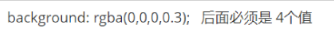

### 基于黑马前端视频学习的CSS3笔记，每一天的知识点都放在一起，方便学习查阅

-   [\==CSS第一天==](https://blog.csdn.net/m0_67401270/article/details/123321807#CSS_3)
-   -   [一、css简介](https://blog.csdn.net/m0_67401270/article/details/123321807#css_5)
    -   [二、css语法规范](https://blog.csdn.net/m0_67401270/article/details/123321807#css_16)
    -   [三、css代码风格](https://blog.csdn.net/m0_67401270/article/details/123321807#css_40)
    -   [四、css选择器的作用](https://blog.csdn.net/m0_67401270/article/details/123321807#css_74)
    -   [五、css基础选择器](https://blog.csdn.net/m0_67401270/article/details/123321807#css_79)
    -   -   [1、标签选择器：](https://blog.csdn.net/m0_67401270/article/details/123321807#1_83)
        -   [2、类选择器](https://blog.csdn.net/m0_67401270/article/details/123321807#2_94)
        -   [3、多类名选择器](https://blog.csdn.net/m0_67401270/article/details/123321807#3_114)
        -   [4、id选择器：](https://blog.csdn.net/m0_67401270/article/details/123321807#4id_127)
        -   [5、id选择器和类选择器的区别](https://blog.csdn.net/m0_67401270/article/details/123321807#5id_138)
        -   [6、通配符选择器](https://blog.csdn.net/m0_67401270/article/details/123321807#6_147)
        -   [7、选择器总结](https://blog.csdn.net/m0_67401270/article/details/123321807#7_164)
    -   [六、css字体属性:](https://blog.csdn.net/m0_67401270/article/details/123321807#css_168)
    -   -   [1、字体大小：](https://blog.csdn.net/m0_67401270/article/details/123321807#1_170)
        -   [2、字体粗细：](https://blog.csdn.net/m0_67401270/article/details/123321807#2_182)
        -   [3、字体样式：](https://blog.csdn.net/m0_67401270/article/details/123321807#3_195)
        -   [4、字体的综合写法](https://blog.csdn.net/m0_67401270/article/details/123321807#4_205)
        -   [5、字体总结：](https://blog.csdn.net/m0_67401270/article/details/123321807#5_213)
    -   [七、css文本属性：](https://blog.csdn.net/m0_67401270/article/details/123321807#css_217)
    -   -   [1、文本颜色：](https://blog.csdn.net/m0_67401270/article/details/123321807#1_219)
        -   [2、文本对齐：](https://blog.csdn.net/m0_67401270/article/details/123321807#2_231)
        -   [3、修饰文本：](https://blog.csdn.net/m0_67401270/article/details/123321807#3_241)
        -   [4、文本缩进](https://blog.csdn.net/m0_67401270/article/details/123321807#4_252)
        -   [5、行间距：](https://blog.csdn.net/m0_67401270/article/details/123321807#5_266)
    -   [八、css样式表：](https://blog.csdn.net/m0_67401270/article/details/123321807#css_275)
    -   -   [1、行内样式表（行内式）](https://blog.csdn.net/m0_67401270/article/details/123321807#1_279)
        -   [2、内部样式表（嵌入式）](https://blog.csdn.net/m0_67401270/article/details/123321807#2_290)
        -   [3、外部样式表（链接式）](https://blog.csdn.net/m0_67401270/article/details/123321807#3_305)
    -   [九、Chrome调试工具：](https://blog.csdn.net/m0_67401270/article/details/123321807#Chrome_316)
-   [\==CSS第二天==](https://blog.csdn.net/m0_67401270/article/details/123321807#CSS_327)
-   -   [一、emmet语法](https://blog.csdn.net/m0_67401270/article/details/123321807#emmet_329)
    -   -   [1、简介](https://blog.csdn.net/m0_67401270/article/details/123321807#1_331)
        -   [2、快速生成HTML结构语法](https://blog.csdn.net/m0_67401270/article/details/123321807#2HTML_339)
        -   [3、快速生成CSS样式语法](https://blog.csdn.net/m0_67401270/article/details/123321807#3CSS_349)
        -   [4、快速格式化代码](https://blog.csdn.net/m0_67401270/article/details/123321807#4_357)
    -   [二、css的复合选择器](https://blog.csdn.net/m0_67401270/article/details/123321807#css_373)
    -   -   [1、什么是复合选择器？](https://blog.csdn.net/m0_67401270/article/details/123321807#1_375)
        -   [2、后代选择器 (重要）](https://blog.csdn.net/m0_67401270/article/details/123321807#2__381)
        -   [3、子选择器 (重要）](https://blog.csdn.net/m0_67401270/article/details/123321807#3__404)
        -   [4、并集选择器 (重要）](https://blog.csdn.net/m0_67401270/article/details/123321807#4__428)
        -   [5、伪类选择器](https://blog.csdn.net/m0_67401270/article/details/123321807#5_450)
        -   [6、链接伪类选择器](https://blog.csdn.net/m0_67401270/article/details/123321807#6_462)
        -   [7、:focus 伪类选择器](https://blog.csdn.net/m0_67401270/article/details/123321807#7focus__491)
        -   [复合选择器总结](https://blog.csdn.net/m0_67401270/article/details/123321807#_505)
    -   [三、css的显示模式](https://blog.csdn.net/m0_67401270/article/details/123321807#css_509)
    -   -   [1、什么是元素的显示模式](https://blog.csdn.net/m0_67401270/article/details/123321807#1_511)
        -   [2、元素显示模式的分类](https://blog.csdn.net/m0_67401270/article/details/123321807#2_521)
        -   -   [2.1、块元素](https://blog.csdn.net/m0_67401270/article/details/123321807#21_523)
            -   [2.2、行内元素](https://blog.csdn.net/m0_67401270/article/details/123321807#22_553)
            -   [2.3、行内块元素](https://blog.csdn.net/m0_67401270/article/details/123321807#23_583)
            -   [2.4、元素显示模式总结](https://blog.csdn.net/m0_67401270/article/details/123321807#24_600)
        -   [3、元素显示模式的转换](https://blog.csdn.net/m0_67401270/article/details/123321807#3_606)
        -   [4、单行文字垂直居中的代码](https://blog.csdn.net/m0_67401270/article/details/123321807#4_619)
    -   [四、css的背景](https://blog.csdn.net/m0_67401270/article/details/123321807#css_643)
    -   -   [1、背景颜色](https://blog.csdn.net/m0_67401270/article/details/123321807#1_648)
        -   [2、背景图片](https://blog.csdn.net/m0_67401270/article/details/123321807#2_664)
        -   [3、背景平铺](https://blog.csdn.net/m0_67401270/article/details/123321807#3_684)
        -   [4、背景图片位置](https://blog.csdn.net/m0_67401270/article/details/123321807#4_696)
        -   [5、背景图片固定](https://blog.csdn.net/m0_67401270/article/details/123321807#5_728)
        -   [6、背景样式合写](https://blog.csdn.net/m0_67401270/article/details/123321807#6_744)
        -   [7、背景色半透明](https://blog.csdn.net/m0_67401270/article/details/123321807#7_754)
        -   [8、背景总结](https://blog.csdn.net/m0_67401270/article/details/123321807#8_771)
-   [\==CSS第三天==](https://blog.csdn.net/m0_67401270/article/details/123321807#CSS_777)
-   -   [一、css三大特性](https://blog.csdn.net/m0_67401270/article/details/123321807#css_779)
    -   -   [1、层叠性](https://blog.csdn.net/m0_67401270/article/details/123321807#1_781)
        -   [2、继承性](https://blog.csdn.net/m0_67401270/article/details/123321807#2_792)
        -   [3、优先级](https://blog.csdn.net/m0_67401270/article/details/123321807#3_821)
        -   -   [3.1、权重叠加（重点）](https://blog.csdn.net/m0_67401270/article/details/123321807#31_850)
    -   [二、盒子模型](https://blog.csdn.net/m0_67401270/article/details/123321807#_859)
    -   -   [1、网页布局的本质](https://blog.csdn.net/m0_67401270/article/details/123321807#1_861)
        -   -   [1.1、网页布局过程](https://blog.csdn.net/m0_67401270/article/details/123321807#11_867)
            -   [1.2、网页布局三大核心](https://blog.csdn.net/m0_67401270/article/details/123321807#12_873)
        -   [2、盒子模型（Box Model）组成](https://blog.csdn.net/m0_67401270/article/details/123321807#2Box_Model_879)
        -   [3、边框（border）](https://blog.csdn.net/m0_67401270/article/details/123321807#3border_887)
        -   -   [3.1、边框的使用](https://blog.csdn.net/m0_67401270/article/details/123321807#31_889)
            -   [3.2、表格的细线边框](https://blog.csdn.net/m0_67401270/article/details/123321807#32_922)
            -   [3.3、边框会影响盒子实际大小](https://blog.csdn.net/m0_67401270/article/details/123321807#33_936)
        -   [4、内边距（padding）](https://blog.csdn.net/m0_67401270/article/details/123321807#4padding_943)
        -   -   [4.1、内边距的使用方式](https://blog.csdn.net/m0_67401270/article/details/123321807#41_945)
            -   [4.2、内边距会影响盒子实际大小](https://blog.csdn.net/m0_67401270/article/details/123321807#42_959)
        -   [5、外边距（margin）](https://blog.csdn.net/m0_67401270/article/details/123321807#5margin_975)
        -   -   [5.1、外边距的使用方式](https://blog.csdn.net/m0_67401270/article/details/123321807#51_977)
            -   [5.2、外边距典型应用](https://blog.csdn.net/m0_67401270/article/details/123321807#52_983)
            -   [5.3、外边距合并](https://blog.csdn.net/m0_67401270/article/details/123321807#53_1000)
            -   [5.4、清除内外边距](https://blog.csdn.net/m0_67401270/article/details/123321807#54_1027)
    -   [三、PS 基本操作](https://blog.csdn.net/m0_67401270/article/details/123321807#PS__1040)
-   [\==CSS第四天==](https://blog.csdn.net/m0_67401270/article/details/123321807#CSS_1056)
-   -   [一、其他样式](https://blog.csdn.net/m0_67401270/article/details/123321807#_1058)
    -   -   [1、圆角边框](https://blog.csdn.net/m0_67401270/article/details/123321807#1_1060)
        -   [2、盒子阴影](https://blog.csdn.net/m0_67401270/article/details/123321807#2_1079)
        -   [3、文字阴影](https://blog.csdn.net/m0_67401270/article/details/123321807#3_1095)
    -   [二、浮动](https://blog.csdn.net/m0_67401270/article/details/123321807#_1106)
    -   -   [1、传统网页布局的三种方式](https://blog.csdn.net/m0_67401270/article/details/123321807#1_1108)
        -   [2、标准流（普通流/文档流）](https://blog.csdn.net/m0_67401270/article/details/123321807#2_1122)
        -   [3、为什么需要浮动？](https://blog.csdn.net/m0_67401270/article/details/123321807#3_1133)
        -   [4、什么是浮动？](https://blog.csdn.net/m0_67401270/article/details/123321807#4_1141)
        -   [5、浮动特性](https://blog.csdn.net/m0_67401270/article/details/123321807#5_1155)
        -   [6、浮动元素经常和标准流父级搭配使用](https://blog.csdn.net/m0_67401270/article/details/123321807#6_1177)
    -   [三、常见网页布局](https://blog.csdn.net/m0_67401270/article/details/123321807#_1185)
    -   -   [浮动布局注意点](https://blog.csdn.net/m0_67401270/article/details/123321807#_1187)
    -   [四、清除浮动](https://blog.csdn.net/m0_67401270/article/details/123321807#_1199)
    -   -   [1、为什么需要清除浮动？](https://blog.csdn.net/m0_67401270/article/details/123321807#1_1201)
        -   [2、清除浮动本质](https://blog.csdn.net/m0_67401270/article/details/123321807#2_1207)
        -   [3、清除浮动样式](https://blog.csdn.net/m0_67401270/article/details/123321807#3_1217)
        -   [4、清除浮动的多种方式](https://blog.csdn.net/m0_67401270/article/details/123321807#4_1231)
        -   -   [4.1、额外标签法](https://blog.csdn.net/m0_67401270/article/details/123321807#41_1233)
            -   [4.2、父级添加 overflow 属性](https://blog.csdn.net/m0_67401270/article/details/123321807#42_overflow__1269)
            -   [4.3、父级添加after伪元素](https://blog.csdn.net/m0_67401270/article/details/123321807#43after_1285)
            -   [4.4、父级添加双伪元素](https://blog.csdn.net/m0_67401270/article/details/123321807#44_1308)
        -   [总结](https://blog.csdn.net/m0_67401270/article/details/123321807#_1322)
    -   [五、PS 切图](https://blog.csdn.net/m0_67401270/article/details/123321807#PS__1332)
    -   -   [1、图层切图](https://blog.csdn.net/m0_67401270/article/details/123321807#1_1334)
        -   [2、切片切图](https://blog.csdn.net/m0_67401270/article/details/123321807#2_1340)
        -   [3、PS插件切图](https://blog.csdn.net/m0_67401270/article/details/123321807#3PS_1354)
-   [\==CSS第五天==](https://blog.csdn.net/m0_67401270/article/details/123321807#CSS_1364)
-   -   [1\. PS 切图](https://blog.csdn.net/m0_67401270/article/details/123321807#1_PS__1378)
    -   -   [1.1. 常见的图片格式](https://blog.csdn.net/m0_67401270/article/details/123321807#11__1380)
        -   [1.2. 图层切图](https://blog.csdn.net/m0_67401270/article/details/123321807#12__1393)
        -   [1.3. 切片切图](https://blog.csdn.net/m0_67401270/article/details/123321807#13__1421)
        -   [1.4. 插件切图](https://blog.csdn.net/m0_67401270/article/details/123321807#14__1437)
        -   -   [1.4.1. 介绍](https://blog.csdn.net/m0_67401270/article/details/123321807#141__1439)
            -   [1.4.2. 安装](https://blog.csdn.net/m0_67401270/article/details/123321807#142__1447)
    -   [2\. CSS属性书写顺序（重点）](https://blog.csdn.net/m0_67401270/article/details/123321807#2_CSS_1489)
    -   [3\. 学成在线页面制作](https://blog.csdn.net/m0_67401270/article/details/123321807#3__1524)
    -   -   [3.1. 前期准备素材](https://blog.csdn.net/m0_67401270/article/details/123321807#31___1536)
        -   [3.2. 前期准备工作](https://blog.csdn.net/m0_67401270/article/details/123321807#32___1541)
        -   [3.3. 页面布局整体思路](https://blog.csdn.net/m0_67401270/article/details/123321807#33__1561)
        -   [3.4. 页面制作](https://blog.csdn.net/m0_67401270/article/details/123321807#34__1575)
        -   -   [3.4.1. header头部制作](https://blog.csdn.net/m0_67401270/article/details/123321807#341_header_1592)
            -   [3.4.2. banner制作](https://blog.csdn.net/m0_67401270/article/details/123321807#342_banner_1629)
            -   -   [3.4.2.1 subnav 侧导航栏 (左侧的)](https://blog.csdn.net/m0_67401270/article/details/123321807#3421__subnav___1644)
                -   [3.4.2.2 course课程表模块 (右侧的)](https://blog.csdn.net/m0_67401270/article/details/123321807#3422__course__1655)
            -   [3.4.3. 精品推荐小模块](https://blog.csdn.net/m0_67401270/article/details/123321807#343__1666)
            -   [3.4.4. 精品推荐大模块](https://blog.csdn.net/m0_67401270/article/details/123321807#344__1684)
            -   [3.4.5. 底部模块制作](https://blog.csdn.net/m0_67401270/article/details/123321807#345___1696)
-   [\==CSS第六天==](https://blog.csdn.net/m0_67401270/article/details/123321807#CSS_1710)
-   -   [1\. 定位(position) 介绍](https://blog.csdn.net/m0_67401270/article/details/123321807#1_position__1723)
    -   -   [1.1 为什么使用定位](https://blog.csdn.net/m0_67401270/article/details/123321807#11__1725)
        -   [1.2 定位组成](https://blog.csdn.net/m0_67401270/article/details/123321807#12__1749)
        -   -   [1.2.1 边偏移（方位名词）](https://blog.csdn.net/m0_67401270/article/details/123321807#121__1761)
            -   [1.2.2 定位模式 (position)](https://blog.csdn.net/m0_67401270/article/details/123321807#122__position_1774)
        -   [1.3 定位模式介绍](https://blog.csdn.net/m0_67401270/article/details/123321807#13__1797)
        -   -   [1.3.1. 静态定位(static) - 了解](https://blog.csdn.net/m0_67401270/article/details/123321807#131__static___1799)
            -   [1.3.2. 相对定位(relative) - 重要](https://blog.csdn.net/m0_67401270/article/details/123321807#132_relative___1815)
            -   [1.3.3. 绝对定位(absolute) - 重要](https://blog.csdn.net/m0_67401270/article/details/123321807#133_absolute___1840)
            -   -   [1.3.3.1 绝对定位的介绍](https://blog.csdn.net/m0_67401270/article/details/123321807#1331__1842)
                -   [1.3.3.2 定位口诀 —— 子绝父相](https://blog.csdn.net/m0_67401270/article/details/123321807#1332____1886)
            -   [1.3.4. 固定定位(fixed) - 重要](https://blog.csdn.net/m0_67401270/article/details/123321807#134_fixed___1932)
            -   [1.3.5 粘性定位(sticky) - 了解](https://blog.csdn.net/m0_67401270/article/details/123321807#135_sticky___1968)
            -   [1.3.6 定位总结](https://blog.csdn.net/m0_67401270/article/details/123321807#136__1994)
    -   [2\. 综合案例：学成在线-hot 模块添加](https://blog.csdn.net/m0_67401270/article/details/123321807#2_hot___2013)
    -   -   [\*\*2. 1 案例截图\*\*：](https://blog.csdn.net/m0_67401270/article/details/123321807#2_1__2015)
        -   [2.2 案例分析](https://blog.csdn.net/m0_67401270/article/details/123321807#22__2019)
        -   [2.3 案例小结](https://blog.csdn.net/m0_67401270/article/details/123321807#23__2025)
    -   [3\. 定位(position)的应用](https://blog.csdn.net/m0_67401270/article/details/123321807#3_position_2088)
    -   -   [3.1. 固定定位小技巧： 固定在版心左侧位置。](https://blog.csdn.net/m0_67401270/article/details/123321807#31____2090)
        -   [3.2. 堆叠顺序（z-index）](https://blog.csdn.net/m0_67401270/article/details/123321807#32_zindex_2142)
    -   [4\. 定位(position)的拓展](https://blog.csdn.net/m0_67401270/article/details/123321807#4_position_2176)
    -   -   [4.1 绝对定位的盒子居中](https://blog.csdn.net/m0_67401270/article/details/123321807#41__2178)
        -   [4.2 定位特殊特性](https://blog.csdn.net/m0_67401270/article/details/123321807#42__2197)
        -   [4.3 脱标的盒子不会触发外边距塌陷](https://blog.csdn.net/m0_67401270/article/details/123321807#43__2215)
        -   [4.4 绝对定位（固定定位）会完全压住盒子](https://blog.csdn.net/m0_67401270/article/details/123321807#44__2223)
    -   [5\. 综合案例 - 淘宝轮播图(重点)](https://blog.csdn.net/m0_67401270/article/details/123321807#5____2233)
    -   -   [5.1 效果图](https://blog.csdn.net/m0_67401270/article/details/123321807#51__2235)
        -   [5.2 布局分析](https://blog.csdn.net/m0_67401270/article/details/123321807#52__2239)
        -   [5.3 步骤](https://blog.csdn.net/m0_67401270/article/details/123321807#53__2245)
        -   [5.4 知识点：圆角矩形设置4个角](https://blog.csdn.net/m0_67401270/article/details/123321807#54_4_2265)
        -   [5.5 代码参考](https://blog.csdn.net/m0_67401270/article/details/123321807#55__2289)
    -   [6\. 网页布局总结](https://blog.csdn.net/m0_67401270/article/details/123321807#6__2401)
    -   -   [6.1. 标准流](https://blog.csdn.net/m0_67401270/article/details/123321807#61__2409)
        -   [6.2. 浮动](https://blog.csdn.net/m0_67401270/article/details/123321807#62__2413)
        -   [6.3. 定位](https://blog.csdn.net/m0_67401270/article/details/123321807#63__2417)
    -   [7\. 元素的显示与隐藏](https://blog.csdn.net/m0_67401270/article/details/123321807#7__2425)
    -   -   [7.1. display 显示（重点）](https://blog.csdn.net/m0_67401270/article/details/123321807#71_display__2435)
        -   [7.2. visibility 可见性 （了解）](https://blog.csdn.net/m0_67401270/article/details/123321807#72_visibility___2453)
        -   [7.3. overflow 溢出（重点）](https://blog.csdn.net/m0_67401270/article/details/123321807#73_overflow__2471)
        -   [7.4. 显示与隐藏总结](https://blog.csdn.net/m0_67401270/article/details/123321807#74__2496)
    -   [8 综合案例：土豆网鼠标经过显示遮罩](https://blog.csdn.net/m0_67401270/article/details/123321807#8__2506)
    -   -   [8.1. 效果图](https://blog.csdn.net/m0_67401270/article/details/123321807#81__2508)
        -   [8.2. 案例目标](https://blog.csdn.net/m0_67401270/article/details/123321807#82__2512)
        -   [8.3. 核心原理](https://blog.csdn.net/m0_67401270/article/details/123321807#83__2518)
        -   [8.4. 代码参考](https://blog.csdn.net/m0_67401270/article/details/123321807#84__2524)
-   [\==CSS第七天==](https://blog.csdn.net/m0_67401270/article/details/123321807#CSS_2586)
-   -   [1\. 精灵图（重点）](https://blog.csdn.net/m0_67401270/article/details/123321807#1__2604)
    -   -   [1.1 为什么需要精灵图](https://blog.csdn.net/m0_67401270/article/details/123321807#11__2606)
        -   [1.2 精灵图（sprites）的使用](https://blog.csdn.net/m0_67401270/article/details/123321807#12_sprites_2624)
        -   [1.3 案例：拼出自己名字](https://blog.csdn.net/m0_67401270/article/details/123321807#13__2645)
        -   -   [1.3.1 案例效果](https://blog.csdn.net/m0_67401270/article/details/123321807#131__2647)
            -   [1.3.2 代码参考](https://blog.csdn.net/m0_67401270/article/details/123321807#132__2651)
    -   [2\. 字体图标](https://blog.csdn.net/m0_67401270/article/details/123321807#2__2695)
    -   -   [2.1 字体图标的产生](https://blog.csdn.net/m0_67401270/article/details/123321807#21__2697)
        -   [2.2 字体图标的优点](https://blog.csdn.net/m0_67401270/article/details/123321807#22__2713)
        -   [\*\*2.3\*\* \*\*字体图标的下载\*\*](https://blog.csdn.net/m0_67401270/article/details/123321807#23__2741)
        -   [\*\*2.4\*\* \*\*字体图标的引入\*\*](https://blog.csdn.net/m0_67401270/article/details/123321807#24__2753)
        -   [2.5 字体图标的追加](https://blog.csdn.net/m0_67401270/article/details/123321807#25__2812)
        -   [2.6 字体图标加载的原理：](https://blog.csdn.net/m0_67401270/article/details/123321807#26__2820)
    -   [3\. CSS 三角](https://blog.csdn.net/m0_67401270/article/details/123321807#3_CSS__2824)
    -   -   [3.1 介绍](https://blog.csdn.net/m0_67401270/article/details/123321807#31__2826)
        -   [3.2 案例：京东三角](https://blog.csdn.net/m0_67401270/article/details/123321807#32__2850)
        -   -   [3.2.1效果图](https://blog.csdn.net/m0_67401270/article/details/123321807#321_2852)
            -   [3.2.2 代码参考](https://blog.csdn.net/m0_67401270/article/details/123321807#322__2856)
    -   [4\. CSS 用户界面样式](https://blog.csdn.net/m0_67401270/article/details/123321807#4_CSS__2915)
    -   -   [4.1 鼠标样式 cursor](https://blog.csdn.net/m0_67401270/article/details/123321807#41__cursor_2925)
        -   [4.2 轮廓线 outline](https://blog.csdn.net/m0_67401270/article/details/123321807#42__outline_2937)
        -   [4.3 防止拖拽文本域 resize](https://blog.csdn.net/m0_67401270/article/details/123321807#43__resize_2947)
    -   [5\. vertical-align 属性应用](https://blog.csdn.net/m0_67401270/article/details/123321807#5_verticalalign__2957)
    -   -   [\*\*5.1\*\* \*\*图片、表单和文字对齐\*\*](https://blog.csdn.net/m0_67401270/article/details/123321807#51__2973)
        -   [5.2 解决图片底部默认空白缝隙问题](https://blog.csdn.net/m0_67401270/article/details/123321807#52__2981)
    -   [6\. 溢出的文字省略号显示](https://blog.csdn.net/m0_67401270/article/details/123321807#6__2995)
    -   -   [6.1 单行文本溢出显示省略号](https://blog.csdn.net/m0_67401270/article/details/123321807#61__2997)
        -   [6.2 多行文本溢出显示省略号（了解）](https://blog.csdn.net/m0_67401270/article/details/123321807#62__3014)
    -   [7\. 常见布局技巧](https://blog.csdn.net/m0_67401270/article/details/123321807#7__3039)
    -   -   [7.1. margin负值运用](https://blog.csdn.net/m0_67401270/article/details/123321807#71_margin_3048)
        -   [7.2 文字围绕浮动元素](https://blog.csdn.net/m0_67401270/article/details/123321807#72__3058)
        -   [7.3 行内块巧妙运用](https://blog.csdn.net/m0_67401270/article/details/123321807#73__3070)
        -   [7.4. CSS 三角强化 案例](https://blog.csdn.net/m0_67401270/article/details/123321807#74_CSS___3081)
        -   -   [\*\*7.4.1 原理\*\*](https://blog.csdn.net/m0_67401270/article/details/123321807#741__3083)
            -   [7.4.2 案例效果](https://blog.csdn.net/m0_67401270/article/details/123321807#742__3117)
            -   [\*\*7.4.3 代码参考\*\*](https://blog.csdn.net/m0_67401270/article/details/123321807#743__3121)
    -   [8\. CSS 初始化](https://blog.csdn.net/m0_67401270/article/details/123321807#8_CSS__3179)
-   [\==目标==](https://blog.csdn.net/m0_67401270/article/details/123321807#_3199)
-   [\==HTML5新特性==](https://blog.csdn.net/m0_67401270/article/details/123321807#HTML5_3204)
-   -   [概述](https://blog.csdn.net/m0_67401270/article/details/123321807#_3206)
    -   [语义化标签 （★★）](https://blog.csdn.net/m0_67401270/article/details/123321807#__3212)
    -   [多媒体标签](https://blog.csdn.net/m0_67401270/article/details/123321807#_3234)
    -   -   [视频标签- video（★★★）](https://blog.csdn.net/m0_67401270/article/details/123321807#_video_3242)
        -   -   [基本使用](https://blog.csdn.net/m0_67401270/article/details/123321807#_3244)
            -   [兼容写法](https://blog.csdn.net/m0_67401270/article/details/123321807#_3256)
            -   [video 常用属性](https://blog.csdn.net/m0_67401270/article/details/123321807#video__3270)
        -   [音频标签- audio](https://blog.csdn.net/m0_67401270/article/details/123321807#_audio_3290)
        -   -   [基本使用](https://blog.csdn.net/m0_67401270/article/details/123321807#_3292)
            -   [兼容写法](https://blog.csdn.net/m0_67401270/article/details/123321807#_3304)
            -   [audio 常用属性](https://blog.csdn.net/m0_67401270/article/details/123321807#audio__3318)
        -   [小结](https://blog.csdn.net/m0_67401270/article/details/123321807#_3328)
    -   [新增的表单元素 （★★）](https://blog.csdn.net/m0_67401270/article/details/123321807#__3336)
-   [CSS3新特性](https://blog.csdn.net/m0_67401270/article/details/123321807#CSS3_3376)
-   -   [CSS3 的现状](https://blog.csdn.net/m0_67401270/article/details/123321807#CSS3__3378)
    -   [CSS3 新增选择器](https://blog.csdn.net/m0_67401270/article/details/123321807#CSS3___3386)
    -   -   [属性选择器（★★）](https://blog.csdn.net/m0_67401270/article/details/123321807#_3394)
        -   [结构伪类选择器](https://blog.csdn.net/m0_67401270/article/details/123321807#_3416)
        -   -   [E:first-child](https://blog.csdn.net/m0_67401270/article/details/123321807#Efirstchild_3422)
            -   [E:nth-child(n)（★★★）](https://blog.csdn.net/m0_67401270/article/details/123321807#Enthchildn_3444)
            -   [E:nth-child 与 E:nth-of-type 的区别](https://blog.csdn.net/m0_67401270/article/details/123321807#Enthchild__Enthoftype__3482)
            -   [小结](https://blog.csdn.net/m0_67401270/article/details/123321807#_3514)
        -   [伪元素选择器（★★★）](https://blog.csdn.net/m0_67401270/article/details/123321807#_3523)
        -   -   [应用场景一： 字体图标](https://blog.csdn.net/m0_67401270/article/details/123321807#__3564)
            -   [应用场景二： 仿土豆效果](https://blog.csdn.net/m0_67401270/article/details/123321807#__3615)
            -   [应用场景三： 清除浮动](https://blog.csdn.net/m0_67401270/article/details/123321807#__3681)
    -   [盒子模型（★★★）](https://blog.csdn.net/m0_67401270/article/details/123321807#_3702)
    -   [其他特性（★）](https://blog.csdn.net/m0_67401270/article/details/123321807#_3713)
    -   -   [图标变模糊 – CSS3滤镜filter](https://blog.csdn.net/m0_67401270/article/details/123321807#___CSS3filter_3715)
        -   [计算盒子宽度 – calc 函数](https://blog.csdn.net/m0_67401270/article/details/123321807#__calc__3727)
    -   [CSS3 过渡（★★★）](https://blog.csdn.net/m0_67401270/article/details/123321807#CSS3__3739)
    -   -   -   [过渡练习](https://blog.csdn.net/m0_67401270/article/details/123321807#_3764)
-   [广义H5说法 了解](https://blog.csdn.net/m0_67401270/article/details/123321807#H5__3806)
-   -   -   [狭隘H5](https://blog.csdn.net/m0_67401270/article/details/123321807#H5_3808)
        -   [广义H5](https://blog.csdn.net/m0_67401270/article/details/123321807#H5_3812)

## CSS第一天

## 一、css简介

-   CSS 是层叠样式表 ( Cascading Style Sheets ) 的简称.  
    有时我们也会称之为 CSS 样式表或级联样式表。
-   CSS 是也是一种标记语言
-   CSS 主要用于设置 HTML 页面中的文本内容（字体、大小、对齐方式等）、图片的外形（宽高、边框样式、边距等）以及版面的布局和外观显示样式。
-   CSS 让我们的网页更加丰富多彩，布局更加灵活自如。简单理解：CSS 可以美化 HTML , 让 HTML 更漂亮， 让页面布局更简单。
-   CSS 最大价值: 由 HTML 专注去做结构呈现，样式交给 CSS，即 结构 ( HTML ) 与样式( CSS ) 相分离


## 二、css语法规范

-   使用 HTML 时，需要遵从一定的规范，CSS 也是如此。要想熟练地使用 CSS 对网页进行修饰，首先需要了解CSS 样式规则。
-   CSS 规则由两个主要的部分构成：选择器以及一条或多条声明。


1.  选择器是用于指定 CSS 样式的 HTML 标签，花括号内是对该对象设置的具体样式
    
2.  属性和属性值以“键值对”的形式出现
    
3.  属性是对指定的对象设置的样式属性，例如字体大小、文本颜色等
    
4.  属性和属性值之间用英文“:”分开
    
5.  多个“键值对”之间用英文“;”进行区分  
    例如：  
    所有的样式，都包含在
    

## 三、css代码风格

```
1. 样式格式书写
    
    - 紧凑格式   
          h3 { color: deeppink;font-size: 20px;}
    - 展开格式   
       h3 {
          color: pink;
          font-size: 20px;    
   }
      强烈推荐第二种格式， 因为更直观。
```

2.  样式大小写风格

-   小写格式  
    h3 {  
    color: pink;  
    }
-   大写格式  
    H3 {  
    COLOR: PINK;

强烈推荐样式选择器，属性名，属性值关键字全部使用小写字母，特殊情况除外。

3.  样式空格风格
    
    -   h3 {  
        color: pink;  
        }
    
    属性值前面，冒号后面，保留一个空格  
    选择器（标签）和大括号中间保留空格
    

## 四、css选择器的作用

答：选择器(选择符)就是根据不同需求把不同的标签选出来这就是选择器的作用。 简单来说，就是选择标签用的。  


## 五、css基础选择器

基础选择器又包括：标签选择器、类选择器、id 选择器和通配符选择器

### 1、标签选择器：

标签选择器（元素选择器）是指用 HTML 标签名称作为选择器，按标签名称分类，为页面中某一类标签指定统一的 CSS 样式。  
语法：  
标签选择器{  
属性：属性值  
…  
}  
作用：  
标签选择器（元素选择器）是指用 HTML 标签名称作为选择器，按标签名称分类，为页面中某一类标签指定统一的 CSS 样式。

### 2、类选择器

如果想要差异化选择不同的标签，单独选一个或者某几个标签，可以使用类选择器.  
语法：  
.类名 {  
属性1: 属性值1;  
…  
}  
结构需要用class属性来调用 class 类的意思

```
 <div class="类名"> 变红色 </div>
```

1.  如果想要差异化选择不同的标签，单独选一个或者某几个标签，可以使用类选择器。
2.  类选择器在 HTML 中以 class 属性表示，在 CSS 中，类选择器以一个点“.”号显示。
3.  类选择器使用“.”（英文点号）进行标识，后面紧跟类名（自定义，我们自己命名的）。
4.  可以理解为给这个标签起了一个名字，来表示。
5.  长名称或词组可以使用中横线来为选择器命名。
6.  不要使用纯数字、中文等命名，尽量使用英文字母来表示。
7.  命名要有意义，尽量使别人一眼就知道这个类名的目的。
8.  命名规范：见附件（ Web 前端开发规范手册.doc）

### 3、多类名选择器

我们可以给一个标签指定多个类名，从而达到更多的选择目的。 这些类名都可以选出这个标签.  
简单理解就是一个标签有多个名字.

  
多类名的具体使用：  
1.

亚瑟

注意：  
1.在标签class 属性中写 多个类名  
2.多个类名中间必须用空格分开  
3.这个标签就可以分别具有这些类名的样式

### 4、id选择器：

id 选择器可以为标有特定 id 的 HTML 元素指定特定的样式。  
HTML 元素以 id 属性来设置 id 选择器，CSS 中 id 选择器以“#" 来定义。  
语法：  
#id名 {  
属性1: 属性值1;  
…  
}  
注意：id 属性只能在每个 HTML 文档中出现一次

### 5、id选择器和类选择器的区别

1.  类选择器（class）好比人的名字，一个人可以有多个名字，同时一个名字也可以被多个人使用。
2.  id 选择器好比人的身份证号码，全中国是唯一的，不得重复。
3.  id 选择器和类选择器最大的不同在于使用次数上。
4.  类选择器在修改样式中用的最多，id 选择器一般用于页面唯一性的元素上，经常和 JavaScript 搭配使用。


### 6、通配符选择器

语法：  
\* {  
属性1: 属性值1;  
…  
}  
通配符选择器不需要调用， 自动就给所有的元素使用样式  
特殊情况才使用，后面讲解使用场景(以下是清除所有的元素标签的内外边距,后期讲)

```
* {
   margin: 0;
   padding: 0;
} 
```

### 7、选择器总结


## 六、css字体属性:

### 1、字体大小：

CSS 使用 font-size 属性定义字体大小。  
语法：  
p {  
font-size: 20px;  
}  
1.px（像素）大小是我们网页的最常用的单位  
2.谷歌浏览器默认的文字大小为16px  
3.不同浏览器可能默认显示的字号大小不一致，我们尽量给一个明确值大小，不要默认大小  
4.可以给 body 指定整个页面文字的大小

### 2、字体粗细：

CSS 使用 font-weight 属性设置文本字体的粗细。  
语法：  
p {  
font-weight: bold;  
}


1.学会让加粗标签（比如 h 和 strong 等) 不加粗，或者其他标签加粗  
2.实际开发时，我们更喜欢用数字表示粗细

### 3、字体样式：

CSS 使用 font-style 属性设置文本的风格。  
语法：  
p {  
font-style: normal;  
}


### 4、字体的综合写法

字体属性可以把以上文字样式综合来写, 这样可以更节约代码:

body { font: font-style font-weight font-size/line-height font-family;}

使用 font 属性时，必须按上面语法格式中的顺序书写，不能更换顺序，并且各个属性间以空格隔开 不需要设置的属性可以省略（取默认值），但必须保留 font-size 和 font-family 属性，否则 font 属性将不起作用

### 5、字体总结：


## 七、css文本属性：

### 1、文本颜色：

color 属性用于定义文本的颜色。  
语法：  
div {  
color: red;  
}


开发中最常用的是十六进制

### 2、文本对齐：

text-align 属性用于设置元素内文本内容的水平对齐方式。  
语法：  
div {  
text-align: center;  
}


### 3、修饰文本：

语法：  
div {  
text-decoration：underline；  
}


重点记住如何添加下划线 如何删除下划线 其余了解即可.

### 4、文本缩进

语法：  
div {  
text-indent：20px；  
}  
div {  
text-indent：2em；  
}


```
em 是一个相对单位，就是当前元素（font-size) 1 个文字的大小, 如果当前元素没有设置大小，则会按照父元素的 1 个文字大小。
```

### 5、行间距：

line-height 属性用于设置行间的距离（行高）。可以控制文字行与行之间的距离  
语法：  
p {  
line-height: 26px;  
}  
行高的文本分为 上间距 文本高度 下间距 = 行间距

## 八、css样式表：

按照 CSS 样式书写的位置（或者引入的方式），CSS 样式表可以分为三大类：

### 1、行内样式表（行内式）

行内样式表（内联样式表）是在元素标签内部的 style 属性中设定 CSS 样式。适合于修改简单样式.  
语法：

青春不常在，抓紧谈恋爱

1.style 其实就是标签的属性  
在双引号中间，写法要符合 CSS 规范  
2.可以控制当前的标签设置样式  
3.由于书写繁琐，并且没有体现出结构与样式相分离的思想，所以不推荐大量使用，只有对当前元素添加简单样式的时候，可以考虑使用  
4.使用行内样式表设定 CSS，通常也被称为行内式引入

### 2、内部样式表（嵌入式）

内部样式表（内嵌样式表）是写到html页面内部. 是将所有的 CSS 代码抽取出来，单独放到一个  
1.

### 3、外部样式表（链接式）

实际开发都是外部样式表. 适合于样式比较多的情况. 核心是:样式单独写到CSS 文件中，之后把CSS文件引入到 HTML 页面中使用.  
引入外部样式表分为两步：  
1\. 新建一个后缀名为 .css 的样式文件，把所有 CSS 代码都放入此文件中。  
2\. 在 HTML 页面中，使用 标签引入这个文件。  
语法：


## 九、Chrome调试工具：


1.Ctrl+滚轮 可以放大开发者工具代码大小。  
2.左边是 HTML 元素结构，右边是 CSS 样式。  
3.右边 CSS 样式可以改动数值（左右箭头或者直接输入）和查看颜色。  
4.Ctrl + 0 复原浏览器大小。  
5.如果点击元素，发现右侧没有样式引入，极有可能是类名或者样式引入错误。  
6.如果有样式，但是样式前面有黄色叹号提示，则是样式属性书写错误。

## CSS第二天

## 一、emmet语法

### 1、简介

Emmet语法的前身是Zen coding,它使用缩写,来提高html/css的编写速度, Vscode内部已经集成该语法。

快速生成HTML结构语法

快速生成CSS样式语法

### 2、快速生成HTML结构语法

-   生成标签 直接输入标签名 按tab键即可 比如 div 然后tab 键， 就可以生成
    
-   如果想要生成多个相同标签 加上 \* 就可以了 比如 div\*3 就可以快速生成3个div
    
-   如果有父子级关系的标签，可以用 > 比如 ul > li就可以了
    
-   如果有兄弟关系的标签，用 + 就可以了 比如 div+p
    
-   如果生成带有类名或者id名字的， 直接写 .demo 或者 #two tab 键就可以了
    
-   如果生成的div 类名是有顺序的， 可以用 自增符号 $
    
-   如果想要在生成的标签内部写内容可以用 { } 表示
    

### 3、快速生成CSS样式语法

CSS 基本采取简写形式即可

比如 w200 按tab 可以 生成 width: 200px;

比如 lh26px 按tab 可以生成 line-height: 26px;

### 4、快速格式化代码

Vscode 快速格式化代码: shift+alt+f

也可以设置 当我们 保存页面的时候自动格式化代码:

1）文件 ------.>【首选项】---------->【设置】；

2）搜索emmet.include;

3）在settings.json下的【工作区设置】中添加以下语句：

“editor.formatOnType”: true,

“editor.formatOnSave”: true

## 二、css的复合选择器

### 1、什么是复合选择器？

在 CSS 中，可以根据选择器的类型把选择器分为\*\*\*基础选择器\*\*\*和\*\*\*复合选择器\*\*\*，复合选择器是建立在基础选择器之上，对基本选择器进行组合形成的。  
复合选择器是由两个或多个基础选择器，通过不同的方式组合而成的，可以更准确、更高效的选择目标元素（标签）  
常用的复合选择器包括：**后代选择器、子选择器、并集选择器、伪类选择器**等等

### 2、后代选择器 (重要）

**定义：**

后代选择器又称为包含选择器，可以选择父元素里面子元素。其写法就是把外层标签写在前面，内层标签写在后面，中间用空格分隔。当标签发生嵌套时，内层标签就成为外层标签的后代。

**语法：**


上述语法表示选择元素 1 里面的所有元素 2 (后代元素)。

**语法说明**：

-   元素1 和 元素2 中间用空格隔开
-   元素1 是父级，元素2 是子级，最终选择的是元素2
-   元素2 可以是儿子，也可以是孙子等，只要是元素1 的后代即可
-   元素1 和 元素2 可以是任意基础选择器

**例子：**


### 3、子选择器 (重要）

**定义：**

子元素选择器（子选择器）只能选择作为某元素的最近一级子元素。

（简单理解就是选亲儿子元素）

**语法：**


上述语法表示选择元素1 里面的所有直接后代(子元素) 元素2。

**语法说明**：

-   元素1 和 元素2 中间用 大于号 隔开
-   元素1 是父级，元素2 是子级，最终选择的是元素2
-   元素2 必须是亲儿子，其孙子、重孙之类都不归他管. 你也可以叫他 亲儿子选择器

**例子：**


### 4、并集选择器 (重要）

**定义：**

并集选择器可以选择多组标签, 同时为他们定义相同的样式，通常用于集体声明。并集选择器是各选择器通过英文逗号（,）连接而成，任何形式的选择器都可以作为并集选择器的一部分。

**语法：**


上述语法表示选择元素1 和 元素2。

**语法说明**：

-   元素1 和 元素2 中间用逗号隔开
-   逗号可以理解为和的意思
-   并集选择器通常用于集体声明

**例子：**


### 5、伪类选择器

**定义：**

伪类选择器用于向某些选择器添加特殊的效果，比如给链接添加特殊效果，或选择第1个，第n个元素。

**语法：**

伪类选择器书写最大的特点是用冒号（:）表示，比如 :hover 、 :first-child 。

### 6、链接伪类选择器

**定义：**

伪类选择器用于向某些选择器添加特殊的效果，比如给链接添加特殊效果，或选择第1个，第n个元素。

**语法：**

伪类选择器书写最大的特点是用冒号（:）表示，比如 :hover 、 :first-child 。

a:link 没有点击过的(访问过的)链接  
a:visited 点击过的(访问过的)链接  
a:hover 鼠标经过的那个链接  
a:active 鼠标正在按下还没有弹起鼠标的那个链接

**链接伪类选择器注意事项**

为了确保生效，请按照 LVHA 的循顺序声明 :link－:visited－:hover－:active。

记忆法：love hate 或者 lv 包包 hao 。

因为 a 链接在浏览器中具有默认样式，所以我们实际工作中都需要给链接单独指定样式。

**链接伪类选择器实际工作开发中的写法**：


### 7、:focus 伪类选择器

**定义：**

:focus 伪类选择器用于选取获得焦点的表单元素。

焦点就是光标，一般情况 类表单元素才能获取

例子：


### 复合选择器总结


## 三、css的显示模式

### 1、什么是元素的显示模式

**定义：**

元素显示模式就是元素（标签）以什么方式进行显示，比如

自己占一行，比如一行可以放多个 。

**作用：**

网页的标签非常多，在不同地方会用到不同类型的标签，了解他们的特点可以更好的布局我们的网页。

### 2、元素显示模式的分类

#### 2.1、块元素

**常见的块元素**：

```
<h1>~<h6>、<p>、<div>、<ul>、<ol>、<li>
```

标签是最典型的块元素。

**块级元素的特点**：

-   比较霸道，自己独占一行。
-   高度，宽度、外边距以及内边距都可以控制。
-   宽度默认是容器（父级宽度）的100%。
-   是一个容器及盒子，里面可以放行内或者块级元素。

**注意：**

文字类的元素内不能放块级元素

```
<p> 标签主要用于存放文字，因此 <p> 里面不能放块级元素，特别是不能放<div> 
同理， <h1>~<h6>等都是文字类块级标签，里面也不能放其他块级元素
```

#### 2.2、行内元素

**常见的行内元素：**

```
<a>、<strong>、<b>、<em>、<i>、<del>、<s>、<ins>、<u>、<span>
```

标签是最典型的行内元素。有的地方也将行内元素称为内联元素。

**行内元素的特点：**

-   相邻行内元素在一行上，一行可以显示多个。
    
-   高、宽直接设置是无效的。
    
-   默认宽度就是它本身内容的宽度。
    
-   行内元素只能容纳文本或其他行内元素。
    

**注意：**  
链接里面不能再放链接  
特殊情况链接 里面可以放块级元素，但是给 转换一下块级模式最安全

#### 2.3、行内块元素

**常见的行内块标签**：

```
、<input />、<td>
```

它们同时具有块元素和行内元素的特点。有些资料称它们为行内块元素。

**行内块元素的特点**：

-   和相邻行内元素（行内块）在一行上，但是他们之间会有空白缝隙。
-   一行可以显示多个（行内元素特点）。
-   默认宽度就是它本身内容的宽度（行内元素特点）。
-   高度，行高、外边距以及内边距都可以控制（块级元素特点）。

#### 2.4、元素显示模式总结

\[外链图片转存失败,源站可能有防盗链机制,建议将图片保存下来直接上传(img-Yii5jFWM-1637142589832)(https://gitee.com/baucd/could-images/raw/master/img/%E5%85%83%E7%B4%A0%E6%98%BE%E7%A4%BA%E6%A8%A1%E5%BC%8F%E6%80%BB%E7%BB%93.png)\]

学习元素显示模式的主要目的就是分清它们各自的特点，当我们网页布局的时候，在合适的地方用合适的标签元素。

### 3、元素显示模式的转换

**简单理解**:

一个模式的元素需要另外一种模式的特性  
比如想要增加链接 的触发范围。

**转换方式**

-   转换为块元素：display:block;
-   转换为行内元素：display:inline;
-   转换为行内块：display: inline-block;

### 4、单行文字垂直居中的代码

**解决方案**:

让文字的行高等于盒子的高度 就可以让文字在当前盒子内垂直居中


**简单理解**:

行高的上空隙和下空隙把文字挤到中间了，

如果行高小于盒子高度,文字会偏上，

如果行高大于盒子高度,则文字偏下。

## 四、css的背景

通过 CSS 背景属性，可以给页面元素添加背景样式。  
背景属性可以设置背景颜色、背景图片、背景平铺、背景图片位置、背景图像固定等。

### 1、背景颜色

**样式名称**：

background-color 定义元素的背景颜色

**使用方式**：


**其他说明**：

元素背景颜色默认值是 transparent（透明）

\[外链图片转存失败,源站可能有防盗链机制,建议将图片保存下来直接上传(img-H0dB00zm-1637142589836)(images/1570886176292.png)\]

### 2、背景图片

**样式名称**：

background-image 定义元素的背景图片

**使用方式**：


```css
div{
background-image:url(/images/aa.png)
}
```
**其他说明**：

实际开发常见于 logo 或者一些装饰性的小图片或者是超大的背景图片, 优点是非常便于控制位置. (精灵图也是一种运用场景)

注意：背景图片后面的地址，千万不要忘记加 URL， 同时里面的路径**不要加引号**。

### 3、背景平铺

**样式名称：**

background-repeat 设置元素背景图像的平铺

**使用方式：**


### 4、背景图片位置

**样式名称：**

background-position 属性可以改变图片在背景中的位置

**使用方式：**


参数代表的意思是：x 坐标和 y 坐标。 可以使用 方位名词 或者 精确单位


**其他说明：**

1、参数是方位名词

如果指定的两个值都是方位名词，则两个值前后顺序无关，比如 left top 和 top left 效果一致

如果只指定了一个方位名词，另一个值省略，则第二个值默认居中对齐

2、参数是精确单位

如果参数值是精确坐标，那么第一个肯定是 x 坐标，第二个一定是 y 坐标

如果只指定一个数值，那该数值一定是 x 坐标，另一个默认垂直居中

3、参数是混合单位

如果指定的两个值是精确单位和方位名词混合使用，则第一个值是 x 坐标，第二个值是 y 坐标

### 5、背景图片固定

**样式名称：**

background-attachment 属性设置背景图像是否固定或者随着页面的其余部分滚动。

**使用方式：**


**其他说明：**

background-attachment 后期可以制作视差滚动的效果。

### 6、背景样式合写

**背景合写样式：**

background: 背景颜色 背景图片地址 背景平铺 背景图像滚动 背景图片位置;

**使用方式：**


### 7、背景色半透明

CSS3 提供了背景颜色半透明的效果。

**使用方式：**



-   最后一个参数是 alpha 透明度，取值范围在 0~1之间
-   前面三个参数为颜色，(0,0,0)为黑色
-   我们习惯把 0.3 的 0 省略掉，写为 background: rgba(0, 0, 0, .3);

**注意**：

-   背景半透明是指盒子背景半透明，盒子里面的内容不受影响
-   CSS3 新增属性，是 IE9+ 版本浏览器才支持的，但是现在实际开发,我们不太关注兼容性写法了,可以放心使用

### 8、背景总结


-   背景位置background-position**重点**

## CSS第三天

## 一、css三大特性

### 1、层叠性

相同选择器给设置相同的样式，此时一个样式就会覆盖（层叠）另一个冲突的样式。层叠性主要解决样式冲突的问题

层叠性原则:

-   样式冲突，遵循的原则是就近原则，哪个样式离结构近，就执行哪个样式
-   样式不冲突，不会层叠


### 2、继承性

CSS中的继承: 子标签会继承父标签的某些样式，如文本颜色和字号。恰当地使用继承可以简化代码，降低 CSS 样式的复杂性。


子元素可以继承父元素的样式：

（text-，font-，line-这些元素开头的可以继承，以及color属性）

继承性口诀：龙生龙，凤生凤，老鼠生的孩子会打洞

行高的继承性：

```
 body {
   font:12px/1.5 Microsoft YaHei；
 }
```

-   行高可以跟单位也可以不跟单位
-   如果子元素没有设置行高，则会继承父元素的行高为 1.5
-   此时子元素的行高是：当前子元素的文字大小font-side \* 1.5
-   body 行高 1.5 这样写法最大的优势就是里面子元素可以根据自己文字大小自动调整行高

### 3、优先级

当同一个元素指定多个选择器，就会有优先级的产生。

-   选择器相同，则执行层叠性
-   选择器不同，则根据选择器权重执行

选择器优先级计算表格：


优先级注意点:

1.  权重是有4组数字组成,但是不会有进位。
    
2.  可以理解为类选择器永远大于元素选择器, id选择器永远大于类选择器,以此类推…
    
3.  等级判断从左向右，如果某一位数值相同，则判断下一位数值。
    
4.  可以简单记忆法: 通配符和继承权重为0, 标签选择器为1,类(伪类)选择器为 10, id选择器 100, 行内样式表为 1000, !important 无穷大.
    
5.  继承的权重是0， 如果该元素没有直接选中，不管父元素权重多高，子元素得到的权重都是 0。
    

#### 3.1、权重叠加（重点）

如果是复合选择器，则会有权重叠加，需要计算权重。

-   div ul li ------> 0,0,0,3
-   .nav ul li ------> 0,0,1,2
-   a:hover -----—> 0,0,1,1
-   .nav a ------> 0,0,1,1

## 二、盒子模型

### 1、网页布局的本质

网页布局的核心本质： 就是利用 CSS 摆盒子。


#### 1.1、网页布局过程

1.  先准备好相关的网页元素，网页元素基本都是盒子 Box 。
2.  利用 CSS 设置好盒子样式，然后摆放到相应位置。
3.  往盒子里面装内容

#### 1.2、网页布局三大核心

-   盒子模型
-   浮动
-   定位

### 2、盒子模型（Box Model）组成

盒子模型：把 HTML 页面中的布局元素看作是一个矩形的盒子，也就是一个盛装内容的容器。

CSS 盒子模型本质上是一个盒子，封装周围的 HTML 元素，它包括：**边框**、**外边距**、**内边距**、和 **实际内容**


### 3、边框（border）

#### 3.1、边框的使用

1、border可以设置元素的边框。边框有三部分组成：边框宽度(粗细) 边框样式 边框颜色；

2、语法：

```
 border : border-width || border-style || border-color;   
```


边框样式 **border-style** 可以设置如下值：

-   none：没有边框即忽略所有边框的宽度（默认值）
-   **solid：边框为单实线(最为常用的)**
-   dashed：边框为虚线
-   dotted：边框为点线

3、边框的合写分写

边框简写：

```
 border: 1px solid red;  
```

边框分开写法：

```
 border-top: 1px solid red;  /* 只设定上边框， 其余同理 */   
 border-bottom
 border-left
 border-right
```

#### 3.2、表格的细线边框

1、border-collapse 属性控制浏览器绘制表格边框的方式。它控制相邻单元格的边框。

2、语法：

```
 border-collapse:collapse; 
```

collapse 单词是合并的意思

border-collapse: collapse; 表示相邻边框合并在一起

#### 3.3、边框会影响盒子实际大小

边框会额外增加盒子的实际大小。因此我们有两种方案解决：

-   测量盒子大小的时候,不量边框。
-   如果测量的时候包含了边框,则需要 width/height 减去边框宽度

### 4、内边距（padding）

#### 4.1、内边距的使用方式

1、padding 属性用于设置内边距，即边框与内容之间的距离。

2、语法：

合写属性：


分写属性：


#### 4.2、内边距会影响盒子实际大小

1、当我们给盒子指定 padding 值之后，发生了 2 件事情：

1.  内容和边框有了距离，添加了内边距。
2.  padding影响了盒子实际大小。

2、内边距对盒子大小的影响：

-   **如果盒子已经有了宽度和高度，此时再指定内边框，会撑大盒子。**
-   如何盒子本身没有指定width/height属性, 则此时padding不会撑开盒子大小。

3、解决方案：

<font color=red>box-size:border-box;强制盒子不会根据内边距改变。</font>
如果保证盒子跟效果图大小保持一致，则让 width/height 减去多出来的内边距大小即可。

### 5、外边距（margin）

#### 5.1、外边距的使用方式

margin 属性用于设置外边距，即控制盒子和盒子之间的距离。


#### 5.2、外边距典型应用

**外边距可以让块级盒子水平居中的两个条件：**

-   **盒子必须指定了宽度（width）。**
-   **盒子左右的外边距都设置为 auto 。**

常见的写法，以下三种都可以：

```
margin-left: auto;   margin-right: auto;
margin: auto;
margin: 0 auto;
```

注意：以上方法是让**块级元素水平居**中，行内元素或者行内块元素水平居中给其**父元素添加 text-align:center** 即可。

#### 5.3、外边距合并

使用 margin 定义块元素的垂直外边距时，可能会出现外边距的合并。

主要有两种情况:

1、相邻块元素垂直外边距的合并

当上下相邻的两个块元素（兄弟关系）相遇时，如果上面的元素有下外边距 margin-bottom，下面的元素有上外边距 margin-top ，则他们之间的垂直间距不是 margin-bottom 与 margin-top 之和。取两个值中的较大者这种现象被称为相邻块元素垂直外边距的合并。


解决方案：  
**尽量只给一个盒子添加 margin 值。**

2、嵌套块元素垂直外边距的塌陷

对于两个嵌套关系（父子关系）的块元素，父元素有上外边距同时子元素也有上外边距，此时父元素会塌陷较大的外边距值。


解决方案：

-   可以为父元素定义上边框。
-   可以为父元素定义上内边距。
-   可以为父元素添加 overflow:hidden。

#### 5.4、清除内外边距

网页元素很多都带有默认的内外边距，而且不同浏览器默认的也不一致。因此我们在布局前，首先要清除下网页元素的内外边距。

```
 * {
    padding:0;   /* 清除内边距 */
    margin:0;    /* 清除外边距 */
  }
```

注意：行内元素为了照顾兼容性，尽量只设置左右内外边距，不要设置上下内外边距。但是转换为块级和行内块元素就可以了

## 三、PS 基本操作

因为网页美工大部分效果图都是利用 PS（Photoshop）来做的，所以以后我们大部分切图工作都是在 PS 里面完成。

部分操作：

-   文件→打开 ：可以打开我们要测量的图片
-   Ctrl+R：可以打开标尺，或者 视图→标尺
-   右击标尺，把里面的单位改为像素
-   Ctrl+ 加号(+)可以放大视图， Ctrl+ 减号(-)可以缩小视图
-   按住空格键，鼠标可以变成小手，拖动 PS 视图
-   用选区拖动 可以测量大小
-   Ctrl+ D 可以取消选区，或者在旁边空白处点击一下也可以取消选区


## CSS第四天

## 一、其他样式

### 1、圆角边框

在 CSS3 中，新增了圆角边框样式，这样我们的盒子就可以变圆角了。

border-radius 属性用于设置元素的外边框圆角。

语法：

```
 border-radius:length;    
```

-   参数值可以为数值或百分比的形式
-   如果是正方形，想要设置为一个圆，把数值修改为高度或者宽度的一半即可，或者直接写为 50%
-   该属性是一个简写属性，可以跟四个值，分别代表左上角、右上角、右下角、左下角
-   两个值：对角线
-   分开写：border-top-left-radius、border-top-right-radius、border-bottom-right-radius 和border-bottom-left-radius
-   兼容性 ie9+ 浏览器支持, 但是不会影响页面布局,可以放心使用

### 2、盒子阴影

CSS3 中新增了盒子阴影，我们可以使用 box-shadow 属性为盒子添加阴影。  
语法：

```
 box-shadow: h-shadow v-shadow blur spread color inset; 
```


注意：

-   默认的是外阴影（outside），但是不可以写这个单词，否则导致阴影无效
-   盒子阴影不占用空间，不会影响其他盒子排列

### 3、文字阴影

在 CSS3 中，我们可以使用 text-shadow 属性将阴影应用于文本。  
语法：

```
 text-shadow: h-shadow v-shadow blur color;
```


## 二、浮动

### 1、传统网页布局的三种方式

CSS 提供了三种传统布局方式(简单说,就是盒子如何进行排列顺序)：

-   普通流（标准流）
    
-   浮动
    
-   定位
    
    这三种布局方式都是用来摆放盒子的，盒子摆放到合适位置，布局自然就完成了。
    

注意：实际开发中，一个页面基本都包含了这三种布局方式（后面移动端学习新的布局方式） 。

### 2、标准流（普通流/文档流）

所谓的标准流: 就是标签按照规定好默认方式排列

1.  块级元素会独占一行，从上向下顺序排列。
    -   常用元素：div、hr、p、h1~h6、ul、ol、dl、form、table
2.  行内元素会按照顺序，从左到右顺序排列，碰到父元素边缘则自动换行。
    -   常用元素：span、a、i、em 等

以上都是标准流布局，我们前面学习的就是标准流，标准流是最基本的布局方式。

### 3、为什么需要浮动？

总结： 有很多的布局效果，标准流没有办法完成，此时就可以利用浮动完成布局。 因为浮动可以改变元素标签默认的排列方式.

浮动最典型的应用：可以让多个块级元素一行内排列显示。

网页布局第一准则：**多个块级元素纵向排列找标准流，多个块级元素横向排列找浮动**。

### 4、什么是浮动？

float 属性用于创建浮动框，将其移动到一边，直到左边缘或右边缘触及包含块或另一个浮动框的边缘。

语法：

```
 选择器 { float: 属性值; }
```


### 5、浮动特性

加了浮动之后的元素,会具有很多特性,需要我们掌握的.

1、浮动元素会脱离标准流(脱标：浮动的盒子不再保留原先的位置)


2、浮动的元素会一行内显示并且元素顶部对齐


注意：

浮动的元素是互相贴靠在一起的（不会有缝隙），如果父级宽度装不下这些浮动的盒子，多出的盒子会另起一行对齐。

3、浮动的元素会具有行内块元素的特性

浮动元素的大小根据内容来决定

浮动的盒子中间是没有缝隙的

### 6、浮动元素经常和标准流父级搭配使用

为了约束浮动元素位置, 我们网页布局一般采取的策略是:

先用标准流父元素排列上下位置, 之后内部子元素采取浮动排列左右位置. 符合网页布局第一准侧


## 三、常见网页布局

### 浮动布局注意点

1、浮动和标准流的父盒子搭配。

先用标准流的父元素排列上下位置, 之后内部子元素采取浮动排列左右位置

2、一个元素浮动了，理论上其余的兄弟元素也要浮动。

一个盒子里面有多个子盒子，如果其中一个盒子浮动了，其他兄弟也应该浮动，以防止引起问题。

浮动的盒子只会影响浮动盒子后面的标准流,不会影响前面的标准流.

## 四、清除浮动

### 1、为什么需要清除浮动？

由于父级盒子很多情况下，不方便给高度，但是子盒子浮动又不占有位置，最后父级盒子高度为 0 时，就会影响下面的标准流盒子。


### 2、清除浮动本质

清除浮动的本质是清除浮动元素造成的影响：浮动的子标签无法撑开父盒子的高度

注意：

-   如果父盒子本身有高度，则不需要清除浮动
-   清除浮动之后，父级就会根据浮动的子盒子自动检测高度。
-   父级有了高度，就不会影响下面的标准流了

### 3、清除浮动样式

语法：

```
 选择器{clear:属性值;} 
```


我们实际工作中， 几乎只用 clear: both;

清除浮动的策略是: 闭合浮动.

### 4、清除浮动的多种方式

#### 4.1、额外标签法

额外标签法也称为隔墙法，是 W3C 推荐的做法。

使用方式：

额外标签法会在浮动元素末尾添加一个空的标签。

```
例如 <div style="clear:both"></div>，或者其他标签（如<br />等）。
```

优点： 通俗易懂，书写方便

缺点： 添加许多无意义的标签，结构化较差

注意： 要求这个新的空标签必须是块级元素。

总结:

1、清除浮动本质是

清除浮动的本质是清除浮动元素脱离标准流造成的影响

2、清除浮动策略是

闭合浮动. 只让浮动在父盒子内部影响,不影响父盒子外面的其他盒子.

3、额外标签法

隔墙法, 就是在最后一个浮动的子元素后面添

4、加一个额外标签, 添加 清除浮动样式.

实际工作可能会遇到,但是不常用

#### 4.2、父级添加 overflow 属性

可以给父级添加 overflow 属性，将其属性值设置为 hidden、 auto 或 scroll 。

例如：

```
overflow:hidden | auto | scroll;
```

优点：代码简洁

缺点：无法显示溢出的部分

注意：是给父元素添加代码

#### 4.3、父级添加after伪元素

:after 方式是额外标签法的升级版。给父元素添加：

```
 .clearfix:after {  
   content: ""; 
   display: block; 
   height: 0; 
   clear: both; 
   visibility: hidden;  
 } 
 .clearfix {  /* IE6、7 专有 */ 
   *zoom: 1;
 }   
```

优点：没有增加标签，结构更简单

缺点：照顾低版本浏览器

代表网站： 百度、淘宝网、网易等

#### 4.4、父级添加双伪元素

给父元素添加

```
 .clearfix:before,.clearfix:after {   content:"";   display:table;  } .clearfix:after {   clear:both; } .clearfix {    *zoom:1; }   
```

优点：代码更简洁

缺点：照顾低版本浏览器

代表网站：小米、腾讯等

### 总结

为什么需要清除浮动？

1.  父级没高度。
2.  子盒子浮动了。
3.  影响下面布局了，我们就应该清除浮动了。


## 五、PS 切图

### 1、图层切图

```
最简单的切图方式：右击图层 → 导出 → 切片。
```

### 2、切片切图

2.1、利用切片选中图片

```
 利用切片工具手动划出
```

2.2、导出选中的图片

```
文件菜单 → 存储为 web 设备所用格式 → 选择我们要的图片格式 → 存储 。
```

### 3、PS插件切图

Cutterman 是一款运行在 Photoshop 中的插件，能够自动将你需要的图层进行输出，以替代传统的手工 “导出 web 所用格式” 以及使用切片工具进行挨个切图的繁琐流程。

官网：http://www.cutterman.cn/zh/cutterman

注意：Cutterman 插件要求你的 PS 必须是完整版，不能是绿色版，所以大家需要安装完整版本。


## CSS第五天

> 学习目标：
> 
> 了解 PS切图
> 
> 掌握 CSS属性书写顺序
> 
> 掌握 学成在线案例

## 1\. PS 切图

### 1.1. 常见的图片格式

序号

格式

特点和常用的用途

1

jpg

JPEG（.JPG）对色彩的信息保留较好，高清，颜色较多，我们**产品类的图片** 经常用jpg格式的

2

gif

GIF格式最多只能储存256色，所以通常用来显示简单图形及字体，但是可以保存透明背景和动画效果, 实际 **经常用于一些图片小动画效果**

3

png

png图像格式，是一种新兴的网络图形格式，结合了GIF和JPEG的优点，具有存储形式丰富的特点，能够保持透明背景. 如果想要切成 **背景透明的图片** ,请选择png格式.

4

psd

PSD图像格式，Photoshop的专用格式，里面可以存放图层、通道、遮罩等多种设计稿. **对我们前端人员来说,最大的优点,我们可以直接从上面复制文字,获得图片,还可以测量大小和距离**.

PS 有很多的切图方式：图层切图、切片切图、PS 插件切图等。

### 1.2. 图层切图

简单版步骤：

① 使用**移动工具**，点击需要的图片


② 查看右侧，找到图片对应的图层，右击图层 → 快速导出为 PNG


但是很多情况下,我们需要合并图层再导出:

步骤：

① 选中需要的若干个图层：选择一个图层，再按住shift键，继续选第二个图层:

② 图层菜单 → 合并图层(ctrl+e)


③ 查看右侧生成的新图层，在合并后的图层上，右击 → 快速导出为 PNG

### 1.3. 切片切图

步骤：

① 利用切片选中图片 ：利用切片工具手动划出


② 导出选中的图片：文件菜单 → 导出 → 存储为 web 设备所用格式 → 选择我们要的图片格式 → 存储 。

注意：保存的时候，要选“选中的切片”：


### 1.4. 插件切图

#### 1.4.1. 介绍

Cutterman是一款运行在photoshop中的插件，能够自动将你需要的图层进行输出， 以替代传统的手工 “导出web所用格式” 以及使用切片工具进行挨个切图的繁琐流程。

它支持各种各样的图片尺寸、格式、形态输出，方便你在pc、ios、Android等端上使用。 它不需要你记住一堆的语法、规则，纯点击操作，方便、快捷，易于上手。

#### 1.4.2. 安装

注意： **cutterman插件要求你的ps 必须是完整版**，不能是绿色版，所以大家需要从新安装完整版本。

查看 “窗口菜单”里面的“扩展功能”：

① 如果是扩展功能的是灰色的，表示就是绿色版的，需要重新安装PS

② 如果是扩展功能右侧是可以使用的，表示就是完整版的，可以安装cutterman插件快速切图


官网: http://www.cutterman.cn/zh/cutterman

当cutterman 安装完成后，重启PS，会发现扩展功能里面多了一个cutterman工具：


1.4.3 使用步骤

① 选择需要的图层

② 选择web端，点击web下面的下拉三角

③ 选择需要的图片格式

④ 设置好存储路径

⑤ 点击 “导出选中图层” 按钮


示意图：


## 2\. CSS属性书写顺序（重点）

**生活中衡量一个人有气质：**

穿着打扮 举止言行 等等

**编程中如何衡量一个人的代码能力**：

规范标准 优雅高质量 等等 一个词形容 专业 从代码中看出是否有经验…

建议遵循以下顺序：

1.  **布局定位属性**：display / position / float / clear / visibility / overflow（建议 display 第一个写，毕竟关系到模式）
2.  **自身属性**：width / height / margin / padding / border / background
3.  **文本属性**：color / font / text-decoration / text-align / vertical-align / white- space / break-word
4.  **其他属性（CSS3）**：content / cursor / border-radius / box-shadow / text-shadow / background:linear-gradient …

**举例：**

```
 .jdc {
    display: block;
    position: relative;
    float: left;
    width: 100px;
    height: 100px;
    margin: 0 10px;
    padding: 20px 0;
    font-family: Arial, 'Helvetica Neue', Helvetica, sans-serif;
    color: #333;
    background: rgba(0,0,0,.5);
    border-radius: 10px;
 } 
```

## 3\. 学成在线页面制作

页面展示：


学成在线，是典型的企业级网站。

学习学成网的目的，是为了整体感知企业级网站布局流程，带着大家复习以前的知识。

### 3.1. 前期准备素材

-   学成在线PSD源文件
-   开发工具 = PS（切图） + sublime（代码） + chrome（测试）

### 3.2. 前期准备工作

先把我们的前期准备工作做好， 我们本次采取结构与样式相分离思想。

1.  创建 study 目录文件夹 (用于存放我们这个页面的相关内容)。
    
2.  用vscode打开study目录文件夹.
    
3.  study 目录内新建 images 文件夹，用于保存图片。
    
4.  新建首页文件 index.html（以后我们的网站**首页**统一命名规定为 **index.html** )。
    
5.  新建 style.css 样式文件。我们本次采用外链样式表。
    
6.  将样式引入到我们的 HTML 页面文件中。
    
7.  样式表写入清除内外边距的样式，来检测样式表是否引入成功。
    


### 3.3. 页面布局整体思路

为了提高网页制作的效率，布局时通常有以下的整体思路，具体如下：

1.必须确定页面的**版心**（可视区），我们**测量**可得知。

2.分析页面中的行模块，以及每个行模块中的列模块。其实页面布局第一准则.

3.一行中的列模块经常浮动布局, 先确定每个列的大小,之后确定列的位置. 页面布局第二准则

4.制作 HTML 结构。我们还是遵循，先有结构，后有样式的原则。结构永远最重要.

5.所以, 先理清楚**布局结构**,再写代码尤为重要. 这需要我们多写多积累.

### 3.4. 页面制作

1.  **确定版心**（可视区）：

这个页面的版心是 1200像素 ，每个版心都要水平居中对齐，所以，我们可以定义版心为公共类：

```
.w {
    width: 1200px;
    margin: auto;
}
```

2.  分析页面中的行模块，以及每个行模块中的列模块。页面布局第一准则。
3.  一行中的列模块经常浮动布局，先确定每个列的大小，之后确定列的位置。页面布局第二准则。
4.  制作HTML结构，遵循先有结构，后有样式的原之。布局结构永远最重要

#### 3.4.1. header头部制作

**结构图如下：**


-   1号是版心盒子 **header** 1200 \* 42 的盒子水平居中对齐, 上下给一个margin值就好了。
-   版心盒子 里面包含 2号盒子 **logo** 图标
-   版心盒子 里面包含 3号盒子 **nav** 导航栏
-   版心盒子 里面包含 4号盒子 **search** 搜索框
-   版心盒子 里面包含 5号盒子 **user** 个人信息
-   注意，要求里面的 **4个子盒子 必须都浮动**

**导航栏注意点:**

实际开发中，**重要的导航栏**，我们不会直接用链接a ，而是**用 li 包含链接(li+a)的做法**

1.li+a 语义更清晰，一看这就是有条理的列表型内容。

2.如果直接用a，搜索引擎容易辨别为有堆砌关键字嫌疑（故意堆砌关键字容易被搜索引擎有降权的风险），从而影响网站排名

**注意:**

1.让导航栏一行显示, 给 li 加浮动, 因为 li 是块级元素, 需要一行显示.

2.这个nav导航栏可以不给宽度,将来可以继续添加其余文字

3.因为导航栏里面文字不一样多,所以最好给链接 a 左右padding 撑开盒子,而不是指定宽度

**4号盒子search的细节：**

search 搜索框的意思: 一个 search 大盒子里面包含 2个 表单

技巧：input和button都，属于行内块元素，会有缝隙，使用浮动，可以去缝隙。


#### 3.4.2. banner制作

结构图如下：


-   1号盒子是通栏的大盒子**banner**， 不给宽度，给高度，给一个蓝色背景。
-   2号盒子是版心 **w**， 要水平居中对齐。
-   3号盒子版心内，左对齐 **subnav** 侧导航栏。
-   4号盒子版心内，右对齐 **course** 课程。

##### 3.4.2.1 subnav 侧导航栏 (左侧的)


-   subnav 盒子 背景色 黑色半透明
-   重要的导航栏，li 包 a ，行高45px
-   a里面包含文字和span，span右浮动
-   当鼠标经过a ，a里面的内容（文字和span）变蓝色

##### 3.4.2.2 course课程表模块 (右侧的)

结构图如下：


-   1号盒子 是 228 \* 300 的盒子 右浮动 **注意 浮动的元素 不会有外边距塌陷的问题**
-   1号盒子内 分为 上下 两个 子盒子
-   2号子盒子是 上部分 我们命名为 course-hd (hd 是 head 的简写 头部的意思，我们经常用)
-   3号子盒子是 下部分 我们命名为 course-bd (bd 是 body 的简写 主体的意思，我们经常用)

#### 3.4.3. 精品推荐小模块

结构图如下：


-   **复习点：** 因为里面三个盒子都要垂直居中，我们利用 继承性，给 最大的盒子 一个垂直居中的代码就好了，还记得 那些 样式可以继承吗？？？ font- line- text- color
    
-   大盒子水平居中 goods 精品 ，注意此处有个盒子阴影
    
-   1号盒子是标题 H3 左侧浮动
    
-   2号盒子 里面放链接 左侧浮动 goods-item 距离可以控制链接的 左右外边距（注意行内元素只给左右内外边距）
    
-   3号盒子 右浮动 mod 修改
    

#### 3.4.4. 精品推荐大模块

结构图如下：


-   1号盒子为最大的盒子 **box** 版心水平居中对齐
-   2号盒子为上面部分 **box-hd** – 里面 左侧标题H3 左浮动 右侧 链接 a 右浮动
-   3号盒子为底下部分 **box-bd** — 里面是无序列表 有 10个 小li 组成
-   小li 外边距的问题， 这里有个小技巧。 给box-hd 宽度为 1215 就可以一行装开5个 li了
-   复习点：我们用到清除浮动，因为 box-hd 里面的盒子个数不一定是多少，所以我们就不给高度了，但是里面的盒子浮动会影响下面的布局，因此需要清除浮动。

#### 3.4.5. 底部模块制作

结构图如下：


-   1号盒子通栏大盒子 底部 **footer** 给高度 底色是白色
    
-   2号盒子版心水平居中
    
-   3号盒子版权 **copyright** 左对齐
    
-   4号盒子 链接组 **links** 右对齐
    

## CSS第六天

> **今日目标**
> 
> -   能够说出 为什么要用定位
> -   能够说出 定位的 4 种分类
> -   能够说出 4 种定位各自的特点
> -   能够说出 为什么常用子绝父相布局
> -   能够写出 淘宝轮播图布局
> -   能够说出 显示隐藏的 3 种方式以及区别

## 1\. 定位(position) 介绍

### 1.1 为什么使用定位

> 我们先来看一个效果，同时思考一下**用标准流或浮动能否实现类似的效果**？

**场景1**： 某个元素可以自由的在一个盒子内移动位置，并且压住其他盒子.

\[外链图片转存失败,源站可能有防盗链机制,建议将图片保存下来直接上传(img-gFPsmDTx-1646613742719)(https://gitee.com/baucd/could-images/raw/master/img/01\_%E5%AE%9A%E4%BD%8Df%E7%A4%BA%E4%BE%8B1.gif)\]

**场景2**：当我们滚动窗口的时候，盒子是固定屏幕某个位置的。


> 结论\*\*：要实现以上效果，\*\*标准流 或 浮动都无法快速实现

所以：

1.浮动可以让多个块级盒子一行没有缝隙排列显示， 经常用于横向排列盒子。

2.定位则是可以让盒子自由的在某个盒子内移动位置或者固定屏幕中某个位置，并且可以压住其他盒子。

### 1.2 定位组成

**定位**：将盒子**定**在某一个位置，所以**定位也是在摆放盒子， 按照定位的方式移动盒子**

定位也是用来布局的，它有两部分组成：

> **定位 = 定位模式 + 边偏移**

**定位模式** 用于指定一个元素在文档中的定位方式。**边偏移**则决定了该元素的最终位置。

#### 1.2.1 边偏移（方位名词）

**边偏移** 就是定位的盒子移动到最终位置。有 top、bottom、left 和 right 4 个属性。

边偏移属性

示例

描述

`top`

`top: 80px`

**顶端**偏移量，定义元素相对于其父元素**上边线的距离**。

`bottom`

`bottom: 80px`

**底部**偏移量，定义元素相对于其父元素**下边线的距离**。

`left`

`left: 80px`

**左侧**偏移量，定义元素相对于其父元素**左边线的距离**。

`right`

`right: 80px`

**右侧**偏移量，定义元素相对于其父元素**右边线的距离**

定位的盒子有了边偏移才有价值。 一般情况下，凡是有定位地方必定有边偏移。

#### 1.2.2 定位模式 (position)

在 CSS 中，通过 `position` 属性定义元素的**定位模式**，语法如下：

```
选择器 { 
    position: 属性值; 
}
```

定位模式是有不同分类的，在不同情况下，我们用到不同的定位模式。

定位模式决定元素的定位方式 ，它通过 CSS 的 position 属性来设置，其值可以分为四个：

值

语义

`static`

**静态**定位

`relative`

**相对**定位

`absolute`

**绝对**定位

`fixed`

**固定**定位


### 1.3 定位模式介绍

#### 1.3.1. 静态定位(static) - 了解

-   **静态定位**是元素的**默认**定位方式，**无定位的意思**。它相当于 border 里面的none，静态定位static，不要定位的时候用。
    
-   语法：
    
    ```
    选择器 { 
        position: static; 
    }
    ```
    
-   静态定位 按照标准流特性摆放位置，它没有边偏移。
    
-   静态定位在布局时我们几乎不用的
    

#### 1.3.2. 相对定位(relative) - 重要

-   **相对定位**是元素在移动位置的时候，是相对于它自己**原来的位置**来说的（自恋型）。
    
-   语法：
    
    选择器 {  
    position: relative;  
    }
    
-   相对定位的特点：（务必记住）
    
    -   1.它是相对于自己原来的位置来移动的（移动位置的时候参照点是自己原来的位置）。
        
    -   2.**原来**在标准流的**位置**继续占有，后面的盒子仍然以标准流的方式对待它。
        
        因此，**相对定位并没有脱标**。它最典型的应用是给绝对定位当爹的。。。
        
-   效果图：
    


#### 1.3.3. 绝对定位(absolute) - 重要

##### 1.3.3.1 绝对定位的介绍

-   **绝对定位**是元素在移动位置的时候，是相对于它**祖先元素**来说的（拼爹型）。
    
-   语法：
    
    ```
     选择器 { 
     position: absolute; 
     }
    ```
    

1.  **完全脱标** —— 完全不占位置；
    
2.  **父元素没有定位**，则以**浏览器**为准定位（Document 文档）。
    
    
    
3.  **父元素要有定位**
    
    -   元素将依据最近的已经定位（绝对、固定或相对定位）的父元素（祖先）进行定位。


-   **绝对定位的特点总结**：（务必记住）
    
    1.如果**没有祖先元素**或者**祖先元素没有定位**，则以浏览器为基准定位（Document 文档）。
    
    2.如果祖先元素有定位（相对、绝对、固定定位），则以最近一级的有定位祖先元素为参考点移动位置。
    
    3.绝对定位**不再占有原先的位置**。所以绝对定位是脱离标准流的。（脱标）
    

##### 1.3.3.2 定位口诀 —— 子绝父相

弄清楚这个口诀，就明白了绝对定位和相对定位的使用场景。

这个\*\*“子绝父相”**太重要了，是我们学习定位的**口诀\*\*，是定位中最常用的一种方式这句话的意思是：**子级是绝对定位的话，父级要用相对定位。**

因为绝对定位的盒子是拼爹的，所以要和父级搭配一起来使用。

①子级绝对定位，不会占有位置，可以放到父盒子里面的任何一个地方，不会影响其他的兄弟盒子。

②父盒子需要加定位限制子盒子在父盒子内显示。

③父盒子布局时，需要占有位置，因此父亲只能是相对定位。

这就是子绝父相的由来，所以**相对定位经常用来作为绝对定位的父级**。

总结： **因为父级需要占有位置，因此是相对定位， 子盒子不需要占有位置，则是绝对定位**

当然，子绝父相不是永远不变的，如果父元素不需要占有位置，**子绝父绝**也会遇到。

**疑问**：为什么在布局时，**子级元素**使用**绝对定位**时，**父级元素**就要用**相对定位**呢？

观察下图，思考一下在布局时，**左右两个方向的箭头图片**以及**父级盒子**的定位方式。

\[外链图片转存失败,源站可能有防盗链机制,建议将图片保存下来直接上传(img-dqpViOKo-1637142589886)(https://gitee.com/baucd/could-images/raw/master/img/07\_%E5%AD%90%E7%BB%9D%E7%88%B6%E7%9B%B8%E6%88%AA%E5%9B%BE.png)\]


**分析**：

1.  **方向箭头**叠加在其他图片上方，应该使用**绝对定位**，因为**绝对定位完全脱标**，完全不占位置。
2.  **父级盒子**应该使用**相对定位**，因为**相对定位不脱标**，后续盒子仍然以标准流的方式对待它。
    -   如果父级盒子也使用**绝对定位**，会完全脱标，那么下方的**广告盒子**会上移，这显然不是我们想要的。

**结论**：**父级要占有位置，子级要任意摆放**，这就是**子绝父相**的由来。

#### 1.3.4. 固定定位(fixed) - 重要

-   **固定定位**是元素**固定于浏览器可视区的位置**。（认死理型） 主要使用场景： 可以在浏览器页面滚动时元素的位置不会改变。
    
-   语法：
    
    ```
     选择器 { 
     position: fixed; 
     }
    ```
    
-   固定定位的特点：（务必记住）：
    
    1.==以浏览器的可视窗口为参照点移动元素。==
    
    -   跟父元素没有任何关系
    -   不随滚动条滚动。
    
    2.固定定位**不在占有原先的位置**。
    
-   固定定位也是**脱标**的，其实**固定定位也可以看做是一种特殊的绝对定位**。（认死理型）
    
    -   **完全脱标**—— 完全不占位置；
    -   只认**浏览器的可视窗口** —— `浏览器可视窗口 + 边偏移属性` 来设置元素的位置；
        -   跟父元素没有任何关系；单独使用的
        -   不随滚动条滚动。

> 固定定位举例：


**提示**：IE 6 等低版本浏览器不支持固定定位。

#### 1.3.5 粘性定位(sticky) - 了解

-   **粘性定位**可以被认为是相对定位和固定定位的混合。 Sticky 粘性的
    
-   语法：
    
    ```
     选择器 { 
         position: sticky; 
         top: 10px; 
     }
    ```
    
-   粘性定位的特点：
    
    1.以浏览器的可视窗口为参照点移动元素（固定定位特点）
    
    2.粘性定位占有原先的位置（相对定位特点）
    
    3.==必须添加== top 、left、right、bottom **其中一个**才有效
    
    跟页面滚动搭配使用。 兼容性较差，IE 不支持。
    

#### 1.3.6 定位总结

**定位模式**

**是否脱标**

**移动位置**

**是否常用**

static 静态定位

否

不能使用边偏移

很少

**relative 相对定位**

**否 (占有位置)**

**相对于自身位置移动**

**基本单独使用**

**absolute绝对定位**

**是（不占有位置）**

**带有定位的父级**

**要和定位父级元素搭配使用**

**fixed 固定定位**

**是（不占有位置）**

**浏览器可视区**

**单独使用，不需要父级**

sticky 粘性定位

否 (占有位置)

浏览器可视区

当前阶段少

-   一定记住 相对定位、固定定位、绝对定位 两个大的特点： 1. 是否占有位置（脱标否） 2. 以谁为基准点移动位置。
    
-   学习定位重点学会子绝父相。
    
-   注意：
    

1.  **边偏移**需要和**定位模式**联合使用，**单独使用无效**；
2.  `top` 和 `bottom` 不要同时使用；
3.  `left` 和 `right` 不要同时使用。

## 2\. 综合案例：学成在线-hot 模块添加

### **2\. 1 案例截图**：


### 2.2 案例分析

1.  一个大的 `li` 中包含 一个课程图片，课程介绍文字信息，还有hot的小图标；
2.  hot图片**重叠**在课程图片上面—— 脱标，不占位置，需要使用**绝对定位**；
3.  hot图片**重叠**在**li的右上方 —— 需要**使用边偏移确定准确位置。

### 2.3 案例小结

1.  **子绝父相** —— **子元素**使用**绝对定位**，**父元素**使用**相对定位**；
2.  **与浮动的对比**：
    -   **绝对定位**：脱标，**利用边偏移指定准确位置**；
    -   **浮动**：脱标，不能指定准确位置，**让多个块级元素在一行显示**。

> 课堂练习：模拟老师的随堂案例完成**哈根达斯**案例（5 分钟）。

结构修改：

```
<!-- 修改.box-bd里面的li标签内容，添加一个hot图标 -->

<li>
 <!-- 添加hot小图片 -->
    <em>
        
    </em>
    
    <h4>
        Think PHP 5.0 博客系统实战项目演练
    </h4>
    <div class="info">
        <span>高级</span> ? 1125人在学习
    </div>
</li>
```

样式修改：

```
.box-bd ul li {
    /* 子绝父相 */
    /* 父元素相对定位 */
    position: relative;
    float: left;
    width: 228px;
    height: 270px;
    background-color: #fff;
    margin-right: 15px;
    margin-bottom: 15px;
   
}
.box-bd ul li > img {
    width: 100%;
}
.box-bd ul li h4 {
    margin: 20px 20px 20px 25px;
    font-size: 14px;
    color: #050505;
    font-weight: 400;
}
.box-bd ul li em {
     /* 子元素绝对定位 */
    position: absolute;
    top: 4px;
    right: -4px;
}
```

## 3\. 定位(position)的应用

### 3.1. 固定定位小技巧： 固定在版心左侧位置。

小算法：

1.让固定定位的盒子 left: 50%. 走到浏览器可视区（也可以看做版心） 的一半位置。

2.让固定定位的盒子 margin-left: 版心宽度的一半距离。 多走 版心宽度的一半位置

就可以让固定定位的盒子**贴着版心右侧对齐**了。

 

案例效果：


```
<style>
    .w {
        width: 800px;
        height: 1400px;
        background-color: pink;
        margin: 0 auto;
    }

    .fixed {
        position: fixed;
        /* 1. 走浏览器宽度的一半 */
        left: 50%;
        /* 2. 利用margin 走版心盒子宽度的一半距离 */
        margin-left: 405px;
        width: 50px;
        height: 150px;
        background-color: skyblue;
    }
</style>
</head>

<body>
    <div class="fixed"></div>
    <div class="w">版心盒子 800像素</div>
</body>
```

### 3.2. 堆叠顺序（z-index）

-   在使用**定位**布局时，可能会**出现盒子重叠的情况**。此时，可以使用 **z-index** 来控制盒子的前后次序 (z轴)
    
-   语法：
    
    ```
    选择器 { z-index: 1; }
    ```
    
-   `z-index` 的特性如下：
    
    1.  **属性值**：**正整数**、**负整数**或 **0**，默认值是 0，数值越大，盒子越靠上；
    2.  如果**属性值相同**，则按照书写顺序，**后来居上**；
    3.  数字后面**不能加单位**。
    
    **注意**：`z-index` 只能应用于**相对定位**、**绝对定位**和**固定定位**的元素，其他**标准流**、**浮动**和**静态定位**无效。
    
-   应用 `z-index` 层叠等级属性可以**调整盒子的堆叠顺序**。如下图所示：
    


> 案例演示：堆叠顺序。

## 4\. 定位(position)的拓展

### 4.1 绝对定位的盒子居中

> **注意**：加了**绝对定位/固定定位的盒子**不能通过设置 `margin: auto` 设置**水平居中**。
> 
> 但是可以通过以下计算方法实现水平和垂直居中，可以按照下图的方法：


1.  `left: 50%;`：让**盒子的左侧**移动到**父级元素的水平中心位置**；
2.  `margin-left: -100px;`：让盒子**向左**移动**自身宽度的一半**。

**盒子居中定位示意图**


### 4.2 定位特殊特性

绝对定位和固定定位也和浮动类似。

1.行内元素添加绝对或者固定定位，可以直接设置高度和宽度。

2.块级元素添加绝对或者固定定位，如果不给宽度或者高度，默认大小是内容的大小。

前面我们讲过， display 是 显示模式， 可以改变显示模式有以下方式:

-   可以用inline-block 转换为行内块
-   可以用浮动 float 默认转换为行内块（类似，并不完全一样，因为浮动是脱标的）
-   绝对定位和固定定位也和浮动类似， 默认转换的特性 转换为行内块。

所以说， 一个行内的盒子，如果加了**浮动**、**固定定位**和**绝对定位**，不用转换，就可以给这个盒子直接设置宽度和高度等。

### 4.3 脱标的盒子不会触发外边距塌陷

浮动元素、\*\*绝对定位(固定定位）\*\*元素的都不会触发外边距合并的问题。 （我们以前是用padding border overflow解决的）

也就是说，我们给盒子改为了浮动或者定位，就不会有垂直**外边距合并的问题**了。

### 4.4 绝对定位（固定定位）会完全压住盒子

浮动元素不同，==只会压住它下面标准流的盒子==，但是不会压住下面标准流盒子里面的文字（图片）

但是==绝对定位（固定定位） 会压住==下面标准流所有的内容。

浮动之所以不会压住文字，因为==浮动产生的目的==最初是为了做文字环绕效果的。 文字会围绕浮动元素


## 5\. 综合案例 - 淘宝轮播图(重点)

### 5.1 效果图


### 5.2 布局分析


### 5.3 步骤

1.  大盒子我们类名为： tb-promo 淘宝广告
    
2.  里面先放一张图片。
    
3.  左右两个按钮 用链接就好了。 左箭头 prev 右箭头 next
    
    左按钮样式（border-radius：左上，右上，右下，左下），
    
    右按钮定位，提取左右按钮共同的样式代码（并集选择器）
    
4.  底侧小圆点ul 继续做。 类名为 promo-nav
    
    中间长方形椭圆 ul的定位（水平居中，离底部15px）
    
    长方形需要五个小圆点，ul无序列表，li浮动，椭圆中小圆点的样式
    

### 5.4 知识点：圆角矩形设置4个角

圆角矩形可以为4个角分别设置圆度， 但是是有顺序的

```
border-top-left-radius:20px;border-top-right-radius:20px;border-bottom-right-radius:20px;border-bottom-left-radius:20px;
```

-   如果4个角，数值相同
    
    ```
    border-radius: 15px;
    ```
    
-   里面数值不同，我们也可以按照简写的形式，具体格式如下:
    
    border-radius: 左上角 右上角 右下角 左下角;
    

还是遵循的顺时针。

### 5.5 代码参考

```
<!DOCTYPE html>
<html lang="en">

<head>
    <meta charset="UTF-8">
    <meta name="viewport" content="width=device-width, initial-scale=1.0">
    <meta http-equiv="X-UA-Compatible" content="ie=edge">
    <title>淘宝轮播图做法</title>
    <style>
        * {
            margin: 0;
            padding: 0;
        }

        li {
            list-style: none;
        }

        .tb-promo {
            position: relative;
            width: 520px;
            height: 280px;
            background-color: pink;
            margin: 100px auto;
        }

        .tb-promo img {
            width: 520px;
            height: 280px;
        }

        /* 并集选择器可以集体声明相同的样式 */
        .prev,
        .next {
            position: absolute;
            /* 绝对定位的盒子垂直居中 */
            top: 50%;
            margin-top: -15px;
            /* 加了绝对定位的盒子可以直接设置高度和宽度 */
            width: 20px;
            height: 30px;
            background: rgba(0, 0, 0, .3);
            text-align: center;
            line-height: 30px;
            color: #fff;
            text-decoration: none;
        }

        .prev {
            left: 0;
            /* border-radius: 15px; */
            border-top-right-radius: 15px;
            border-bottom-right-radius: 15px;
        }

        .next {
            /* 如果一个盒子既有left属性也有right属性，则默认会执行 left属性 同理  top  bottom  会执行 top */
            right: 0;
            /* border-radius: 15px; */
            border-top-left-radius: 15px;
            border-bottom-left-radius: 15px;
        }

        .promo-nav {
            position: absolute;
            bottom: 15px;
            left: 50%;
            margin-left: -35px;
            width: 70px;
            height: 13px;
            /* background-color: pink; */
            background: rgba(255, 255, 255, .3);
            border-radius: 7px;
        }

        .promo-nav li {
            float: left;
            width: 8px;
            height: 8px;
            background-color: #fff;
            border-radius: 50%;
            margin: 3px;
        }

        /* 不要忘记选择器权重的问题 */
        .promo-nav .selected {
            background-color: #ff5000;
        }
    </style>
</head>

<body>
    <div class="tb-promo">  <!-- 左侧按钮箭头 --> <a href="#" class="prev"> &lt; </a>
        <!-- 右侧按钮箭头 --> <a href="#" class="next"> &gt; </a> <!-- 小圆点 -->
        <ul class="promo-nav">
            <li class="selected"></li>
            <li></li>
            <li></li>
            <li></li>
            <li></li>
        </ul>
    </div>
</body>

</html>
```

## 6\. 网页布局总结

通过盒子模型，清楚知道大部分html标签是一个盒子。

通过CSS浮动、定位 可以让每个盒子排列成为网页。

一个完整的网页，是标准流、浮动、定位一起完成布局的，每个都有自己的专门用法。

### 6.1. 标准流

可以让盒子上下排列或者左右排列，**垂直的块级盒子显示就用标准流布局**。

### 6.2. 浮动

可以让多个块级元素一行显示或者左右对齐盒子，**多个块级盒子水平显示就用浮动布局**

### 6.3. 定位

定位最大的特点是有层叠的概念，就是可以让多个盒子前后叠压来显示。**如果元素自由在某个盒子内移动就用定位布局。**

## 7\. 元素的显示与隐藏

-   目的（本质）
    
    让一个元素在页面中消失或者显示出来
    
-   场景
    
    类似网站广告，当我们点击关闭就不见了，但是我们重新刷新页面，会重新出现！
    

### 7.1. display 显示（重点）

-   display 设置或检索对象是否及如何显示。
    
    ```
    display: none 隐藏对象display：block 除了转换为块级元素之外，同时还有显示元素的意思。
    ```
    
-   特点： display 隐藏元素后，**不再占**有原来的位置。
    
-   后面应用及其广泛，搭配 JS 可以做很多的网页特效。实际开发场景：
    
    > 配合后面js做特效，比如下拉菜单，原先没有，鼠标经过，显示下拉菜单， 应用极为广泛
    


### 7.2. visibility 可见性 （了解）

-   visibility 属性用于指定一个元素应可见还是隐藏。
    
    ```
    visibility：visible ; 　元素可视visibility：hidden; 　  元素隐藏
    ```
    
-   特点：**visibility 隐藏元素后，继续占有原来的位置**。（停职留薪）
    
-   如果隐藏元素想要原来位置， 就用 visibility：hidden
    
-   如果隐藏元素不想要原来位置， 就用 display：none (用处更多 重点）
    


### 7.3. overflow 溢出（重点）

-   overflow 属性指定了如果内容溢出一个元素的框（超过其指定高度及宽度） 时，会发生什么。

属性值

描述

**visible**

不剪切内容也不添加滚动条

**hidden**

不显示超过对象尺寸的内容，超出的部分隐藏掉

**scroll**

不管超出内容否，总是显示滚动条

**auto**

超出自动显示滚动条，不超出不显示滚动条

-   一般情况下，我们都不想让溢出的内容显示出来，因为溢出的部分会影响布局。
-   但是如果有定位的盒子， 请慎用overflow:hidden 因为它会隐藏多余的部分。


-   实际开发场景：

1.  清除浮动
2.  隐藏超出内容，隐藏掉, 不允许内容超过父盒子。

### 7.4. 显示与隐藏总结

属性

区别

用途

**display 显示 （重点）**

隐藏对象，不保留位置

配合后面js做特效，比如下拉菜单，原先没有，鼠标经过，显示下拉菜单， 应用极为广泛

**visibility 可见性 （了解）**

隐藏对象，保留位置

使用较少

**overflow 溢出（重点）**

只是隐藏超出大小的部分

1\. 可以清除浮动 2. 保证盒子里面的内容不会超出该盒子范围

## 8 综合案例：土豆网鼠标经过显示遮罩

### 8.1. 效果图

\[外链图片转存失败,源站可能有防盗链机制,建议将图片保存下来直接上传(img-2ZOnh6Up-1646613742729)(images/土豆网案例.png)\]

### 8.2. 案例目标

1.练习元素的显示与隐藏

2.练习元素的定位

### 8.3. 核心原理

原先半透明的黑色遮罩看不见， 鼠标经过 大盒子，就显示出来。

遮罩的盒子不占有位置， 就需要用绝对定位 和 display 配合使用。
==当我们鼠标经过了土豆这个盒子，就让里面遮罩层显示出来==。下面是代码:
```css
        .tudou:hover .mask {
            /* 而是显示元素 */
            display: block;
        }
```

### 8.4. 代码参考

```
<!DOCTYPE html>
<html lang="en">

<head>
    <meta charset="UTF-8">
    <meta name="viewport" content="width=device-width, initial-scale=1.0">
    <meta http-equiv="X-UA-Compatible" content="ie=edge">
    <title>仿土豆网显示隐藏遮罩案例</title>
    <style>
        .tudou {
            position: relative;
            width: 444px;
            height: 320px;
            background-color: pink;
            margin: 30px auto;
        }

        .tudou img {
            width: 100%;
            height: 100%;
        }

        .mask {
            /* 隐藏遮罩层 */
            display: none;
            position: absolute;
            top: 0;
            left: 0;
            width: 100%;
            height: 100%;
            background: rgba(0, 0, 0, .4) url(images/arr.png) no-repeat center;
        }

        /* 当我们鼠标经过了 土豆这个盒子，就让里面遮罩层显示出来 */
        .tudou:hover .mask {
            /* 而是显示元素 */
            display: block;
        }
    </style>
</head>

<body>
    <div class="tudou">
        <div class="mask"></div> 
    </div>
    <div class="tudou">
        <div class="mask"></div> 
    </div>
    <div class="tudou">
        <div class="mask"></div> 
    </div>
    <div class="tudou">
        <div class="mask"></div> 
    </div>
</body>

</html>
```

## CSS第七天

> 学习目标：
> 
> 能够使用精灵图
> 
> 能够使用字体图标
> 
> 能够写出 CSS 三角
> 
> 能够写出常见的 CSS 用户界面样式
> 
> 能够说出常见的布局技巧

## 1\. 精灵图（重点）

### 1.1 为什么需要精灵图


一个网页中往往会应用很多小的背景图像作为修饰，当网页中的图像过多时，服务器就会频繁地接收和发送请求图片，造成服务器请求压力过大，这将大大降低页面的加载速度。

**为什么使用精灵图（目的）：**

**为了有效地减少服务器接收和发送请求的次数**，**提高**页面的**加载速度**，出现了 **CSS 精灵技术**（也称 CSS Sprites、CSS 雪碧）。

**核心原理**：

将网页中的一些小背景图像整合到一张大图中 ，这样服务器只需要一次请求就可以了。

**精灵图举例**:


### 1.2 精灵图（sprites）的使用

使用精灵图核心：

1.  精灵技术主要针对于背景图片使用。就是把多个小背景图片整合到一张大图片中。
2.  这个大图片也称为 sprites 精灵图 或者 雪碧图
3.  移动背景图片位置， 此时可以使用 background-position 。
4.  移动的距离就是这个目标图片的 x 和 y 坐标。注意网页中的坐标有所不同
5.  因为一般情况下都是往上往左移动，所以数值是负值。
6.  使用精灵图的时候需要精确测量，每个小背景图片的大小和位置。

使用精灵图核心总结：

1.  精灵图主要**针对于小的背景图片**使用。
    
2.  主要借助于背景位置来实现—**background-position** 。
    
3.  一般情况下精灵图都是**负值**。（千万注意网页中的坐标： x轴右边走是正值，左边走是负值， y轴同理。）
    

### 1.3 案例：拼出自己名字

#### 1.3.1 案例效果


#### 1.3.2 代码参考

结构

```
<span class="p">p</span>
<span class="i">i</span>
<span class="n">n</span>
<span class="k">k</span>
```

样式

```
span {
    display: inline-block;
    background: url(images/abcd.jpg) no-repeat;
}
.p {
    width: 100px;
    height: 112px;
    /* background-color: pink; */
    background-position:  -493px -276px;
}
.i {
    width: 60px;
    height: 108px;
    /* background-color: pink; */
    background-position: -327px -142px;
}
.n {
    width: 108px;
    height: 109px;
    /* background-color: pink; */
    background-position: -215px -141px;
}
.k {
    width: 105px;
    height: 114px;
    /* background-color: pink; */
    background-position: -495px -142px;
}
```

## 2\. 字体图标

### 2.1 字体图标的产生

字体图标使用场景： 主要用于显示网页中通用、常用的一些小图标。

精灵图是有诸多优点的，但是缺点很明显。

1.图片文件还是比较大的。

2.图片本身放大和缩小会失真。

3.一旦图片制作完毕想要更换非常复杂。

此时，有一种技术的出现很好的解决了以上问题，就是**字体图标 iconfont**。

**字体图标**可以为前端工程师提供一种方便高效的图标使用方式，**展示的是图标，本质属于字体**。

### 2.2 字体图标的优点

**轻量级**：一个图标字体要比一系列的图像要小。一旦字体加载了，图标就会马上渲染出来，减少了服务器请求

-   灵活性：本质其实是文字，可以很随意的改变颜色、产生阴影、透明效果、旋转等
-   兼容性：几乎支持所有的浏览器，请放心使用
-   注意： 字体图标不能替代精灵技术，只是对工作中图标部分技术的提升和优化。

**总结：**

1.如果遇到一些结构和样式比较简单的小图标，就用字体图标。

2.如果遇到一些结构和样式复杂一点的小图片，就用精灵图。


**使用步骤**

字体图标是一些网页常见的小图标，我们直接网上下载即可。 因此使用可以分为：

1.字体图标的下载

2.字体图标的引入 （引入到我们html页面中）

3.字体图标的追加 （以后添加新的小图标）

### **2.3** **字体图标的下载**

**推荐下载网站：**

-   **icomoon** **字库** http://icomoon.io 推荐指数 **★★★★★**

IcoMoon 成立于 2011 年，推出了第一个自定义图标字体生成器，它允许用户选择所需要的图标，使它们成一字型。该字库内容种类繁多，非常全面，唯一的遗憾是国外服务器，打开网速较慢。

-   **阿里** **iconfont** **字库** http://www.iconfont.cn/ 推荐指数 **★★★★★**

这个是阿里妈妈 M2UX 的一个 iconfont 字体图标字库，包含了淘宝图标库和阿里妈妈图标库。可以使用 AI制作图标上传生成。 重点是，免费！

### **2.4** **字体图标的引入**

**下载完毕之后，注意原先的文件不要删，后面会用**。

1.  把下载包里面的 **fonts** 文件夹放入页面根目录下


-   **字体文件格式**

不同浏览器所支持的字体格式是不一样的，字体图标之所以兼容，就是因为包含了主流浏览器支持的字体文件。

1).TureType( **.ttf** )格式.ttf字体是Windows和Mac的最常见的字体，支持这种字体的浏览器有IE9+、Firefox3.5+、Chrome4+、Safari3+、Opera10+、iOS Mobile、Safari4.2+；

2).Web Open Font Format( **.woff** )格式woff字体，支持这种字体的浏览器有IE9+、Firefox3.5+、Chrome6+、Safari3.6+、Opera11.1+；

3).Embedded Open Type( **.eot** )格式.eot字体是IE专用字体，支持这种字体的浏览器有IE4+；

4).SVG( .**svg** )格式.svg字体是基于SVG字体渲染的一种格式，支持这种字体的浏览器有Chrome4+、Safari3.1+、Opera10.0+、iOS Mobile Safari3.2+；

2.  在 CSS 样式中全局声明字体： 简单理解把这些字体文件通过css引入到我们页面中。

一定注意字体文件路径的问题

```
 @font-face {
   font-family: 'icomoon';
   src:  url('fonts/icomoon.eot?7kkyc2');
   src:  url('fonts/icomoon.eot?7kkyc2#iefix') format('embedded-opentype'),
     url('fonts/icomoon.ttf?7kkyc2') format('truetype'),
     url('fonts/icomoon.woff?7kkyc2') format('woff'),
     url('fonts/icomoon.svg?7kkyc2#icomoon') format('svg');
   font-weight: normal;
   font-style: normal;
 }
```

3.  html 标签内添加小图标。


4.  给标签定义字体。
    
    span {  
    font-family: “icomoon”;  
    }
    

注意：务必保证 这个字体和上面@font-face里面的字体保持一致


### 2.5 字体图标的追加

如果工作中，原来的字体图标不够用了，我们需要添加新的字体图标到原来的字体文件中。

把压缩包里面的 **selection.json** 从新上传，然后选中自己想要新的图标，从新下载压缩包，并替换原来的文件即可。


### 2.6 字体图标加载的原理：


## 3\. CSS 三角

### 3.1 介绍

网页中常见一些三角形，使用 CSS 直接画出来就可以，不必做成图片或者字体图标。

一张图， 你就知道 CSS 三角是怎么来的了, 做法如下：


```
 div {
 width: 0; 
    height: 0;
    border: 50px solid transparent;
border-color: red green blue black;
line-height:0;
    font-size: 0;
 }
```

1.  我们用css 边框可以模拟三角效果
2.  宽度高度为0
3.  我们4个边框都要写， 只保留需要的边框颜色，其余的不能省略，都改为 transparent 透明就好了
4.  为了照顾兼容性 低版本的浏览器，加上 font-size: 0; line-height: 0;

### 3.2 案例：京东三角

#### 3.2.1效果图


#### 3.2.2 代码参考

```
<!DOCTYPE html>
<html lang="en">
<head>
    <meta charset="UTF-8">
    <meta name="viewport" content="width=device-width, initial-scale=1.0">
    <meta http-equiv="X-UA-Compatible" content="ie=edge">
    <title>CSS 三角制作</title>
    <style>
        .box1 {
            width: 0;
            height: 0;
            /* border: 10px solid pink; */
            border-top: 10px solid pink;
            border-right: 10px solid red;
            border-bottom: 10px solid blue;
            border-left: 10px solid green;
        }
        .box2 {
            width: 0;
            height: 0;
            border: 50px solid transparent;
            border-left-color: pink;
            margin: 100px auto;
        }
        .jd {
            position: relative;
            width: 120px;
            height: 249px;
            background-color: pink;
        }
        .jd span {
            position: absolute;
            right: 15px;
            top: -10px;
            width: 0;
            height: 0;
            /* 为了照顾兼容性 */
            line-height: 0;  
            font-size: 0;
            border: 5px solid transparent;
            border-bottom-color: pink;
        }
    </style>
</head>
<body>
    <div class="box1"></div>
    <div class="box2"></div>
    <div class="jd">
        <span></span>
    </div>
</body>
</html>
```

## 4\. CSS 用户界面样式

**什么是界面样式**

所谓的界面样式，就是更改一些用户操作样式，以便提高更好的用户体验。

-   更改用户的鼠标样式
-   表单轮廓
-   防止表单域拖拽

### 4.1 鼠标样式 cursor

```
 li {
 cursor: pointer; 
 }
```

设置或检索在对象上移动的鼠标指针采用何种系统预定义的光标形状。


### 4.2 轮廓线 outline

给表单添加 outline: 0; 或者 outline: none; 样式之后，就可以去掉默认的蓝色边框。

```
 input {
 outline: none; 
 }
```

### 4.3 防止拖拽文本域 resize

实际开发中，我们文本域右下角是不可以拖拽的。

```
 textarea{  resize: none; }
```

vertical-align 属性应用

## 5\. vertical-align 属性应用

CSS 的 **vertical-align** 属性使用场景： 经常用于设置图片或者表单(行内块元素）和文字垂直对齐。

官方解释： 用于设置一个元素的**垂直对齐方式**，但是它只针对于行内元素或者行内块元素有效。

语法：

```
vertical-align : baseline | top | middle | bottom 
```


### **5.1** **图片、表单和文字对齐**

图片、表单都属于行内块元素，默认的 vertical-align 是基线对齐。


此时可以给图片、表单这些行内块元素的 **vertical-align 属性设置为 middle** 就可以让文字和图片垂直居中对齐了。

### 5.2 解决图片底部默认空白缝隙问题

bug：图片底侧会有一个空白缝隙，原因是行内块元素会和文字的基线对齐。

主要解决方法有两种：

1.**给图片**添加 **vertical-align:middle | top| bottom** 等。 （提倡使用的）

2.把图片转换为块级元素 **display: block**;


## 6\. 溢出的文字省略号显示

### 6.1 单行文本溢出显示省略号


单行文本溢出显示省略号–必须满足三个条件：

```
/*1. 先强制一行内显示文本*/  
white-space: nowrap;  （ 默认 normal 自动换行）     
/*2. 超出的部分隐藏*/  
overflow: hidden;     
/*3. 文字用省略号替代超出的部分*/  
text-overflow: ellipsis;
```

### 6.2 多行文本溢出显示省略号（了解）


多行文本溢出显示省略号，**有较大兼容性问题**，适合于webKit浏览器或移动端（移动端大部分是webkit内核）

```
/*1. 超出的部分隐藏 */
overflow: hidden;
/*2. 文字用省略号替代超出的部分 */
text-overflow: ellipsis;
/* 3. 弹性伸缩盒子模型显示 */
display: -webkit-box;
/* 4. 限制在一个块元素显示的文本的行数 */
-webkit-line-clamp: 2;
/* 5. 设置或检索伸缩盒对象的子元素的排列方式 */
-webkit-box-orient: vertical;
```

**更推荐让后台人员来做这个效果，因为后台人员可以设置显示多少个字，操作更简单。**

## 7\. 常见布局技巧

**巧妙利用一个技术更快更好的布局：**

1.  margin负值的运用
2.  文字围绕浮动元素
3.  行内块的巧妙运用
4.  CSS三角强化

### 7.1. margin负值运用


1.让每个盒子margin 往左侧移动 -1px 正好压住相邻盒子边框

2.鼠标经过某个盒子的时候，提高当前盒子的层级即可（如果没有有定位，则加相对定位（保留位置），如果有定位，则加z-index）

### 7.2 文字围绕浮动元素

**效果**


**布局示意图**


**巧妙运用浮动元素不会压住文字的特性**

### 7.3 行内块巧妙运用


页码在页面中间显示:

1.  把这些链接盒子转换为行内块， 之后给父级指定 text-align:center;
2.  利用行内块元素中间有缝隙，并且给父级添加 text-align:center; 行内块元素会水平会居中


### 7.4. CSS 三角强化 案例

#### **7.4.1 原理**


```
<style>
    .box1 {
        width: 0;
        height: 0;
        /* 把上边框宽度调大 */
        /* border-top: 100px solid transparent;        border-right: 50px solid skyblue; */
        /* 左边和下边的边框宽度设置为0 */
        /* border-bottom: 0 solid blue;        border-left: 0 solid green; */
        /* 1.只保留右边的边框有颜色 */
        border-color: transparent red transparent transparent;
        /* 2. 样式都是solid */
        border-style: solid;
        /* 3. 上边框宽度要大， 右边框 宽度稍小， 其余的边框该为 0 */
        border-width: 100px 50px 0 0;
    }
</style>
</head>

<body>
    <div class="box1"></div>
</body>
```

#### 7.4.2 案例效果


#### **7.4.3 代码参考**

```
<!DOCTYPE html>
<html lang="en">

<head>
    <meta charset="UTF-8">
    <meta name="viewport" content="width=device-width, initial-scale=1.0">
    <meta http-equiv="X-UA-Compatible" content="ie=edge">
    <title>CSS三角强化的巧妙运用</title>
    <style>
        .price {
            width: 160px;
            height: 24px;
            line-height: 24px;
            border: 1px solid red;
            margin: 0 auto;
        }

        .miaosha {
            position: relative;
            float: left;
            width: 90px;
            height: 100%;
            background-color: red;
            text-align: center;
            color: #fff;
            font-weight: 700;
            margin-right: 8px;
        }

        .miaosha i {
            position: absolute;
            right: 0;
            top: 0;
            width: 0;
            height: 0;
            border-color: transparent #fff transparent transparent;
            border-style: solid;
            border-width: 24px 10px 0 0;
        }

        .origin {
            font-size: 12px;
            color: gray;
            text-decoration: line-through;
        }
    </style>
</head>

<body>
    <div class="price"> <span class="miaosha"> ￥1650 <i></i> </span> <span class="origin">￥5650</span> </div>
</body>

</html>
```

## 8\. CSS 初始化

不同浏览器对有些标签的默认值是不同的，为了消除不同浏览器对HTML文本呈现的差异，照顾浏览器的兼容，我们需要对CSS 初始化

简单理解： CSS初始化是指重设浏览器的样式。 (也称为CSS reset）

每个网页都必须首先进行 CSS初始化。

这里我们以 京东CSS初始化代码为例。

**Unicode编码字体：**

把中文字体的名称用相应的Unicode编码来代替，这样就可以有效的避免浏览器解释CSS代码时候出现乱码的问题。

比如：

黑体 9ED1F53  
宋体 B8BF53  
微软雅黑 FAE8F6F96C59ED1

## 目标

-   能够说出 3~5 个 HTML5 新增布局和表单标签
-   能够说出 CSS3 的新增特性有哪些

## HTML5新特性

## 概述

HTML5 的新增特性主要是针对于以前的不足，增加了一些新的标签、新的表单和新的表单属性等。

这些新特性都有兼容性问题，基本是 **IE9+ 以上版本的浏览器**才支持，如果不考虑兼容性问题，可以大量使用这些新特性。

## 语义化标签 （★★）

以前布局，我们基本用 div 来做。div 对于搜索引擎来说，是没有语义的

```
<div class=“header”> </div>
<div class=“nav”> </div>
<div class=“content”> </div>
<div class=“footer”> </div>
```

发展到了HTML5后，新增了一些语义化标签，这样的话更加有利于浏览器的搜索引擎搜索，也方便了网站的seo（Search Engine Optimization，搜索引擎优化），下面就是新增的一些语义化标签

-   `<header>` 头部标签
-   `<nav>` 导航标签
-   `<article>` 内容标签
-   `<section>` 定义文档某个区域
-   `<aside>` 侧边栏标签
-   `<footer>` 尾部标签


## 多媒体标签

多媒体标签分为 音频 **audio** 和视频 **video** 两个标签 使用它们，我们可以很方便的在页面中嵌入音频和视频，而不再去使用落后的flash和其他浏览器插件了。

因为多媒体标签的 属性、方法、事件比较多，因此我们需要什么功能的时候，就需要去查找相关的文档进行学习使用。


### 视频标签- video（★★★）

#### 基本使用

当前 元素支持三种视频格式： 尽量使用 **mp4格式**

**使用语法：**

```
 <video src="media/mi.mp4"></video>
```


#### 兼容写法

由于各个浏览器的支持情况不同，所以我们会有一种兼容性的写法，这种写法了解一下即可

```
<video  controls="controls"  width="300">
    <source src="move.ogg" type="video/ogg" >
    <source src="move.mp4" type="video/mp4" >
    您的浏览器暂不支持 <video> 标签播放视频
</ video >
```

**上面这种写法，浏览器会匹配video标签中的source，如果支持就播放，如果不支持往下匹配，直到没有匹配的格式，就提示文本**

#### video 常用属性


**属性很多，有一些属性需要大家重点掌握：**

-   `autoplay` 自动播放
    -   注意： 在google浏览器上面，默认禁止了自动播放，如果想要自动播放的效果，需要设置 muted属性
-   `width` 宽度
-   `height` 高度
-   `loop` 循环播放
-   `src` 播放源
-   `muted` 静音播放

**示例代码：**

```
<video src="media/mi.mp4" autoplay="autoplay" muted="muted"  loop="loop" poster="media/mi9.jpg"></video>
```

### 音频标签- audio

#### 基本使用

当前 元素支持三种视频格式： 尽量使用 **mp3格式**

**使用语法：**

```
<audio src="media/music.mp3"></audio>
```


#### 兼容写法

由于各个浏览器的支持情况不同，所以我们会有一种兼容性的写法，这种写法了解一下即可

```
< audio controls="controls"  >
    <source src="happy.mp3" type="audio/mpeg" >
    <source src="happy.ogg" type="audio/ogg" >
    您的浏览器暂不支持 <audio> 标签。
</ audio>
```

**上面这种写法，浏览器会匹配audio标签中的source，如果支持就播放，如果不支持往下匹配，直到没有匹配的格式，就提示文本**

#### audio 常用属性


**示例代码：**

```
<audio src="media/music.mp3" autoplay="autoplay" controls="controls"></audio>
```

### 小结

-   音频标签和视频标签使用方式基本一致
-   浏览器支持情况不同
-   谷歌浏览器把音频和视频自动播放禁止了
-   我们可以给视频标签添加 muted 属性来静音播放视频，音频不可以（可以通过JavaScript解决）
-   视频标签是重点，我们经常设置自动播放，不使用 controls 控件，循环和设置大小属性

## 新增的表单元素 （★★）

在H5中，帮我们新增加了很多类型的表单，这样方便了程序员的开发

**课堂案例：在这个案例中，熟练了新增表单的用法**


**案例代码：**

```
<!-- 我们验证的时候必须添加form表单域 -->
<form action="">
    <ul>
        <li>邮箱: <input type="email" /></li>
        <li>网址: <input type="url" /></li>
        <li>日期: <input type="date" /></li>
        <li>时间: <input type="time" /></li>
        <li>数量: <input type="number" /></li>
        <li>手机号码: <input type="tel" /></li>
        <li>搜索: <input type="search" /></li>
        <li>颜色: <input type="color" /></li>
        <!-- 当我们点击提交按钮就可以验证表单了 -->
        <li> <input type="submit" value="提交"></li>
    </ul>
</form>
```

**常见输入类型**

```
text password radio checkbox button file hidden submit reset image
```

**新的输入类型**


类型很多，我们现阶段**重点记忆三个**： **`number` `tel` `search`**

## CSS3新特性

## CSS3 的现状

-   新增的CSS3特性有兼容性问题，ie9+才支持
-   移动端支持优于 PC 端
-   不断改进中
-   应用相对广泛
-   现阶段主要学习：新增选择器和盒子模型以及其他特性

## CSS3 新增选择器

CSS3 给我们新增了选择器，可以更加便捷，更加自由的选择目标元素。

-   属性选择器
-   结构伪类选择器
-   伪元素选择器

### 属性选择器（★★）

属性选择器，按照字面意思，都是根据标签中的属性来选择元素


**示例代码：**

```
 /* 只选择 type =text 文本框的input 选取出来 */
input[type=text] {    color: pink;}
/* 选择首先是div 然后 具有class属性 并且属性值 必须是 icon开头的这些元素 */
div[class^=icon] {    color: red;}
/* 选择首先是section 然后 具有class属性 并且属性值 必须是 data结尾的这些元素 */
section[class$=data] {    color: blue;}
```

-   属性选择器，按照字面意思，都是根据标签中的属性来选择元素
-   属性选择器可以根据元素特定属性的来选择元素。 这样就可以不用借助于类或者id选择器
-   属性选择器也可以选择出来自定义的属性
-   \*\*注意：\*\*类选择器、属性选择器、伪类选择器，权重为 10。

### 结构伪类选择器

结构伪类选择器主要根据文档结构来选择器元素， 常用于根据父级选择器里面的子元素


#### E:first-child

匹配父元素的第一个子元素E

```
<style>
    ul li:first-child {
        background-color: red;
    }
</style>
<ul>
    <li>列表项一</li>
    <li>列表项二</li>
    <li>列表项三</li>
    <li>列表项四</li>
</ul>
```


**E:last-child** 则是选择到了最后一个li标签

#### E:nth-child(n)（★★★）

匹配到父元素的第n个元素

-   匹配到父元素的第2个子元素
    
    `ul li:nth-child(2){}`
    
-   匹配到父元素的序号为奇数的子元素
    
    `ul li:nth-child(odd){}` **odd** 是关键字 奇数的意思（3个字母 ）
    
-   匹配到父元素的序号为偶数的子元素
    
    `ul li:nth-child(even){}` **even**（4个字母 ）
    
-   **匹配到父元素的前3个子元素**
    
    `ul li:nth-child(-n+3){}`
    
    选择器中的 **n** 是怎么变化的呢？
    
    因为 n是从 0 ，1，2，3… 一直递增
    
    所以 -n+3 就变成了
    
    -   n=0 时 -0+3=3
    -   n=1时 -1+3=2
    -   n=2时 -2+3=1
    -   n=3时 -3+3=0
    -   …

**一些常用的公式： 公式不是死的，在这里列举出来让大家能够找寻到这个模式，能够理解代码，这样才能写出满足自己功能需求的代码**


**常用的结构伪类选择器是：** `nth-child(n) {...}`

#### E:nth-child 与 E:nth-of-type 的区别

这里只讲明 **E:nth-child(n)** 和 **E:nth-of-type(n)** 的区别 剩下的 **E:first-of-type** **E:last-of-type** **E:nth-last-of-type(n)** 同理做推导即可

```
<style>
    ul li:nth-child(2) {
        /* 字体变成红色 */
        color: red;
    }

    ul li:nth-of-type(2) {
        /* 背景变成绿色 */
        background-color: green;
    }
</style>
<ul>
    <li>列表项一</li>
    <p>乱来的p标签</p>
    <li>列表项二</li>
    <li>列表项三</li>
    <li>列表项四</li>
</ul>
```


也就是说：

-   `E:nth-child(n)` 匹配父元素的第n个子元素E，也就是说，nth-child 对父元素里面所有孩子排序选择（序号是固定的） 先找到第n个孩子，然后看看是否和E匹配
-   `E:nth-of-type(n)` 匹配同类型中的第n个同级兄弟元素E，也就是说，对父元素里面指定子元素进行排序选择。 先去匹配E ，然后再根据E 找第n个孩子

#### 小结

-   结构伪类选择器一般用于选择父级里面的第几个孩子
-   nth-child 对父元素里面所有孩子排序选择（序号是固定的） 先找到第n个孩子，然后看看是否和E匹配
-   nth-of-type 对父元素里面指定子元素进行排序选择。 先去匹配E ，然后再根据E 找第n个孩子
-   关于 nth-child（n） 我们要知道 n 是从 0 开始计算的，要记住常用的公式
-   如果是无序列表，我们肯定用 nth-child 更多
-   类选择器、属性选择器、伪类选择器，权重为 10

### 伪元素选择器（★★★）

伪元素选择器可以帮助我们利用CSS创建新标签元素，而不需要HTML标签，从而简化HTML结构


**示例demo**

```
<style>
    div {
        width: 200px;
        height: 200px;
        background-color: pink;
    }

    /* div::before 权重是2 */
    div::before {
        /* 这个content是必须要写的 */
        content: '我';
    }

    div::after {
        content: '小猪佩奇';
    }
</style>

<body>
    <div> 是 </div>
</body>
```

注意：

-   before 和 after 创建一个元素，但是属于行内元素
-   新创建的这个元素在文档树中是找不到的，所以我们称为伪元素
-   语法： element::before {}
-   before 和 after 必须有 content 属性
-   before 在父元素内容的前面创建元素，after 在父元素内容的后面插入元素  
    伪元素选择器和标签选择器一样，权重为 1

#### 应用场景一： 字体图标

在实际工作中，字体图标基本上都是用伪元素来实现的，好处在于我们不需要在结构中额外去定义字体图标的标签，通过content属性来设置字体图标的 编码

**步骤：**

-   结构中定义div盒子
    
-   在style中先申明字体 @font-face
    
-   在style中定义after伪元素 div::after{…}
    
-   在after伪元素中 设置content属性，属性的值就是字体编码
    
-   在after伪元素中 设置font-family的属性
    
-   利用定位的方式，让伪元素定位到相应的位置；记住定位口诀：子绝父相
    
    ...

#### 应用场景二： 仿土豆效果

把之前的代码进行了改善

**步骤：**

-   找到之前写过的仿土豆的结构和样式，拷贝到自己的页面中
    
-   删除之前的mask遮罩
    
-   在style中，给大的div盒子（类名叫tudou的），设置 before伪元素
    
-   这个伪元素充当的是遮罩的角色，所以我们不用设置内容，但是需要设置content属性，属性的值为空字符串
    
-   给这个遮罩设置宽高，背景颜色，默认是隐藏的
    
-   当鼠标移入到 div盒子时候，让遮罩显示，利用 hover 来实现
    
    Document

#### 应用场景三： 清除浮动

回忆一下清除浮动的方式：

-   额外标签法也称为隔墙法，是 W3C 推荐的做法。
-   父级添加 overflow 属性
-   父级添加after伪元素
-   父级添加双伪元素

**额外标签法**也称为隔墙法，是 W3C 推荐的做法


**注意：** 要求这个新的空标签必须是块级元素

后面两种伪元素清除浮动算是第一种额外标签法的一个**升级**和**优化**


## 盒子模型（★★★）

CSS3 中可以通过 box-sizing 来指定盒模型，有2个值：即可指定为 content-box、border-box，这样我们计算盒子大小的方式就发生了改变

可以分成两种情况：

-   box-sizing: content-box 盒子大小为 width + padding + border （以前默认的）
-   box-sizing: border-box 盒子大小为 width

如果盒子模型我们改为了box-sizing: border-box ， 那padding和border就不会撑大盒子了（前提padding和border不会超过width宽度）

## 其他特性（★）

### 图标变模糊 – CSS3滤镜filter

filter CSS属性将模糊或颜色偏移等图形效果应用于元素

语法：

```
filter:   函数(); -->  例如： filter: blur(5px);  -->  blur模糊处理  数值越大越模糊
```


### 计算盒子宽度 – calc 函数

calc() 此CSS函数让你在声明CSS属性值时执行一些计算

语法：

```
width: calc(100% - 80px);
```

括号里面可以使用 + - \* / 来进行计算

## CSS3 过渡（★★★）

过渡（transition)是CSS3中具有颠覆性的特征之一，我们可以在不使用 Flash 动画或 JavaScript 的情况下，当元素从一种样式变换为另一种样式时为元素添加效果。

**过渡动画：** 是从一个状态 渐渐的过渡到另外一个状态

可以让我们页面更好看，更动感十足，虽然 低版本浏览器不支持（ie9以下版本） 但是不会影响页面布局。

我们现在经常和 :hover 一起 搭配使用。

语法：

```
transition: 要过渡的属性  花费时间  运动曲线  何时开始;
```

-   属性 ： 想要变化的 css 属性， 宽度高度 背景颜色 内外边距都可以 。如果想要所有的属性都变化过渡， 写一个all 就可以
-   花费时间： 单位是 秒（必须写单位） 比如 0.5s
-   运动曲线： 默认是 ease （可以省略）
-   何时开始：单位是 秒（必须写单位）可以设置延迟触发时间 默认是 0s （可以省略）
-   **后面两个属性可以省略**
-   **记住过渡的使用口诀： 谁做过渡给谁加**


#### 过渡练习


步骤：

-   创建两个div的盒子，属于的嵌套关系，外层类名叫 bar，里层类名叫 bar\_in
-   给外层的bar 这个盒子设置边框，宽高，圆角边框
-   给里层的bar\_in 设置 初试的宽度，背景颜色，过渡效果
-   给外层的 bar 添加 hover事件，当触发了hover事件 让里层的bar\_in 来进行宽度的变化

代码：

```
<style>
        .bar {
            width: 150px;
            height: 15px;
            border: 1px solid red;
            border-radius: 7px;
            padding: 1px;
        }

        .bar_in {
            width: 50%;
            height: 100%;
            background-color: red;
            /* 谁做过渡给谁加 */
            transition: all .7s;
        }

        .bar:hover .bar_in {
            width: 100%;
        }
</style>
<body>
    <div class="bar">
        <div class="bar_in"></div>
    </div>
</body>
```

## 广义H5说法 了解

### 狭隘H5


### 广义H5

-   广义的 HTML5 是 HTML5 本身 + CSS3 + JavaScript 。
-   这个集合有时称为 HTML5 和朋友，通常缩写为 HTML5 。
-   虽然 HTML5 的一些特性仍然不被某些浏览器支持，但是它是一种发展趋势。
-   HTML5 MDN 介绍：  
    https://developer.mozilla.org/zh-CN/docs/Web/Guide/HTML/HTML

L