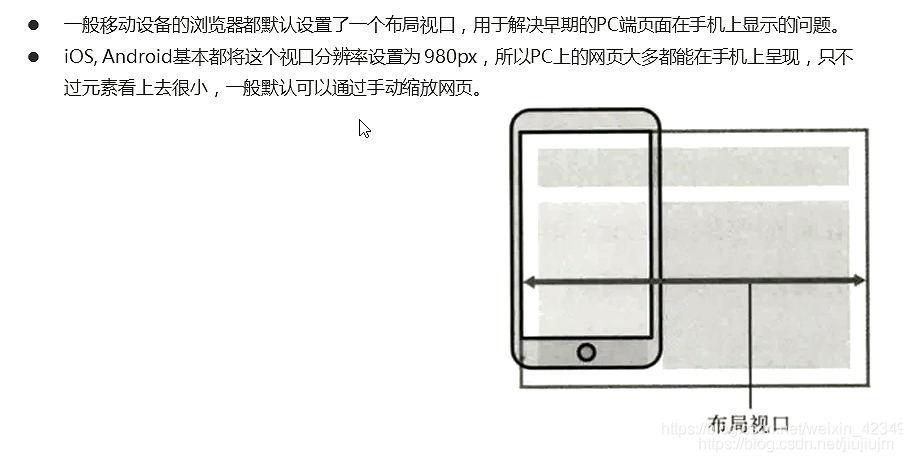
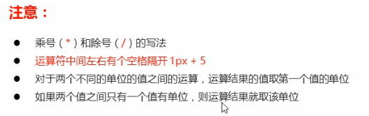

## 移动WEB开发之流式布局

## 01 移动端基础

### 1.1 浏览器现状

### 1.2 手机屏幕现状

## 02 视口

视口就是屏幕区域。

### 2.1 布局视口layout viewport



### 2.2 视觉视口visual viewport


### 2.3 理想视口 ideal viewport


### 2.5 meta视口标签


### 2.6 标准的viewport设置


```html
    <meta name="viewport" content="width=device-width,
     initial-scale=1.0,maximum-scale=1.0, minimum-scale=1.0, user-scalable=no">

```

## 03 二倍图

### 3.1 物理像素&物理像素比

物理像素就是屏幕分辨率  
  
  
原因如下  


### 3.2 多倍图


```html
<!DOCTYPE html>
<html lang="en">

<head>
    <meta charset="UTF-8">
    <meta name="viewport" content="width=device-width, initial-scale=1.0">
    <meta http-equiv="X-UA-Compatible" content="ie=edge">
    <title>Document</title>
    <style>
        /* 我们需要一个50*50像素（css像素）的图片 直接放到我们的iphone8 里面会放大2倍  100* 100 就会模糊 */
        /* 我们采取的是 放一个 100* 100 图片  然后手动的把这个图片 缩小为 50* 50 （css像素） */
        /* 我们准备的图片 比我们实际需要的大小 大2倍，这就方式就是 2倍图 */
        
        img:nth-child(2) {
            width: 50px;
            height: 50px;
        }
    </style>
</head>

<body>
    <!-- 模糊的 -->
    
    <!-- 我们采取2倍图 -->
    
</body>

</html>
```

### 3.3 背景缩放background-size

  
  
背景图片二倍图

```css
    <style>
        /* 1. 我们有一个 50 * 50的盒子需要一个背景图片，但是根据分析这个图片还是要准备2倍， 100*100 */
        /* 2. 我们需要把这个图片缩放一半，也就是 50*50  background-size*/
        
        div {
            width: 50px;
            height: 50px;
            border: 1px solid red;
            background: url(images/apple100.jpg) no-repeat;
            background-size: 50px 50px;
        }
    </style>
```

### 3.4 多倍图切图cutterman

切图可以使用ps的切图工具同时切出2倍图，三倍图。  
@3X 3倍图  
@2X 2倍图  
@1X 1倍图原图

## 04 移动端调试

### 4.2 单独移动端页面（主流）


### 4.3 响应式兼容PC端


### 4.4 总结


## 05 移动端技术解决方案

### 5.1 移动端浏览器

放心大胆使用h5c3。  


### 5.2 CSS初始化normalize.css

  
下载地址：http://necolas.github.io/normalize.css/

### 5.3 CSS3盒子模型 box-sizing

  


### 5.4 特殊样式


```css
   <style>
        a {
            /* 取消连接高亮/*  */ 
            -webkit-tap-highlight-color: transparent;
        }
        
        input {
            /* 取消默认外观 */
            -webkit-appearance: none;
        }
    </style>
```

## 06 移动端常见布局


### 6.1 流式布局（百分比布局）

  


```css
   <style>
        * {
            margin: 0;
            padding: 0;
        }
        
        section {
            width: 100%;
            max-width: 980px;
            min-width: 320px;
            margin: 0 auto;
        }
        
        section div {
            float: left;
            width: 50%;
            height: 400px;
        }
        
        section div:nth-child(1) {
            background-color: pink;
        }
        
        section div:nth-child(2) {
            background-color: purple;
        }
    </style>
</head>

<body>
    <section>
        <div></div>
        <div></div>
    </section>
</body>

```

## 07 移动端开发之流式布局

## 08 京东移动端首页制作

(D:\\黑马HTML\\CSS练习new\\京东移动端首页布局)

## 移动WEB开发之flex布局

## 01 flex布局体验

### 1.1 传统布局与flex布局


### 1.2 初体验

```html
<!DOCTYPE html>
<html lang="en">

<head>
    <meta charset="UTF-8">
    <meta name="viewport" content="width=device-width, initial-scale=1.0">
    <meta http-equiv="X-UA-Compatible" content="ie=edge">
    <title>Document</title>
    <style>
        div {
            display: flex;
            width: 80%;
            height: 300px;
            background-color: pink;
            justify-content: space-around;
        }
        
        div span {
            /* width: 150px; */
            height: 100px;
            background-color: purple;
            margin-right: 5px;
            flex: 1;
        }
    </style>
</head>

<body>
    <div>
        <span>1</span>
        <span>2</span>
        <span>3</span>
    </div>
</body>

</html>
```

## 02 flex布局原理

**结论：通过给父盒子设置flex的display属性，来控制子盒子的布局**  
一旦父盒子设置flex,子盒子就会变成block,可以设置宽高，有点类似于设置了float

### 2.1 布局原理

  


## 03 flex布局父项常见属性

### 3.1 常见父项属性


### 3.2 flex-direction设置主轴的方向 \*\*\*

  
  
默认的主轴是 x 轴 行 row 那么y轴就是侧轴喽  
我们的元素是跟着主轴来排列的

### 3.3 justify-content设置主轴上的子元素的排列方式\*\*\*


```css
/* 先两边贴边， 在分配剩余的空间 */
            justify-content: space-between;
```

### 3.4 flex-wrap设置子元素是否换行\*\*\*

flex布局中，默认的子元素是不换行的， 如果装不开，会缩小子元素的宽度，放到父元素里面  


### 3.5 align-items设置侧轴上的子元素排列方式（单行）\*\*\*


```css
/* 拉伸，但是子盒子不要给高度 */
            /* align-items: stretch; */
            /* 默认的主轴是 x 轴 row */
            flex-direction: column;
            justify-content: center;
            align-items: center;
```

### 3.6 align-content设置侧轴上的子元素排列方式（多行）


### 3.6 alight-content和alight-items区别


### 3.7 flex-flow


```css
/* flex-direction: column;
            flex-wrap: wrap; */
            /* 把设置主轴方向和是否换行（换列）简写 */
            flex-flow: column wrap;
```

## 04 flex布局子项常见属性

### 4.1 flex属性\*\*\*

  
值得注意的是，它是父盒子先设置：display:flex之后，子盒子再设置flex:所占份数。  
并且，谁设置了flex，谁就开始分配剩余空间，如果有多个子元素参与分配，则设置好分配的份数，它们自己会协调好谁多宽的。

```html
<!DOCTYPE html>
<html lang="en">

<head>
    <meta charset="UTF-8">
    <meta name="viewport" content="width=device-width, initial-scale=1.0">
    <meta http-equiv="X-UA-Compatible" content="ie=edge">
    <title>Document</title>
    <style>
        section {
            display: flex;
            width: 60%;
            height: 150px;
            background-color: pink;
            margin: 0 auto;
        }
        
        section div:nth-child(1) {
            width: 100px;
            height: 150px;
            background-color: red;
        }
        
        section div:nth-child(2) {
            flex: 1;
            background-color: green;
        }
        
        section div:nth-child(3) {
            width: 100px;
            height: 150px;
            background-color: blue;
        }
        
        p {
            display: flex;
            width: 60%;
            height: 150px;
            background-color: pink;
            margin: 100px auto;
        }
        
        p span {
            flex: 1;
        }
        
        p span:nth-child(2) {
            flex: 2;
            background-color: purple;
        }
    </style>
</head>

<body>
    <section>
        <div></div>
        <div></div>
        <div></div>
    </section>
    <p>
        <span>1</span>
        <span>2</span>
        <span>3</span>
    </p>
</body>

</html>
```

### 4.2 aligh-self控制子项自己在侧轴上的排列方式


```html
<!DOCTYPE html>
<html lang="en">

<head>
    <meta charset="UTF-8">
    <meta name="viewport" content="width=device-width, initial-scale=1.0">
    <meta http-equiv="X-UA-Compatible" content="ie=edge">
    <title>Document</title>
    <style>
        div {
            display: flex;
            width: 80%;
            height: 300px;
            background-color: pink;
            /* 让三个子盒子沿着侧轴底侧对齐 */
            /* align-items: flex-end; */
            /* 我们想只让3号盒子下来底侧 */
        }
        
        div span {
            width: 150px;
            height: 100px;
            background-color: purple;
            margin-right: 5px;
        }
        
        div span:nth-child(2) {
            /* 默认是0   -1比0小所以在前面 */
            order: -1;
        }
        
        div span:nth-child(3) {
            align-self: flex-end;
        }
    </style>
</head>

<body>
    <div>
        <span>1</span>
        <span>2</span>
        <span>3</span>
    </div>
</body>

</html>
```

### 4.3 order


## 05 携程网首页案例制作

### 5.1 常见flex布局思路


### 5.2 背景线性渐变


```css
    <style>
        div {
            width: 600px;
            height: 200px;
            /* 背景渐变必须添加浏览器私有前缀 */
            /* background: -webkit-linear-gradient(left, red, blue); */
            /* background: -webkit-linear-gradient(red, blue); */
            background: -webkit-linear-gradient(top left, red, blue);
        }
    </style>
```

## 移动WEB开发之rem布局

## 01 rem基础

1.em：长度单位，基准是父元素的font-size值大小。  
2.rem：长度单位，基准是html的font-size值大小。  
3.rem的优点就是可以通过修改html里面的文字大小  
来改变页面中元素的大小可以整体控制

## 02 媒体查询（Media Query）

### 2.1 什么是媒体查询

@media 可以针对不同的屏幕尺寸设置不同的样式

### 2.2 语法规范

  
  
  
  


### 2.3 媒体查询+rem可以实现元素的动态变化

```html
<!DOCTYPE html>
<html lang="en">

<head>
    <meta charset="UTF-8">
    <meta name="viewport" content="width=device-width, initial-scale=1.0">
    <meta http-equiv="X-UA-Compatible" content="ie=edge">
    <title>Document</title>
    <style>
        * {
            margin: 0;
            padding: 0;
        }
        /* html {
            font-size: 100px;
        } */
        /* 从小到大的顺序 */
        
        @media screen and (min-width: 320px) {
            html {
                font-size: 50px;
            }
        }
        
        @media screen and (min-width: 640px) {
            html {
                font-size: 100px;
            }
        }
        
        .top {
            height: 1rem;
            font-size: .5rem;
            background-color: green;
            color: #fff;
            text-align: center;
            line-height: 1rem;
        }
    </style>
</head>

<body>
    <div class="top">购物车</div>
</body>

</html>
```

### 2.4 引入资源（理解）

```
    /* 当我们屏幕大于等于 640px以上的，我们让div 一行显示2个 */
    /* 当我们屏幕小于640 我们让div一行显示一个 */
    /* 一个建议： 我们媒体查询最好的方法是从小到大 */
    /* 引入资源就是 针对于不同的屏幕尺寸 调用不同的css文件 */
```

```html
<!DOCTYPE html>
<html lang="en">

<head>
    <meta charset="UTF-8">
    <meta name="viewport" content="width=device-width, initial-scale=1.0">
    <meta http-equiv="X-UA-Compatible" content="ie=edge">
    <title>Document</title>
    <style>
        /* 当我们屏幕大于等于 640px以上的，我们让div 一行显示2个 */
        /* 当我们屏幕小于640 我们让div一行显示一个 */
        /* 一个建议： 我们媒体查询最好的方法是从小到大 */
        /* 引入资源就是 针对于不同的屏幕尺寸 调用不同的css文件 */
    </style>
    <link rel="stylesheet" href="style320.css" media="screen and (min-width: 320px)">
    <link rel="stylesheet" href="style640.css" media="screen and (min-width: 640px)">
</head>

<body>
    <div>1</div>
    <div>2</div>
</body>

</html>
```

## 03 Less基础

### 3.1 维护css的弊端


### 3.2 Less介绍


### 3.3 Less使用


### 3.4 Less变量

  
my.less

```less
// 定义一个粉色的变量
@color: pink;  
// 错误的变量名  @1color   @color~@#
// 变量名区分大小写  @color  和  @Color 是两个不同的变量
// 定义了一个 字体为14像素的变量
@font14: 14px;
body {
    background-color: @color;
}
div {
    color: @color;
    font-size: @font14;
}
a {
    font-size: @font14;
}
```

### 3.5 Less编译

  


### 3.6 Less嵌套

  


```less
.header {
    width: 200px;
    height: 200px;
    background-color: pink;
    // 1. less嵌套 子元素的样式直接写到父元素里面就好了
    a {
        color: red;
        // 2. 如果有伪类、交集选择器、 伪元素选择器 我们内层选择器的前面需要加&
        &:hover {
            color: blue;
        }
    }
}
.nav {
    .logo {
        color: green;
    }
    &::before {
        content: "";
    }
}
```

### 3.7 Less运算\*\*\*

  


```less
@baseFont: 50px;
html {
    font-size: @baseFont;
}
@border: 5px + 5;
div {
    width: 200px - 50;
    height: (200px + 50px ) * 2;
    border: @border solid red;
    background-color: #666 - #222;
}
img {
    width: 82rem / @baseFont;
    height: 82rem / @baseFont;
}
// 1. 我们运算符的左右两侧必须敲一个空格隔开
// 2. 两个数参与运算  如果只有一个数有单位，则最后的结果就以这个单位为准
// 3. 两个数参与运算，如果2个数都有单位，而且不一样的单位 最后的结果以第一个单位为准

```

## 04 rem适配方案

  


### 4.1 rem实际开发适配方案


### 4.2 rem适配方案技术使用（市场主流）


### 4.3 rem实际开发适配方案1

  
  


```html
<!DOCTYPE html>
<html lang="en">

<head>
    <meta charset="UTF-8">
    <meta name="viewport" content="width=device-width, initial-scale=1.0">
    <meta http-equiv="X-UA-Compatible" content="ie=edge">
    <title>Document</title>
    <style>
        @media screen and (min-width: 320px) {
            html {
                font-size: 21.33px;
            }
        }
        
        @media screen and (min-width: 750px) {
            html {
                font-size: 50px;
            }
        }
        
        div {
            width: 2rem;
            height: 2rem;
            background-color: pink;
        }
        /* 1. 首先我们选一套标准尺寸 750为准 
        2. 我们用屏幕尺寸 除以 我们划分的份数 得到了 html 里面的文字大小 但是我们知道不同屏幕下得到的文字大小是不一样的 */
        /* 3. 页面元素的rem值 =  页面元素在 750像素的下px值 / html 里面的文字大小 */
    </style>
</head>

<body>
    <div></div>
</body>

</html>
```

## 05 苏宁首页案例制作

(D:\\黑马HTML\\html\_css\_material\\rem案例\\H5)

## 06 rem适配方案2


### 6.1 简洁高效的rem适配方案flexible.js


### 6.2 使用适配方案2制作苏宁移动端首页

（D:\\黑马HTML\\html\_css\_material\\rem案例\\html5）

### 6.3 vscode px转换rem 插件cssrem

## 移动WEB开发之响应式布局

## 01 响应式开发

### 1.1 响应式开发原理


### 1.2 响应式布局容器


## 02 Bootstrap前端开发框架

### 2.1 Bootstrap简介

  
1、优点  
  
2、版本  


### 2.2 Bootstrap使用

  
  
  


### 2.3 布局容器


## 03 Bootstrap栅格系统

### 3.1 栅格系统简介


### 3.2 栅格选项参数


```html
        <!-- 如果孩子的份数相加等于12 则孩子能占满整个 的container 的宽度 -->
        <div class="row">
            <div class="col-lg-6">1</div>
            <div class="col-lg-2">2</div>
            <div class="col-lg-2">3</div>
            <div class="col-lg-2">4</div>
        </div>
        <!-- 如果孩子的份数相加 小于 12 则会？ 则占不满整个container 的宽度 会有空白 -->
        <div class="row">
            <div class="col-lg-6">1</div>
            <div class="col-lg-2">2</div>
            <div class="col-lg-2">3</div>
            <div class="col-lg-1">4</div>
        </div>
        <!-- 如果孩子的份数相加 大于 12 则会？多于的那一列会 另起一行显示  -->

        <div class="row">
            <div class="col-lg-6">1</div>
            <div class="col-lg-2">2</div>
            <div class="col-lg-2">3</div>
            <div class="col-lg-3">4</div>
        </div>

```

### 3.3 列嵌套

  
我们列嵌套最好加1个行 row 这样可以取消父元素的padding值  
而且高度自动和父级一样高

```html
<body>
    <div class="container">
        <div class="row">
            <div class="col-md-4">
                <!-- 我们列嵌套最好加1个行 row 这样可以取消父元素的padding值 而且高度自动和父级一样高 -->
                <div class="row">
                    <div class="col-md-4">a</div>
                    <div class="col-md-8">b</div>
                </div>
            </div>
            <div class="col-md-4">2</div>
            <div class="col-md-4">3</div>
        </div>
    </div>
</body>

```

### 3.4 列偏移


```html
<body>
    <div class="container">
        <div class="row">
            <div class="col-md-3">左侧</div>
            <!-- 偏移的份数 就是 12 - 两个盒子的份数 = 6 -->
            <div class="col-md-3 col-md-offset-6">右侧</div>
        </div>
        <div class="row">
            <!-- 如果只有一个盒子 那么就偏移 = (12 - 8) /2 -->
            <div class="col-md-8 col-md-offset-2">中间盒子</div>
        </div>

    </div>
</body>
```

### 3.5 列排序


```html
    <style>
        .row div {
            height: 50px;
            background-color: pink;
        }
    </style>
</head>

<body>
    <div class="container">
        <div class="row">
            <div class="col-md-4 col-md-push-8">左侧</div>
            <div class="col-md-8 col-md-pull-4">右侧</div>
        </div>
    </div>
</body>
```

### 3.6 响应式工具


```html
<body>
    <div class="container">
        <div class="row">
            <div class="col-xs-3">
                <span class="visible-lg">我会显示哦</span>
            </div>
            <div class="col-xs-3">2</div>
            <div class="col-xs-3 hidden-md hidden-xs">我会变魔术哦</div>
            <div class="col-xs-3">4</div>
        </div>

    </div>
</body>
```

## 04 阿里百秀首页案例

（D:\\黑马HTML\\CSS练习new\\响应式布局\\alibaixiu）