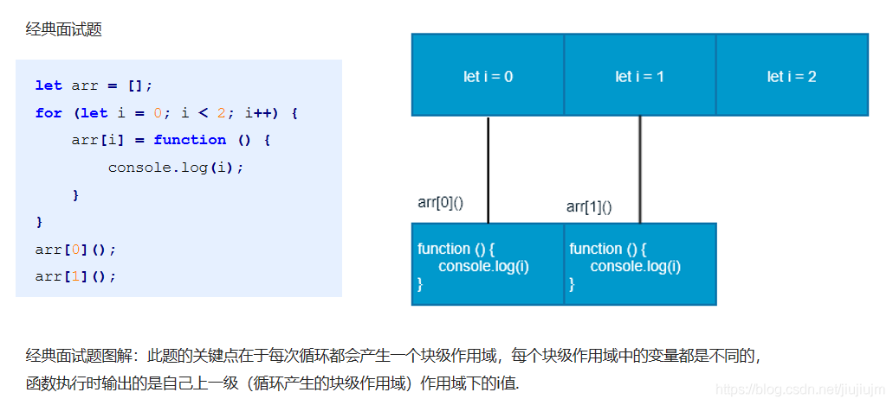
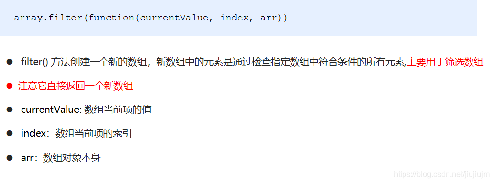
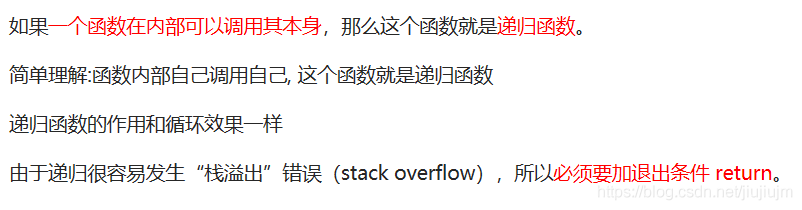

## JavaScript[面向对象](https://so.csdn.net/so/search?q=%E9%9D%A2%E5%90%91%E5%AF%B9%E8%B1%A1&spm=1001.2101.3001.7020)编程

## 01 面向对象编程介绍

### 1.1 两大编程思想

[面向过程](https://so.csdn.net/so/search?q=%E9%9D%A2%E5%90%91%E8%BF%87%E7%A8%8B&spm=1001.2101.3001.7020)  
面向对象

### 1.2 面向过程编程 POP(Process-oriented programming)

面向过程，就是按照我们分析好了的步骤，按照步骤解决问题。  


### 1.3 面向对象编程 OOP (Object Oriented Programming)

面向对象是以对象功能来划分问题，而不是步骤。  
  


### 1.4 面向过程和面向对象的对比


## 02 [ES6](https://so.csdn.net/so/search?q=ES6&spm=1001.2101.3001.7020)中的类和对象

### 2.1 对象


### 2.2 类class

  


### 2.3 创建类


### 2.4 类constructor构造函数


```html
<body>
    <script>
        // 1. 创建类 class  创建一个 明星类
        class Star {
            constructor(uname, age) {
                this.uname = uname;
                this.age = age;
            }
        }

        // 2. 利用类创建对象 new
        var ldh = new Star('刘德华', 18);
        var zxy = new Star('张学友', 20);
        console.log(ldh);
        console.log(zxy);
        //(1) 通过class 关键字创建类, 类名我们还是习惯性定义首字母大写
        //(2) 类里面有个constructor 函数,可以接受传递过来的参数,同时返回实例对象
        //(3) constructor 函数 只要 new 生成实例时,就会自动调用这个函数, 如果我们不写这个函数,类也会自动生成这个函数
        //(4) 生成实例 new 不能省略
        //(5) 最后注意语法规范, 创建类 类名后面不要加小括号,生成实例 类名后面加小括号, 构造函数不需要加function
    </script>
</body>

```

### 2.5 类添加方法


```html
<body>
    <script>
        // 1. 创建类 class  创建一个 明星类
        class Star {
            // 类的共有属性放到 constructor 里面
            constructor(uname, age) {
                this.uname = uname;
                this.age = age;
            }
            sing(song) {
                // console.log('我唱歌');
                console.log(this.uname + song);

            }
        }

        // 2. 利用类创建对象 new
        var ldh = new Star('刘德华', 18);
        var zxy = new Star('张学友', 20);
        console.log(ldh);
        console.log(zxy);
        // (1) 我们类里面所有的函数不需要写function 
        //(2) 多个函数方法之间不需要添加逗号分隔
        ldh.sing('冰雨');
        zxy.sing('李香兰');
    </script>
</body>
```

## 03 类的继承

### 3.1 继承


### 3.2 super关键字


```html
<script>
        class Father {
            constructor(x, y) {
                this.x = x;
                this.y = y;
            }
            sum() {
                console.log(this.x + this.y);

            }
        }
        class Son extends Father {
            constructor(x, y) {
                super(x, y); //调用了父类中的构造函数
            }
        }
        var son = new Son(1, 2);
        var son1 = new Son(11, 22);
        son.sum();
        son1.sum();
</script>
```

  
继承中的属性或者方法查找原则: 就近原则  
1 继承中,如果实例化子类输出一个方法,先看子类有没有这个方法,如果有就先执行子类的  
2\. 继承中,如果子类里面没有,就去查找父类有没有这个方法,如果有,就执行父类的这个方法(就近原则)

```html
    <script>
        // super 关键字调用父类普通函数
        class Father {
            say() {
                return '我是爸爸';
            }
        }
        class Son extends Father {
            say() {
                // console.log('我是儿子');
                console.log(super.say() + '的儿子');
                // super.say() 就是调用父类中的普通函数 say()
            }
        }
        var son = new Son();
        son.say();
        // 继承中的属性或者方法查找原则: 就近原则
        // 1. 继承中,如果实例化子类输出一个方法,先看子类有没有这个方法,如果有就先执行子类的
        // 2. 继承中,如果子类里面没有,就去查找父类有没有这个方法,如果有,就执行父类的这个方法(就近原则)
    </script>
```

super 必须在子类this之前调用

```html
    <script>
        // 父类有加法方法
        class Father {
            constructor(x, y) {
                this.x = x;
                this.y = y;
            }
            sum() {
                console.log(this.x + this.y);
            }
        }
        // 子类继承父类加法方法 同时 扩展减法方法
        class Son extends Father {
            constructor(x, y) {
                // 利用super 调用父类的构造函数
                // super 必须在子类this之前调用
                super(x, y);
                this.x = x;
                this.y = y;

            }
            subtract() {
                console.log(this.x - this.y);

            }
        }
        var son = new Son(5, 3);
        son.subtract();
        son.sum();
    </script>
```


```html
<body>
    <button>点击</button>
    <script>
        var that;
        var _that;
        class Star {
            constructor(uname, age) {
                // constructor 里面的this 指向的是 创建的实例对象
                that = this;
                console.log(this);

                this.uname = uname;
                this.age = age;
                // this.sing();
                this.btn = document.querySelector('button');
                this.btn.onclick = this.sing;
            }
            sing() {
                // 这个sing方法里面的this 指向的是 btn 这个按钮,因为这个按钮调用了这个函数
                console.log(this);

                console.log(that.uname); // that里面存储的是constructor里面的this
            }
            dance() {
                // 这个dance里面的this 指向的是实例对象 ldh 因为ldh 调用了这个函数
                _that = this;
                console.log(this);

            }
        }

        var ldh = new Star('刘德华');
        console.log(that === ldh);
        ldh.dance();
        console.log(_that === ldh);

        // 1. 在 ES6 中类没有变量提升，所以必须先定义类，才能通过类实例化对象

        // 2. 类里面的共有的属性和方法一定要加this使用.
    </script>
</body>
```

## 04 面向对象案例

(D:\\前端学习\\黑马JavaScript\\ja-vaScript进阶面向对象ES6资料\\JavaScript高级\\JavaScript 高级第一天\\code\\07-面向对象案例)

## 构造函数和原型

## 01 构造函数和原型

### 1.1 概述


```html
<body>
    <script>
        // 1. 利用 new Object() 创建对象

        var obj1 = new Object();

        // 2. 利用 对象字面量创建对象

        var obj2 = {};

        // 3. 利用构造函数创建对象
        function Star(uname, age) {
            this.uname = uname;
            this.age = age;
            this.sing = function() {
                console.log('我会唱歌');

            }
        }

        var ldh = new Star('刘德华', 18);
        var zxy = new Star('张学友', 19);
        console.log(ldh);
        ldh.sing();
        zxy.sing();
    </script>
</body>
```

### 1.2 构造函数

  
  


```html
<body>
    <script>
        // 构造函数中的属性和方法我们称为成员, 成员可以添加
        function Star(uname, age) {
            this.uname = uname;
            this.age = age;
            this.sing = function() {
                console.log('我会唱歌');

            }
        }
        var ldh = new Star('刘德华', 18);
        // 1.实例成员就是构造函数内部通过this添加的成员 uname age sing 就是实例成员
        // 实例成员只能通过实例化的对象来访问
        console.log(ldh.uname);
        ldh.sing();
        // console.log(Star.uname); // 不可以通过构造函数来访问实例成员
        // 2. 静态成员 在构造函数本身上添加的成员  sex 就是静态成员
        Star.sex = '男';
        // 静态成员只能通过构造函数来访问
        console.log(Star.sex);
        console.log(ldh.sex); // 不能通过对象来访问
    </script>
</body>
```

### 1.3 构造函数的问题


### 1.4 构造函数原型prototype

  
一般情况下,我们的公共属性定义到构造函数里面, 公共的方法我们放到原型对象身上

```html
<body>
    <script>
        // 1. 构造函数的问题. 
        function Star(uname, age) {
            this.uname = uname;
            this.age = age;
            // this.sing = function() {
            //     console.log('我会唱歌');

            // }
        }
        Star.prototype.sing = function() {
            console.log('我会唱歌');
        }
        var ldh = new Star('刘德华', 18);
        var zxy = new Star('张学友', 19);
        console.log(ldh.sing === zxy.sing);
        // console.dir(Star);
        ldh.sing();
        zxy.sing();
        // 2. 一般情况下,我们的公共属性定义到构造函数里面, 公共的方法我们放到原型对象身上
    </script>
</body>
```

### 1.5 对象原型\_\_proto\_\_



```html
<body>
    <script>
        function Star(uname, age) {
            this.uname = uname;
            this.age = age;
        }
        Star.prototype.sing = function() {
            console.log('我会唱歌');
        }
        var ldh = new Star('刘德华', 18);
        var zxy = new Star('张学友', 19);
        ldh.sing();
        console.log(ldh); // 对象身上系统自己添加一个 __proto__ 指向我们构造函数的原型对象 prototype
        console.log(ldh.__proto__ === Star.prototype);
        // 方法的查找规则: 首先先看ldh 对象身上是否有 sing 方法,如果有就执行这个对象上的sing
        // 如果么有sing 这个方法,因为有__proto__ 的存在,就去构造函数原型对象prototype身上去查找sing这个方法
    </script>
</body>

```

### 1.6 constructor构造函数

  
Star.prototype = {  
constructor: Star,  
// 如果我们修改了原来的原型对象,给原型对象赋值的是一个对象,则必须手动的利用constructor指回原来的构造函数

```html
    <script>
        function Star(uname, age) {
            this.uname = uname;
            this.age = age;
        }
        // 很多情况下,我们需要手动的利用constructor 这个属性指回 原来的构造函数
        // Star.prototype.sing = function() {
        //     console.log('我会唱歌');
        // };
        // Star.prototype.movie = function() {
        //     console.log('我会演电影');
        // }
        Star.prototype = {
            // 如果我们修改了原来的原型对象,给原型对象赋值的是一个对象,则必须手动的利用constructor指回原来的构造函数
            constructor: Star,
            sing: function() {
                console.log('我会唱歌');
            },
            movie: function() {
                console.log('我会演电影');
            }
        }
        var ldh = new Star('刘德华', 18);
        var zxy = new Star('张学友', 19);
        console.log(Star.prototype);
        console.log(ldh.__proto__);
        console.log(Star.prototype.constructor);
        console.log(ldh.__proto__.constructor);
    </script>
```

### 1.7 构造函数、实例、原型对象三者之间的关系


### 1.8 原型链


```html
<body>
    <script>
        function Star(uname, age) {
            this.uname = uname;
            this.age = age;
        }
        Star.prototype.sing = function() {
            console.log('我会唱歌');
        }
        var ldh = new Star('刘德华', 18);
        // 1. 只要是对象就有__proto__ 原型, 指向原型对象
        console.log(Star.prototype);
        console.log(Star.prototype.__proto__ === Object.prototype);
        // 2.我们Star原型对象里面的__proto__原型指向的是 Object.prototype
        console.log(Object.prototype.__proto__);
        // 3. 我们Object.prototype原型对象里面的__proto__原型  指向为 null
    </script>
</body>
```

### 1.9 JavaScript 的成员查找机制(规则)


```html
<body>
    <script>
        function Star(uname, age) {
            this.uname = uname;
            this.age = age;
        }
        Star.prototype.sing = function() {
            console.log('我会唱歌');

        }
        Star.prototype.sex = '女';
        // Object.prototype.sex = '男';
        var ldh = new Star('刘德华', 18);
        ldh.sex = '男';
        console.log(ldh.sex);
        console.log(Object.prototype);
        console.log(ldh);
        console.log(Star.prototype);
        console.log(ldh.toString());
    </script>
</body>
```

### 1.10 原型对象this指向


```html
<body>
    <script>
        function Star(uname, age) {
            this.uname = uname;
            this.age = age;
        }
        var that;
        Star.prototype.sing = function() {
            console.log('我会唱歌');
            that = this;
        }
        var ldh = new Star('刘德华', 18);
        // 1. 在构造函数中,里面this指向的是对象实例 ldh
        ldh.sing();
        console.log(that === ldh);

        // 2.原型对象函数里面的this 指向的是 实例对象 ldh
    </script>
</body>
```

### 1.11 扩展内置对象


```html
<body>
    <script>
        // 原型对象的应用 扩展内置对象方法

        Array.prototype.sum = function() {
            var sum = 0;
            for (var i = 0; i < this.length; i++) {
                sum += this[i];
            }
            return sum;
        };
        // Array.prototype = {
        //     sum: function() {
        //         var sum = 0;
        //         for (var i = 0; i < this.length; i++) {
        //             sum += this[i];
        //         }
        //         return sum;
        //     }

        // }
        var arr = [1, 2, 3];
        console.log(arr.sum());
        console.log(Array.prototype);
        var arr1 = new Array(11, 22, 33);
        console.log(arr1.sum());
    </script>
</body>
```

## 02 继承

ES6之前并没有给我们提供 extends 继承。我们可以通过构造函数+原型对象模拟实现继承，被称为组合继承。

### 2.1 call（）


1.  call() 可以调用函数  
    fn.call();
2.  call() 可以改变这个函数的this指向 此时这个函数的this 就指向了o这个对象

```html
<body>
    <script>
        // call 方法
        function fn(x, y) {
            console.log('我想喝手磨咖啡');
            console.log(this);
            console.log(x + y);


        }
        var o = {
            name: 'andy'
        };
        // fn();
        // 1. call() 可以调用函数
        // fn.call();
        // 2. call() 可以改变这个函数的this指向 此时这个函数的this 就指向了o这个对象
        fn.call(o, 1, 2);
    </script>
</body>
```

### 2.2 借用构造函数继承父类型属性

核心原理： 通过 call() 把父类型的 this 指向子类型的 this ，这样就可以实现子类型继承父类型的属性。

```html
<body>
    <script>
        // 借用父构造函数继承属性
        // 1. 父构造函数
        function Father(uname, age) {
            // this 指向父构造函数的对象实例
            this.uname = uname;
            this.age = age;
        }
        // 2 .子构造函数 
        function Son(uname, age, score) {
            // this 指向子构造函数的对象实例
            Father.call(this, uname, age);
            this.score = score;
        }
        var son = new Son('刘德华', 18, 100);
        console.log(son);
    </script>
</body>

```

### 2.3 借用原型对象继承父类型方法

  
// 如果利用对象的形式修改了原型对象,别忘了利用constructor 指回原来的构造函数  
Son.prototype = new Father();  
Son.prototype.constructor = Son;

```html
<body>
    <script>
        // 借用父构造函数继承属性
        // 1. 父构造函数
        function Father(uname, age) {
            // this 指向父构造函数的对象实例
            this.uname = uname;
            this.age = age;
        }
        Father.prototype.money = function() {
            console.log(100000);

        };
        // 2 .子构造函数 
        function Son(uname, age, score) {
            // this 指向子构造函数的对象实例
            Father.call(this, uname, age);
            this.score = score;
        }
        // Son.prototype = Father.prototype;  这样直接赋值会有问题,如果修改了子原型对象,父原型对象也会跟着一起变化
        Son.prototype = new Father();
        // 如果利用对象的形式修改了原型对象,别忘了利用constructor 指回原来的构造函数
        Son.prototype.constructor = Son;
        // 这个是子构造函数专门的方法
        Son.prototype.exam = function() {
            console.log('孩子要考试');

        }
        var son = new Son('刘德华', 18, 100);
        console.log(son);
        console.log(Father.prototype);
        console.log(Son.prototype.constructor);
    </script>
</body>
```

### 2.4 类的本质


```html
<body>
    <script>
        // ES6 之前通过 构造函数+ 原型实现面向对象 编程
        // (1) 构造函数有原型对象prototype 
        // (2) 构造函数原型对象prototype 里面有constructor 指向构造函数本身
        // (3) 构造函数可以通过原型对象添加方法
        // (4) 构造函数创建的实例对象有__proto__ 原型指向 构造函数的原型对象
        // ES6 通过 类 实现面向对象编程 
        class Star {

        }
        console.log(typeof Star);
        // 1. 类的本质其实还是一个函数 我们也可以简单的认为 类就是 构造函数的另外一种写法
        // (1) 类有原型对象prototype 
        console.log(Star.prototype);
        // (2) 类原型对象prototype 里面有constructor 指向类本身
        console.log(Star.prototype.constructor);
        // (3)类可以通过原型对象添加方法
        Star.prototype.sing = function() {
            console.log('冰雨');

        }
        var ldh = new Star();
        console.dir(ldh);
        // (4) 类创建的实例对象有__proto__ 原型指向 类的原型对象
        console.log(ldh.__proto__ === Star.prototype);
        i = i + 1;
        i++
    </script>
</body>
```

## 03 ES5中的新增方法

### 3.1 ES5 新增方法概述

ES5 中给我们新增了一些方法，可以很方便的操作数组或者字符串，这些方法主要包括：  
1、数组方法  
2、字符串方法  
3、对象方法

### 3.2 数组方法

迭代(遍历)方法：forEach()、map()、filter()、some()、every()；

**forEach()** 迭代(遍历) 数组  


```html
<body>
    <script>
        // forEach 迭代(遍历) 数组
        var arr = [1, 2, 3];
        var sum = 0;
        arr.forEach(function(value, index, array) {
            console.log('每个数组元素' + value);
            console.log('每个数组元素的索引号' + index);
            console.log('数组本身' + array);
            sum += value;
        })
        console.log(sum);
    </script>
</body>
```

**filter()** 筛选数组  


```html
<body>
    <script>
        // filter 筛选数组
        var arr = [12, 66, 4, 88, 3, 7];
        var newArr = arr.filter(function(value, index) {
            // return value >= 20;
            return value % 2 === 0;
        });
        console.log(newArr);
    </script>
</body>

```

**some()** 查找数组中是否有满足条件的元素  


```html
<body>
    <script>
        // some 查找数组中是否有满足条件的元素 
        // var arr = [10, 30, 4];
        // var flag = arr.some(function(value) {
        //     // return value >= 20;
        //     return value < 3;
        // });
        // console.log(flag);
        var arr1 = ['red', 'pink', 'blue'];
        var flag1 = arr1.some(function(value) {
            return value == 'pink';
        });
        console.log(flag1);
        // 1. filter 也是查找满足条件的元素 返回的是一个数组 而且是把所有满足条件的元素返回回来
        // 2. some 也是查找满足条件的元素是否存在  返回的是一个布尔值 如果查找到第一个满足条件的元素就终止循环
    </script>
</body>
```

1.  filter 也是查找满足条件的元素 返回的是一个数组 而且是把所有满足条件的元素返回回来
2.  some 也是查找满足条件的元素是否存在 返回的是一个布尔值 如果查找到第一个满足条件的元素就终止循环

查询商品案例  
（D:\\前端学习\\黑马JavaScript\\ja-vaScript进阶面向对象ES6资料\\JavaScript高级\\JavaScript 高级第二天\\code\\17）

```html
<body>
    <div class="search">
        按照价格查询: <input type="text" class="start"> - <input type="text" class="end"> <button class="search-price">搜索</button> 按照商品名称查询: <input type="text" class="product"> <button class="search-pro">查询</button>
    </div>
    <table>
        <thead>
            <tr>
                <th>id</th>
                <th>产品名称</th>
                <th>价格</th>
            </tr>
        </thead>
        <tbody>


        </tbody>
    </table>
    <script>
        // 利用新增数组方法操作数据
        var data = [{
            id: 1,
            pname: '小米',
            price: 3999
        }, {
            id: 2,
            pname: 'oppo',
            price: 999
        }, {
            id: 3,
            pname: '荣耀',
            price: 1299
        }, {
            id: 4,
            pname: '华为',
            price: 1999
        }, ];
        // 1. 获取相应的元素
        var tbody = document.querySelector('tbody');
        var search_price = document.querySelector('.search-price');
        var start = document.querySelector('.start');
        var end = document.querySelector('.end');
        var product = document.querySelector('.product');
        var search_pro = document.querySelector('.search-pro');
        setDate(data);
        // 2. 把数据渲染到页面中
        function setDate(mydata) {
            // 先清空原来tbody 里面的数据
            tbody.innerHTML = '';
            mydata.forEach(function(value) {
                // console.log(value);
                var tr = document.createElement('tr');
                tr.innerHTML = '<td>' + value.id + '</td><td>' + value.pname + '</td><td>' + value.price + '</td>';
                tbody.appendChild(tr);
            });
        }

        // 3. 根据价格查询商品
        // 当我们点击了按钮,就可以根据我们的商品价格去筛选数组里面的对象
        search_price.addEventListener('click', function() {
            // alert(11);
            var newDate = data.filter(function(value) {
                return value.price >= start.value && value.price <= end.value;
            });
            console.log(newDate);
            // 把筛选完之后的对象渲染到页面中
            setDate(newDate);
        });
        // 4. 根据商品名称查找商品
        // 如果查询数组中唯一的元素, 用some方法更合适,因为它找到这个元素,就不在进行循环,效率更高]
        search_pro.addEventListener('click', function() {
            var arr = [];
            data.some(function(value) {
                if (value.pname === product.value) {
                    // console.log(value);
                    arr.push(value);
                    return true; // return 后面必须写true  
                }
            });
            // 把拿到的数据渲染到页面中
            setDate(arr);
        })
    </script>
</body>

```

如果查询数组中唯一的元素, 用some方法更合适,因为它找到这个元素,就不在进行循环,效率更高

```html
<body>
    <script>
        var arr = ['red', 'green', 'blue', 'pink'];
        // 1. forEach迭代 遍历
        // arr.forEach(function(value) {
        //     if (value == 'green') {
        //         console.log('找到了该元素');
        //         return true; // 在forEach 里面 return 不会终止迭代
        //     }
        //     console.log(11);

        // })
        // 如果查询数组中唯一的元素, 用some方法更合适,
        arr.some(function(value) {
            if (value == 'green') {
                console.log('找到了该元素');
                return true; //  在some 里面 遇到 return true 就是终止遍历 迭代效率更高
            }
            console.log(11);

        });
        // arr.filter(function(value) {
        //     if (value == 'green') {
        //         console.log('找到了该元素');
        //         return true; //  // filter 里面 return 不会终止迭代
        //     }
        //     console.log(11);

        // });
    </script>
</body>

```

在forEach 里面 return 不会终止迭代  
在some 里面 遇到 return true 就是终止遍历 迭代效率更高  
filter 里面 return 不会终止迭代

### 3.3 字符串方法


```html
<body>
    <input type="text"> <button>点击</button>
    <div></div>
    <script>
        // trim 方法去除字符串两侧空格
        var str = '   an  dy   ';
        console.log(str);
        var str1 = str.trim();
        console.log(str1);
        
        var input = document.querySelector('input');
        var btn = document.querySelector('button');
        var div = document.querySelector('div');
        btn.onclick = function() {
            var str = input.value.trim();
            if (str === '') {
                alert('请输入内容');
            } else {
                console.log(str);
                console.log(str.length);
                div.innerHTML = str;
            }
        }
    </script>
</body>
```

### 3.4 对象方法


```html
<body>
    <script>
        // 用于获取对象自身所有的属性
        var obj = {
            id: 1,
            pname: '小米',
            price: 1999,
            num: 2000
        };
        var arr = Object.keys(obj);
        console.log(arr);
        arr.forEach(function(value) {
            console.log(value);

        })
    </script>
</body>
```

  


```html
 Object.defineProperty(obj, 'address', {
            value: '中国山东蓝翔技校xx单元',
            // 如果只为false 不允许修改这个属性值 默认值也是false
            writable: false,
            // enumerable 如果值为false 则不允许遍历, 默认的值是 false
            enumerable: false,
            // configurable 如果为false 则不允许删除这个属性 不允许在修改第三个参数里面的特性 默认为false
            configurable: false
        });
```

## 函数进阶

## 01 函数的定义和调用

### 1.1 函数的定义方式

  


```html
<body>
    <script>
        //  函数的定义方式

        // 1. 自定义函数(命名函数) 

        function fn() {};

        // 2. 函数表达式 (匿名函数)

        var fun = function() {};


        // 3. 利用 new Function('参数1','参数2', '函数体');

        var f = new Function('a', 'b', 'console.log(a + b)');
        f(1, 2);
        // 4. 所有函数都是 Function 的实例(对象)
        console.dir(f);
        // 5. 函数也属于对象
        console.log(f instanceof Object);
    </script>
</body>
```

### 1.2 函数的调用

1.  普通函数  
    this指向window

```html
<script>
 function fn() {
        console.log('人生的巅峰');

    }
    fn();   
    //fn.call()
</script>
```

2.  对象的方法  
    this指向对象o

```javascript
 var o = {
        sayHi: function() {
            console.log('人生的巅峰');
         }
    }
    o.sayHi();
```

3.  构造函数 this指向ldh这个实例对象  
    原型对象里的this也指向ldh这个实例对象

```javascript
  function Star() {};
  var ldh = new Star();
  Star.prototype.sing = function() {

        }
```

4.  绑定事件函数 指向调用者 btn这个按钮对象

```javascript
btn.onclick = function() {};   // 点击了按钮就可以调用这个函数
```

5.  定时器函数 this指向的是window对象

```
 window.setInterval(function() {}, 1000);  这个函数是定时器自动1秒钟调用一次
```

6.  立即执行函数 this指向window

```javascript
  (function() {
        console.log('人生的巅峰');
    })();
    // 立即执行函数是自动调用
```

## 02 this

### 2.1 函数内this的指向

（见1.2 ）  


```javascript
    <script>
        // 函数的不同调用方式决定了this 的指向不同
        // 1. 普通函数 this 指向window
        function fn() {
            console.log('普通函数的this' + this);
        }
        window.fn();
        // 2. 对象的方法 this指向的是对象 o
        var o = {
            sayHi: function() {
                console.log('对象方法的this:' + this);
            }
        }
        o.sayHi();
        // 3. 构造函数 this 指向 ldh 这个实例对象 原型对象里面的this 指向的也是 ldh这个实例对象
        function Star() {};
        Star.prototype.sing = function() {

        }
        var ldh = new Star();
        // 4. 绑定事件函数 this 指向的是函数的调用者 btn这个按钮对象
        var btn = document.querySelector('button');
        btn.onclick = function() {
            console.log('绑定时间函数的this:' + this);
        };
        // 5. 定时器函数 this 指向的也是window
        window.setTimeout(function() {
            console.log('定时器的this:' + this);

        }, 1000);
        // 6. 立即执行函数 this还是指向window
        (function() {
            console.log('立即执行函数的this' + this);
        })();
    </script>
</body>
```

### 2.1 改变函数内部this的指向

JavaScript 为我们专门提供了一些函数方法来帮我们更优雅的处理函数内部 this 的指向问题，常用的有 bind()、call()、apply() 三种方法。  
  
call 第一个可以调用函数 第二个可以改变函数内的this 指向  
call 的主要作用可以实现继承 Father.call(this, uname, age, sex);

```javascript
    <script>
        // 改变函数内this指向  js提供了三种方法  call()  apply()  bind()

        // 1. call()
        var o = {
            name: 'andy'
        }

        function fn(a, b) {
            console.log(this);
            console.log(a + b);

        };
        fn.call(o, 1, 2);
        // call 第一个可以调用函数 第二个可以改变函数内的this 指向
        // call 的主要作用可以实现继承
        function Father(uname, age, sex) {
            this.uname = uname;
            this.age = age;
            this.sex = sex;
        }

        function Son(uname, age, sex) {
            Father.call(this, uname, age, sex);
        }
        var son = new Son('刘德华', 18, '男');
        console.log(son);
    </script>
```


1.  也是调用函数 第二个可以改变函数内部的this指向
2.  但是他的参数必须是数组(伪数组)
3.  apply 的主要应用 比如说我们可以利用 apply 借助于数学内置对象求数组最大值  
    // Math.max();

```javascript
    <script>
        // 改变函数内this指向  js提供了三种方法  call()  apply()  bind()

        // 2. apply()  应用 运用的意思
        var o = {
            name: 'andy'
        };

        function fn(arr) {
            console.log(this);
            console.log(arr); // 'pink'

        };
        fn.apply(o, ['pink']);
        // 1. 也是调用函数 第二个可以改变函数内部的this指向
        // 2. 但是他的参数必须是数组(伪数组)
        // 3. apply 的主要应用 比如说我们可以利用 apply 借助于数学内置对象求数组最大值 
        // Math.max();
        var arr = [1, 66, 3, 99, 4];
        var arr1 = ['red', 'pink'];
        // var max = Math.max.apply(null, arr);
        var max = Math.max.apply(Math, arr);
        var min = Math.min.apply(Math, arr);
        console.log(max, min);
    </script>
```


1.  不会调用原来的函数 可以改变原来函数内部的this 指向
2.  返回的是原函数改变this之后产生的新函数
3.  如果有的函数我们不需要立即调用,但是又想改变这个函数内部的this指向此时用bind
4.  我们有一个按钮,当我们点击了之后,就禁用这个按钮,3秒钟之后开启这个按钮  
    var btn1 = document.querySelector(‘button’);  
    btn1.onclick = function() {  
    this.disabled = true; // 这个this 指向的是 btn 这个按钮  
    // var that = this;  
    setTimeout(function() {  
    // that.disabled = false; // 定时器函数里面的this 指向的是window  
    this.disabled = false; // 此时定时器函数里面的this 指向的是btn  
    }.bind(this), 3000); // 这个this 指向的是btn 这个对象  
    }

```javascript
<body>
    <button>点击</button>
    <button>点击</button>
    <button>点击</button>
    <script>
        // 改变函数内this指向  js提供了三种方法  call()  apply()  bind()

        // 3. bind()  绑定 捆绑的意思
        var o = {
            name: 'andy'
        };

        function fn(a, b) {
            console.log(this);
            console.log(a + b);


        };
        var f = fn.bind(o, 1, 2);
        f();
        // 1. 不会调用原来的函数   可以改变原来函数内部的this 指向
        // 2. 返回的是原函数改变this之后产生的新函数
        // 3. 如果有的函数我们不需要立即调用,但是又想改变这个函数内部的this指向此时用bind
        // 4. 我们有一个按钮,当我们点击了之后,就禁用这个按钮,3秒钟之后开启这个按钮
        // var btn1 = document.querySelector('button');
        // btn1.onclick = function() {
        //     this.disabled = true; // 这个this 指向的是 btn 这个按钮
        //     // var that = this;
        //     setTimeout(function() {
        //         // that.disabled = false; // 定时器函数里面的this 指向的是window
        //         this.disabled = false; // 此时定时器函数里面的this 指向的是btn
        //     }.bind(this), 3000); // 这个this 指向的是btn 这个对象
        // }
        var btns = document.querySelectorAll('button');
        for (var i = 0; i < btns.length; i++) {
            btns[i].onclick = function() {
                this.disabled = true;
                setTimeout(function() {
                    this.disabled = false;
                }.bind(this), 2000);
            }
        }
    </script>
</body>
```

### 2.2 call apply bind 总结


## 03 严格模式

### 3.1 什么是严格模式


### 3.2 开启严格模式

严格模式可以应用到整个脚本或个别函数中。因此在使用时，我们可以将严格模式分为为脚本开启严格模式和为函数开启严格模式两种情况。  
  
  


```javascript
<body>
    <!-- 为整个脚本(script标签)开启严格模式 -->
    <script>
        'use strict';
        //   下面的js 代码就会按照严格模式执行代码
    </script>
    <script>
        (function() {
            'use strict';
        })();
    </script>
    <!-- 为某个函数开启严格模式 -->
    <script>
        // 此时只是给fn函数开启严格模式
        function fn() {
            'use strict';
            // 下面的代码按照严格模式执行
        }

        function fun() {
            // 里面的还是按照普通模式执行
        }
    </script>
</body>
```

### 3.4 严格模式中的变化

  
  


```javascript
<body>
    <script>
        'use strict';
        // 1. 我们的变量名必须先声明再使用
        // num = 10;
        // console.log(num);
        var num = 10;
        console.log(num);
        // 2.我们不能随意删除已经声明好的变量
        // delete num;
        // 3. 严格模式下全局作用域中函数中的 this 是 undefined。
        // function fn() {
        //     console.log(this); // undefined。

        // }
        // fn();
        // 4. 严格模式下,如果 构造函数不加new调用, this 指向的是undefined 如果给他赋值则 会报错.
        // function Star() {
        //     this.sex = '男';
        // }
        // // Star();
        // var ldh = new Star();
        // console.log(ldh.sex);
        // 5. 定时器 this 还是指向 window 
        // setTimeout(function() {
        //     console.log(this);

        // }, 2000);
        // a = 1;
        // a = 2;
        // 6. 严格模式下函数里面的参数不允许有重名
        // function fn(a, a) {
        //     console.log(a + a);

        // };
        // fn(1, 2);
        function fn() {}
    </script>
</body>
```

## 04 高阶函数

高阶函数是对其他函数进行操作的函数，它接收函数作为参数或将函数作为返回值输出。  


```javascript
<body>
    <div></div>
    <script>
        // 高阶函数- 函数可以作为参数传递
        function fn(a, b, callback) {
            console.log(a + b);
            callback && callback();
        }
        fn(1, 2, function() {
            console.log('我是最后调用的');

        });
        $("div").animate({
            left: 500
        }, function() {
            $("div").css("backgroundColor", "purple");
        })
    </script>
</body>
```

## 05 闭包

### 5.1 变量作用域

变量根据作用域的不同分为两种：全局变量和局部变量。

1.  函数内部可以使用全局变量。
2.  函数外部不可以使用局部变量。
3.  当函数执行完毕，本作用域内的局部变量会销毁。

### 5.2 什么是闭包

闭包（closure）指有权访问另一个函数作用域中变量的函数。  
简单理解就是 ，一个作用域可以访问另外一个函数内部的局部变量。  


```javascript
<body>
    <script>
        // 闭包（closure）指有权访问另一个函数作用域中变量的函数。
        // 闭包: 我们fun 这个函数作用域 访问了另外一个函数 fn 里面的局部变量 num
        function fn() {
            var num = 10;

            function fun() {
                console.log(num);

            }
            fun();
        }
        fn();
    </script>
</body>
```


### 5.3 闭包的作用

闭包作用：延伸变量的作用范围。

```
<body>
    <script>
        // 闭包（closure）指有权访问另一个函数作用域中变量的函数。
        // 一个作用域可以访问另外一个函数的局部变量 
        // 我们fn 外面的作用域可以访问fn 内部的局部变量
        // 闭包的主要作用: 延伸了变量的作用范围
        function fn() {
            var num = 10;

            // function fun() {
            //     console.log(num);

            // }
            // return fun;
            return function() {
                console.log(num);
            }
        }
        var f = fn();
        f();
        // 类似于
        // var f = function() {
        //         console.log(num);
        //     }
        // var f =  function fun() {
        //         console.log(num);

        //     }
    </script>
</body>
```

闭包应用-点击li输出当前li的索引号

```html
<body>
    <ul class="nav">
        <li>榴莲</li>
        <li>臭豆腐</li>
        <li>鲱鱼罐头</li>
        <li>大猪蹄子</li>
    </ul>
    <script>
        // 闭包应用-点击li输出当前li的索引号
        // 1. 我们可以利用动态添加属性的方式
        var lis = document.querySelector('.nav').querySelectorAll('li');
        for (var i = 0; i < lis.length; i++) {
            lis[i].index = i;
            lis[i].onclick = function() {
                // console.log(i);
                console.log(this.index);

            }
        }
        // 2. 利用闭包的方式得到当前小li 的索引号
        for (var i = 0; i < lis.length; i++) {
            // 利用for循环创建了4个立即执行函数
            // 立即执行函数也成为小闭包因为立即执行函数里面的任何一个函数都可以使用它的i这变量
            (function(i) {
                // console.log(i);
                lis[i].onclick = function() {
                    console.log(i);

                }
            })(i);
        }
    </script>
</body>
```

闭包应用-3秒钟之后,打印所有li元素的内容

```html
<body>
    <ul class="nav">
        <li>榴莲</li>
        <li>臭豆腐</li>
        <li>鲱鱼罐头</li>
        <li>大猪蹄子</li>
    </ul>
    <script>
        // 闭包应用-3秒钟之后,打印所有li元素的内容
        var lis = document.querySelector('.nav').querySelectorAll('li');
        for (var i = 0; i < lis.length; i++) {
            (function(i) {
                setTimeout(function() {
                    console.log(lis[i].innerHTML);
                }, 3000)
            })(i);
        }
    </script>
</body>
```

闭包应用-计算打车价格

```html
<body>
    <script>
        // 闭包应用-计算打车价格 
        // 打车起步价13(3公里内),  之后每多一公里增加 5块钱.  用户输入公里数就可以计算打车价格
        // 如果有拥堵情况,总价格多收取10块钱拥堵费
        // function fn() {};
        // fn();
        var car = (function() {
            var start = 13; // 起步价  局部变量
            var total = 0; // 总价  局部变量
            return {
                // 正常的总价
                price: function(n) {
                    if (n <= 3) {
                        total = start;
                    } else {
                        total = start + (n - 3) * 5
                    }
                    return total;
                },
                // 拥堵之后的费用
                yd: function(flag) {
                    return flag ? total + 10 : total;
                }
            }
        })();
        console.log(car.price(5)); // 23
        console.log(car.yd(true)); // 33

        console.log(car.price(1)); // 13
        console.log(car.yd(false)); // 13
    </script>
</body>

```

思考题

```html
<body>
    <script>
        // 思考题 1：

        var name = "The Window";
        var object = {
            name: "My Object",
            getNameFunc: function() {
                return function() {
                    return this.name;
                };
            }
        };

        console.log(object.getNameFunc()())
        var f = object.getNameFunc();
        // 类似于
        var f = function() {
            return this.name;
        }
        f();

        // 思考题 2：

        // var name = "The Window";　　
        // var object = {　　　　
        //     name: "My Object",
        //     getNameFunc: function() {
        //         var that = this;
        //         return function() {
        //             return that.name;
        //         };
        //     }
        // };
        // console.log(object.getNameFunc()())
    </script>
</body>

```

### 5.6 闭包总结


## 06 递归

### 6.1 什么是递归



```html
<body>
    <script>
        // 递归函数 : 函数内部自己调用自己, 这个函数就是递归函数
        var num = 1;

        function fn() {
            console.log('我要打印6句话');

            if (num == 6) {
                return; // 递归里面必须加退出条件
            }
            num++;
            fn();
        }
        fn();
    </script>
</body>
```

### 6.2 利用递归求数学题


```html
<body>
    <script>
        // 利用递归函数求1~n的阶乘 1 * 2 * 3 * 4 * ..n
        function fn(n) {
            if (n == 1) {
                return 1;
            }
            return n * fn(n - 1);
        }
        console.log(fn(3));
        console.log(fn(4));
        // 详细思路 假如用户输入的是3
        //return  3 * fn(2)
        //return  3 * (2 * fn(1))
        //return  3 * (2 * 1)
        //return  3 * (2)
        //return  6
    </script>
</body>
```

### 6.3 利用递归求:根据id返回对应的数据对象

```html
<body>
    <script>
        // 利用递归函数求斐波那契数列(兔子序列)  1、1、2、3、5、8、13、21...
        // 用户输入一个数字 n 就可以求出 这个数字对应的兔子序列值
        // 我们只需要知道用户输入的n 的前面两项(n-1 n-2)就可以计算出n 对应的序列值
        function fb(n) {
            if (n === 1 || n === 2) {
                return 1;
            }
            return fb(n - 1) + fb(n - 2);
        }
        console.log(fb(3));
        console.log(fb(6));
    </script>
</body>

```

```html
<body>
    <script>
        var data = [{
            id: 1,
            name: '家电',
            goods: [{
                id: 11,
                gname: '冰箱',
                goods: [{
                    id: 111,
                    gname: '海尔'
                }, {
                    id: 112,
                    gname: '美的'
                }, ]
            }, {
                id: 12,
                gname: '洗衣机'
            }]
        }, {
            id: 2,
            name: '服饰'
        }];
        // 我们想要做输入id号,就可以返回的数据对象
        // 1. 利用 forEach 去遍历里面的每一个对象
        function getID(json, id) {
            var o = {};
            json.forEach(function(item) {
                // console.log(item); // 2个数组元素
                if (item.id == id) {
                    // console.log(item);
                    o = item;
                    // 2. 我们想要得里层的数据 11 12 可以利用递归函数
                    // 里面应该有goods这个数组并且数组的长度不为 0 
                } else if (item.goods && item.goods.length > 0) {
                    o = getID(item.goods, id);
                }

            });
            return o;
        }
        console.log(getID(data, 1));
        console.log(getID(data, 2));
        console.log(getID(data, 11));
        console.log(getID(data, 12));
        console.log(getID(data, 111));
    </script>
</body>

```

### 6.4 浅拷贝和深拷贝

  
浅拷贝

```html
<body>
    <script>
        // 浅拷贝只是拷贝一层, 更深层次对象级别的只拷贝引用.
        // 深拷贝拷贝多层, 每一级别的数据都会拷贝.
        var obj = {
            id: 1,
            name: 'andy',
            msg: {
                age: 18
            }
        };
        var o = {};
        // for (var k in obj) {
        //     // k 是属性名   obj[k] 属性值
        //     o[k] = obj[k];
        // }
        // console.log(o);
        // o.msg.age = 20;
        // console.log(obj);

        console.log('--------------');
        Object.assign(o, obj);
        console.log(o);
        o.msg.age = 20;
        console.log(obj);
    </script>
</body>
```

深拷贝

```html
<body>
    <script>
        // 深拷贝拷贝多层, 每一级别的数据都会拷贝.
        var obj = {
            id: 1,
            name: 'andy',
            msg: {
                age: 18
            },
            color: ['pink', 'red']
        };
        var o = {};
        // 封装函数 
        function deepCopy(newobj, oldobj) {
            for (var k in oldobj) {
                // 判断我们的属性值属于那种数据类型
                // 1. 获取属性值  oldobj[k]
                var item = oldobj[k];
                // 2. 判断这个值是否是数组
                if (item instanceof Array) {
                    newobj[k] = [];
                    deepCopy(newobj[k], item)
                } else if (item instanceof Object) {
                    // 3. 判断这个值是否是对象
                    newobj[k] = {};
                    deepCopy(newobj[k], item)
                } else {
                    // 4. 属于简单数据类型
                    newobj[k] = item;
                }

            }
        }
        deepCopy(o, obj);
        console.log(o);

        var arr = [];
        console.log(arr instanceof Object);
        o.msg.age = 20;
        console.log(obj);
    </script>
</body>
```

## 正则表达式

## 01 正则表达式概述

### 1.1 什么是正则表达式


### 1.2 正则表达式的特点


## 02 正则表达式在JavaScript中的使用

### 2.1 创建正则表达式


### 2.2 测试正则表达式test


```html
    <script>
        // 正则表达式在js中的使用

        // 1. 利用 RegExp对象来创建 正则表达式
        var regexp = new RegExp(/123/);
        console.log(regexp);

        // 2. 利用字面量创建 正则表达式
        var rg = /123/;
        // 3.test 方法用来检测字符串是否符合正则表达式要求的规范
        console.log(rg.test(123));
        console.log(rg.test('abc'));
    </script>
```

## 03 正则表达式中的特殊符号

### 3.1 正则表达式的组成


### 3.2 边界符


```html
    <script>
        // 边界符 ^ $ 
        var rg = /abc/; // 正则表达式里面不需要加引号 不管是数字型还是字符串型
        // /abc/ 只要包含有abc这个字符串返回的都是true
        console.log(rg.test('abc'));
        console.log(rg.test('abcd'));
        console.log(rg.test('aabcd'));
        console.log('---------------------------');
        var reg = /^abc/;
        console.log(reg.test('abc')); // true
        console.log(reg.test('abcd')); // true
        console.log(reg.test('aabcd')); // false
        console.log('---------------------------');
        var reg1 = /^abc$/; // 精确匹配 要求必须是 abc字符串才符合规范
        console.log(reg1.test('abc')); // true
        console.log(reg1.test('abcd')); // false
        console.log(reg1.test('aabcd')); // false
        console.log(reg1.test('abcabc')); // false
    </script>
```

### 3.3 字符类

  
  
  


```html
    <script>
        //var rg = /abc/;  只要包含abc就可以 
        // 字符类: [] 表示有一系列字符可供选择，只要匹配其中一个就可以了
        var rg = /[abc]/; // 只要包含有a 或者 包含有b 或者包含有c 都返回为true
        console.log(rg.test('andy'));
        console.log(rg.test('baby'));
        console.log(rg.test('color'));
        console.log(rg.test('red'));
        var rg1 = /^[abc]$/; // 三选一 只有是a 或者是 b  或者是c 这三个字母才返回 true
        console.log(rg1.test('aa'));
        console.log(rg1.test('a'));
        console.log(rg1.test('b'));
        console.log(rg1.test('c'));
        console.log(rg1.test('abc'));
        console.log('------------------');

        var reg = /^[a-z]$/; // 26个英文字母任何一个字母返回 true  - 表示的是a 到z 的范围  
        console.log(reg.test('a'));
        console.log(reg.test('z'));
        console.log(reg.test(1));
        console.log(reg.test('A'));
        // 字符组合
        var reg1 = /^[a-zA-Z0-9_-]$/; // 26个英文字母(大写和小写都可以)任何一个字母返回 true  
        console.log(reg1.test('a'));
        console.log(reg1.test('B'));
        console.log(reg1.test(8));
        console.log(reg1.test('-'));
        console.log(reg1.test('_'));
        console.log(reg1.test('!'));
        console.log('----------------');
        // 如果中括号里面有^ 表示取反的意思 千万和 我们边界符 ^ 别混淆
        var reg2 = /^[^a-zA-Z0-9_-]$/;
        console.log(reg2.test('a'));
        console.log(reg2.test('B'));
        console.log(reg2.test(8));
        console.log(reg2.test('-'));
        console.log(reg2.test('_'));
        console.log(reg2.test('!'));
    </script>
```

### 3.4 量词符


```html
    <script>
        // 量词符: 用来设定某个模式出现的次数
        // 简单理解: 就是让下面的a这个字符重复多少次
        // var reg = /^a$/;


        //  * 相当于 >= 0 可以出现0次或者很多次 
        // var reg = /^a*$/;
        // console.log(reg.test(''));
        // console.log(reg.test('a'));
        // console.log(reg.test('aaaa'));


        //  + 相当于 >= 1 可以出现1次或者很多次
        // var reg = /^a+$/;
        // console.log(reg.test('')); // false
        // console.log(reg.test('a')); // true
        // console.log(reg.test('aaaa')); // true

        //  ?  相当于 1 || 0
        // var reg = /^a?$/;
        // console.log(reg.test('')); // true
        // console.log(reg.test('a')); // true
        // console.log(reg.test('aaaa')); // false

        //  {3 } 就是重复3次
        // var reg = /^a{3}$/;
        // console.log(reg.test('')); // false
        // console.log(reg.test('a')); // false
        // console.log(reg.test('aaaa')); // false
        // console.log(reg.test('aaa')); // true
        //  {3, }  大于等于3
        var reg = /^a{3,}$/;
        console.log(reg.test('')); // false
        console.log(reg.test('a')); // false
        console.log(reg.test('aaaa')); // true
        console.log(reg.test('aaa')); // true
        //  {3,16}  大于等于3 并且 小于等于16
        var reg = /^a{3,6}$/;
        console.log(reg.test('')); // false
        console.log(reg.test('a')); // false
        console.log(reg.test('aaaa')); // true
        console.log(reg.test('aaa')); // true
        console.log(reg.test('aaaaaaa')); // false
    </script>
```

用户名验证案例

```html
    <style>
        span {
            color: #aaa;
            font-size: 14px;
        }

        .right {
            color: green;
        }

        .wrong {
            color: red;
        }
    </style>
</head>

<body>
    <input type="text" class="uname"> <span>请输入用户名</span>
    <script>
        var uname = document.querySelector('.uname');
        var span = document.querySelector('span');
        var reg = /^[a-zA-Z0-9_-]{6,16}$/;
        uname.onblur = function () {
            if (reg.test(this.value)) {
                span.className = 'right';
                span.innerHTML = '用户名合法';
            } else {
                span.innerHTML = '用户名不符合规范';
                span.className = 'wrong';
            }
        }
    </script>
</body>
```

### 3.5 括号总结

1、大括号 量词符. 里面表示重复次数  
2、中括号 字符集合。匹配方括号中的任意字符.  
3、小括号 表示优先级

可以在线测试: https://c.runoob.com/

```html
    <script>
        // 中括号 字符集合.匹配方括号中的任意字符. 
        // var reg = /^[abc]$/;
        // a 也可以 b 也可以 c 可以  a ||b || c
        // 大括号  量词符. 里面表示重复次数
        // var reg = /^abc{3}$/; // 它只是让c重复三次   abccc
        // console.log(reg.test('abc'));
        // console.log(reg.test('abcabcabc'));
        // console.log(reg.test('abccc'));

        // 小括号 表示优先级
        var reg = /^(abc){3}$/; // 它是让abcc重复三次
        console.log(reg.test('abc'));
        console.log(reg.test('abcabcabc'));
        console.log(reg.test('abccc'));
    </script>
```

### 3.6 预定义类

  
座机号码验证

```html
    <script>
        // 座机号码验证:  全国座机号码  两种格式:   010-12345678  或者  0530-1234567
        // 正则里面的或者 符号  |  
        // var reg = /^\d{3}-\d{8}|\d{4}-\d{7}$/;
        var reg = /^\d{3,4}-\d{7,8}$/;
    </script>
```

品优购注册页面表单验证  
（D:\\前端学习\\黑马JavaScript\\JavaScript高级\\JavaScript 高级第四天\\code\\08-表单验证）

```javascript
window.onload = function () {
    var regtel = /^1[3|4|5|7|8]\d{9}$/; // 手机号码的正则表达式
    var regqq = /^[1-9]\d{4,}$/; // 10000
    var regnc = /^[\u4e00-\u9fa5]{2,8}$/;
    var regmsg = /^\d{6}$/;
    var regpwd = /^[a-zA-Z0-9_-]{6,16}$/;
    var tel = document.querySelector('#tel');
    var qq = document.querySelector('#qq');
    var nc = document.querySelector('#nc');
    var msg = document.querySelector('#msg');
    var pwd = document.querySelector('#pwd');
    var surepwd = document.querySelector('#surepwd');
    regexp(tel, regtel); // 手机号码
    regexp(qq, regqq); // qq号码
    regexp(nc, regnc); // 昵称
    regexp(msg, regmsg); // 短信验证
    regexp(pwd, regpwd); // 密码框
    // 表单验证的函数
    function regexp(ele, reg) {
        ele.onblur = function() {
            if (reg.test(this.value)) {
                // console.log('正确的');
                this.nextElementSibling.className = 'success';
                this.nextElementSibling.innerHTML = '<i class="success_icon"></i> 恭喜您输入正确';
            } else {
                // console.log('不正确');
                this.nextElementSibling.className = 'error';
                this.nextElementSibling.innerHTML = '<i class="error_icon"></i> 格式不正确，请从新输入 ';
            }
        }
    };

    surepwd.onblur = function() {
        if (this.value == pwd.value) {
            this.nextElementSibling.className = 'success';
            this.nextElementSibling.innerHTML = '<i class="success_icon"></i> 恭喜您输入正确';
        } else {
            this.nextElementSibling.className = 'error';
            this.nextElementSibling.innerHTML = '<i class="error_icon"></i> 两次密码输入不一致';

        }
    }

}

```

## 04 正则表达式中的替换

### 4.1 replace替换


### 4.2 正则表达式参数


```html
<body>
    <textarea name="" id="message"></textarea> <button>提交</button>
    <div></div>
    <script>
        // 替换 replace
        // var str = 'andy和red';
        // // var newStr = str.replace('andy', 'baby');
        // var newStr = str.replace(/andy/, 'baby');
        // console.log(newStr);
        var text = document.querySelector('textarea');
        var btn = document.querySelector('button');
        var div = document.querySelector('div');
        btn.onclick = function() {
            div.innerHTML = text.value.replace(/激情|gay/g, '**');
        }
    </script>
</body>

```

## ES6

## 01 ES6简介

  


## 02 ES6的新增语法

### 2.1 let声明变量

  
注意：使用let关键字声明的变量才具有块级作用域，使用var声明的变量不具备块级作用域特性。  


1、let关键字就是用来声明变量的

```javascript
let a = 10;
console.log(a);
```

```
2、使用let关键字声明的变量具有块级作用域
```

```javascript
if (true) {
let b = 20;
console.log(b)
if (true) {
let c = 30;
}
console.log(c);
}
console.log(b)
```

```
3、在一个大括号中 使用let关键字声明的变量才具有块级作用域 var关键字是不具备这个特点的
```

```javascript
if (true) {
let num = 100;
var abc = 200;
}
console.log(abc);
console.log(num)
```

```
4、防止循环变量变成全局变量
```

```javascript
for (let i = 0; i < 2; i++) {}
console.log(i);
```

```
5、使用let关键字声明的变量没有变量提升
```

```
console.log(a);
let a = 100;
```

```
6、使用let关键字声明的变量具有暂时性死区特性
```

```javascript
var num = 10
if (true) {
console.log(num); //报错，没定义
let num = 20;
}
```

#### let面试题

  


### 2.2 const声明常量

  
  
1、使用const关键字声明的常量具有块级作用域

```javascript
if (true) {
const a = 10;
if (true) {
const a = 20;
console.log(a);//20
}
console.log(a);//10
}
console.log(a);//error
```

2、使用const关键字声明的常量必须赋初始值  
const PI = 3.14;  
3、常量声明后值不可更改

```javascript
const PI = 3.14;
// PI = 100;
const ary = [100, 200];
ary[0] = 123;//[123,200]
ary = [1, 2]
console.log(ary);//Assignment to constant variable
```

### 2.3 let、const、var 的区别

  
如果存储的值不需要变化，使用const关键字就可以了。

### 2.4 解构赋值

ES6中允许从数组中提取值，按照对应位置，对变量赋值。对象也可以实现解构。

#### 1、数组解构

数组解构允许我们按照一一对应的关系从数组中提取值 然后将值赋值给变量  


#### 2、对象解构

对象解构允许我们使用变量的名字匹配对象的属性 匹配成功 将对象属性的值赋值给变量  


### 2.5 箭头函数

  


1、箭头函数是用来简化函数定义语法的

```javascript
const fn = () => {
console.log(123)
}
fn();
```

2、在箭头函数中 如果函数体中只有一句代码 并且代码的执行结果就是函数的返回值 函数体大括号可以省略

```javascript
const sum = (n1, n2) => n1 + n2; 
const result = sum(10, 20);
console.log(result)
```

3、在箭头函数中 如果形参只有一个 形参外侧的小括号也是可以省略的

```javascript
const fn = v => {
alert(v);
}
fn(20)
```

  
4、箭头函数不绑定this 箭头函数没有自己的this关键字 如果在箭头函数中使用this this关键字将指向箭头函数定义位置中的this

```javascript
function fn () {
console.log(this);//obj
return () => {
console.log(this)//obj
}
}

const obj = {name: 'zhangsan'};

const resFn = fn.call(obj);

resFn();//obj
```

面试题

```javascript
var age = 100;

var obj = {
age: 20,
say: () => {
alert(this.age) //this指向window
}
}

obj.say();//100
```

### 2.6 剩余参数


```javascript
const sum = (...args) => {
let total = 0;
args.forEach(item => total += item);
return total;
};

console.log(sum(10, 20));
console.log(sum(10, 20, 30));
```


```javascript
let ary1 = ['张三' , '李四', '王五'];
let [s1, ...s2] = ary1;
console.log(s1)
console.log(s2)
```

## 03 ES6的内置对象扩展

### 3.1 Array的扩展方法

#### 1、扩展运算符（展开语法）

  
1、扩展运算符可以将数组拆分成以逗号分隔的参数序列

```javascript
let ary = ["a", "b", "c"];
...ary // "a", "b", "c"
console.log(...ary) // a b c
console.log("a", "b", "c")
```

  
2、扩展运算符应用于数组合并

```javascript
let ary1 = [1, 2, 3];
let ary2 = [4, 5, 6];
// ...ary1 // 1, 2, 3
// ...ary1 // 4, 5, 6
let ary3 = [...ary1, ...ary2];
console.log(ary3)

```

合并数组的第二种方法

```javascript
let ary1 = [1, 2, 3];
let ary2 = [4, 5, 6];

ary1.push(...ary2);
console.log(ary1)
```

  
3、利用扩展运算符将伪数组转换为真正的数组

```javascript
var oDivs = document.getElementsByTagName('div');
console.log(oDivs)
var ary = [...oDivs];
ary.push('a');
console.log(ary);
```

#### 2、构造函数方法：Array.from()

将类数组或可遍历对象转换为真正的数组

```javascript
var arrayLike = {
"0": "张三",
"1": "李四",
"2": "王五",
"length": 3
}

var ary = Array.from(arrayLike);
console.log(ary)
```

方法还可以接受第二个参数，作用类似于数组的map方法，用来对每个元素进行处理，将处理后的值放入返回的数组。

```javascript
var arrayLike = {
"0": "1",
"1": "2",
"length": 2
}

var ary = Array.from(arrayLike, item => item * 2)
console.log(ary)
```

#### 3、实例方法：find（）

用于找出第一个符合条件的数组成员，如果没有找到返回undefined

```javascript
var ary = [{
id: 1,
name: '张三'
}, {
id: 2,
name: '李四'
}];
let target = ary.find(item => item.id == 3);
console.log(target)
```

#### 4、实例方法：findIndex()

用于找出第一个符合条件的数组成员的位置，如果没有找到返回-1

```javascript
let ary = [10, 20, 50];
let index = ary.findIndex(item => item > 15);
console.log(index) //1
```

#### 5、实例方法：includes（）

表示某个数组是否包含给定的值，返回布尔值。

```javascript
let ary = ["a", "b", "c"];

let result = ary.includes('a')
console.log(result) //true
result = ary.includes('e')
console.log(result) //false
```

### 3.2 String的扩展方法

#### 1、模板字符串

ES6新增的创建字符串的方式，使用反引号定义。

```javascript
let name = `张三`;
```

模板字符串中可以解析变量。

```javascript
let name = `张三`;
let sayHello = `Hello, 我的名字叫${name}`;
console.log(sayHello);
```

模板字符串中可以换行

```javascript
let result = {
name: "zhangsan",
age: 20
};
let html = `
<div>
<span>${result.name}</span>
<span>${result.age}</span>
</div>
`;
console.log(html);
```

在模板字符串中可以调用函数。

```javascript
const fn = () => {
return '我是fn函数'
}

let html = `我是模板字符串 ${fn()}`;
console.log(html)
```

#### 2、实例方法：startsWith()和endsWith()

startsWith()：表示参数字符串是否在原字符串的头部，返回布尔值  
endsWith()：表示参数字符串是否在原字符串的尾部，返回布尔值

```javascript
let str = 'Hello ECMAScript 2015';
let r1 = str.startsWith('Hello');
console.log(r1); //true
let r2 = str.endsWith('2016');
console.log(r2) //false
```

#### 3、实例方法：repeat（）

repeat方法表示将原字符串重复n次，返回一个新字符串。

```javascript
'x'.repeat(3)      // "xxx" 
'hello'.repeat(2)  // "hellohello"
```

### 3.3 Set数据结构

ES6 提供了新的数据结构 Set。它类似于数组，但是成员的值都是唯一的，没有重复的值。  
1、Set本身是一个构造函数，用来生成 Set 数据结构。

```javascript
const s1 = new Set();
console.log(s1.size) //0
```

2、Set函数可以接受一个数组作为参数，用来初始化。

```javascript
const s2 = new Set(["a", "b"]);
console.log(s2.size) //2
```

数组去重

```javascript
const s3 = new Set(["a","a","b","b"]);
console.log(s3.size) //2
const ary = [...s3];
console.log(ary) 
```

3、实例方法  
const s4 = new Set();  
（1）add(value)：添加某个值，返回 Set 结构本身

```javascript
s4.add('a').add('b');
console.log(s4.size) //2
```

（2）delete(value)：删除某个值，返回一个布尔值，表示删除是否成功

```javascript
const r1 = s4.delete('c');
console.log(s4.size) //2
console.log(r1); //false
```

（3）has(value)：返回一个布尔值，表示该值是否为 Set 的成员

```javascript
const r2 = s4.has('d');
console.log(r2) //false
```

（4）clear()：清除所有成员，没有返回值

```javascript
s4.clear();
console.log(s4.size); //0
```

4、遍历  
Set 结构的实例与数组一样，也拥有forEach方法，用于对每个成员执行某种操作，没有返回值。

```javascript
// 遍历set数据结构 从中取值
const s5 = new Set(['a', 'b', 'c']);
s5.forEach(value => {
console.log(value)
})

```