> ⚠️注意： 1️⃣原视频打包时，是使用electron-builder打包，使用electron-builder打包，打包时要访问`github`需要`修仙术`才能访问。 2️⃣本笔记，使用Electron Forge进行打包，使用Electron Forge不需要访问`github`更友好。在Electron 官网中也推荐使用这种方式 👉[Electron](https://www.electronjs.org/zh/docs/latest/tutorial/forge-overview)

## 一、Electron是什么

**简单的一句话，就是用html+css+js+nodejs+（Native Api）做兼容多个系统（Windows、Linux、Mac）的软件。**

**官网解释如下(有点像绕口令)：** Electron是一个使用 JavaScript、HTML 和 CSS 构建桌面应用程序的框架。 嵌入 Chromium 和 Node.js 到 二进制的 Electron 允许您保持一个 JavaScript 代码代码库并创建 在Windows上运行的跨平台应用 macOS和Linux——不需要本地开发 经验。 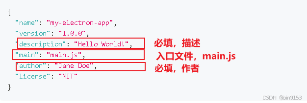 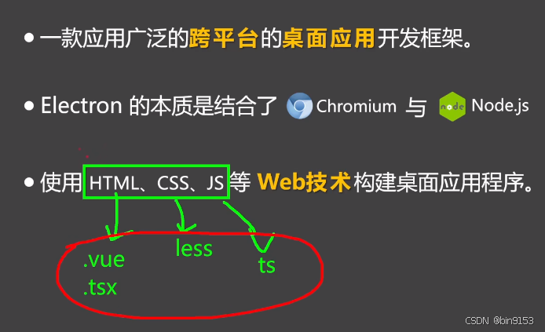

## 二、Elemtron流程模型

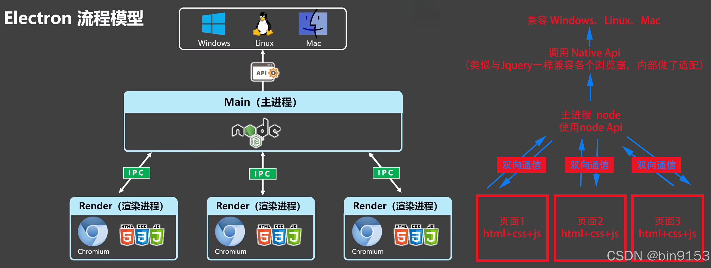

## 三、Electron搭建工程，若成功则输出123

### 3.1 准备

[可参考Electron官网地址](https://www.electronjs.org/zh/docs/latest/tutorial/quick-start) 需要node和npm，先检测是否安装。

node -v npm -v

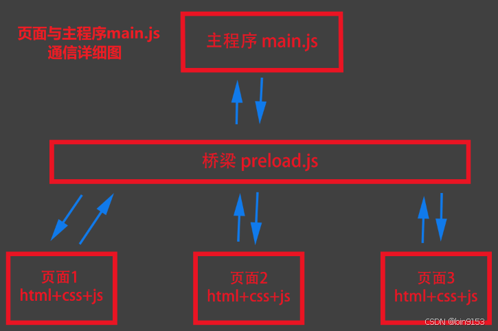

### 3.2 项目初始化

命令行创建

mkdir my-electron-app && cd my-electron-app npm init

或者，手动快速创建 

package.json文件

{ "name": "my-electron-app", "version": "1.0.0", "description": "test Electron", "main": "main.js", "author": "Bin9153", "license": "MIT" }

有几条规则需要遵循：

entry point 应为 main.js. author 与 description 可为任意值，但对于应用打包是必填项。 

### 3.3 安装 Electron

npm install --save-dev electron //或者 npm install electron -D

### 3.4 配置并启动

**在 package.json配置文件中的scripts字段下增加一条start命令：**

{ "scripts": { "start": "electron ." } }

**这一步，完整的package.json**

{ "name": "my-electron-app", "version": "1.0.0", "main": "main.js", "scripts": { "start": "electron ." }, "author": "bin9153", "license": "ISC", "description": "electron test", "dependencies": { "electron": "^31.2.0" } }

代码解析： 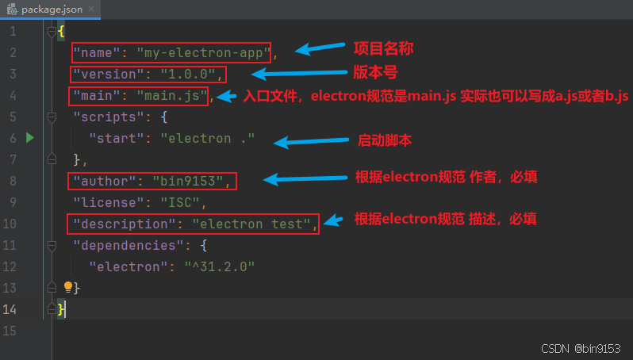 **创建main.js**。  **在main.js里写入**

console.log(123)

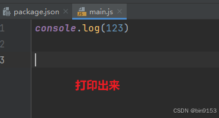

**再运行！**

npm start

**注意：**

1. 先创建main.js，否则报错
    
2. 如果main.js里没写输出（或其他代码）则，启动了运行窗口也不容易看出变化
    

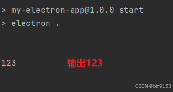 **成功输出123，工程搭建完成。**

## 四、开始制作程序

### 4.1 案例1：做一个简易网页程序

[点击可以查看，browser-window配置项的开发文档](https://www.electronjs.org/zh/docs/latest/api/browser-window) 在main.js里写入

const {app, BrowserWindow} = require('electron') app.on('ready', () => { //当app准备好后，执行createWindow创建窗口 const win = new BrowserWindow({ width: 800,//窗口宽度 height: 600,//窗口高度 autoHideMenuBar: true,//自动隐藏菜单档 alwaysOnTop: true,//置顶 x: 0,//窗口位置x坐标 y: 0//窗口位置y坐标 }) //加载一个远程页面 win.loadURL('https://blog.csdn.net/qq_33650655/article/details/140353815') })

运行

npm start

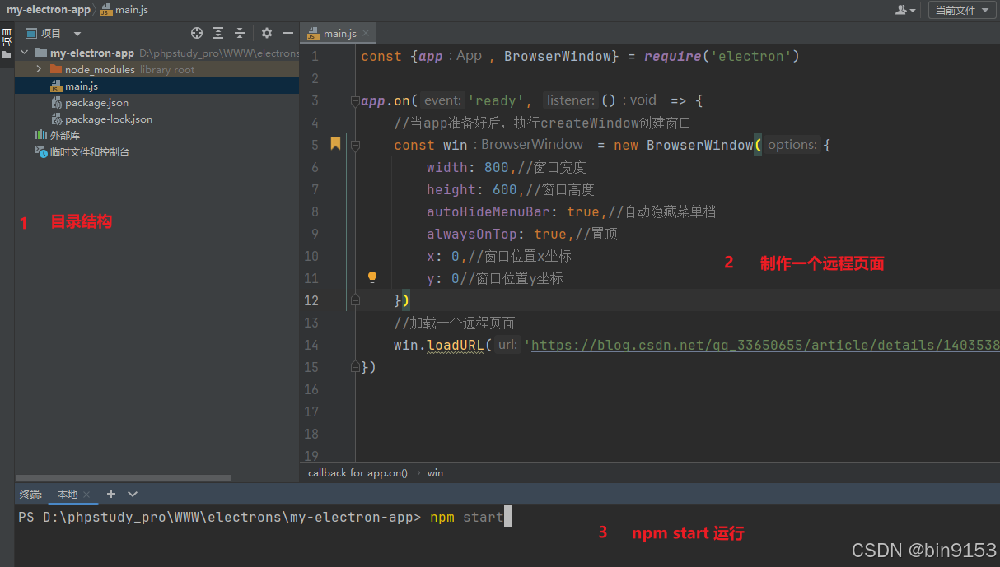 成功显示页面。 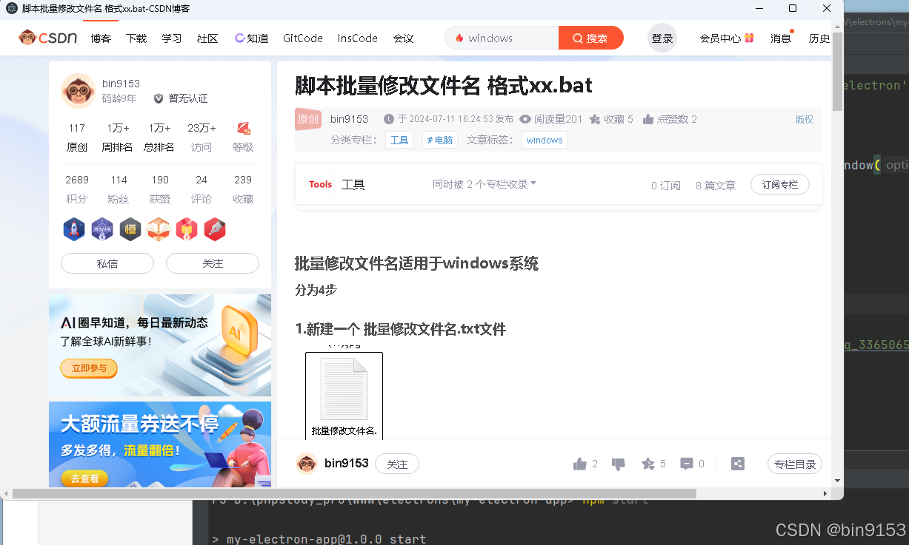

### 4.2 案例2：做一个本地程序（不是远程链接页面，是自己写的页面）

#### 4.2.1 是本地程序，所以创建新的页面

新建pages目录，创建页面，这里就像写前端一样了。index.html,index.css  index.html里

<!DOCTYPE html> <html lang="en"> <head> <meta charset="UTF-8"> <title>这里是index页面</title> </head> <body> <h1> 这里是index里的标题 </h1> </body> </html>

main.js里引入页面

const {app, BrowserWindow} = require('electron') app.on('ready', () => { //当app准备好后，执行createWindow创建窗口 const win = new BrowserWindow({ width: 800,//窗口宽度 height: 600,//窗口高度 autoHideMenuBar: true,//自动隐藏菜单档 alwaysOnTop: true,//置顶 }) //引入页面 win.loadFile('./pages/index/index.html') })

运行

npm start

#### 4.2.2 解决内容安全策略

有安全提示 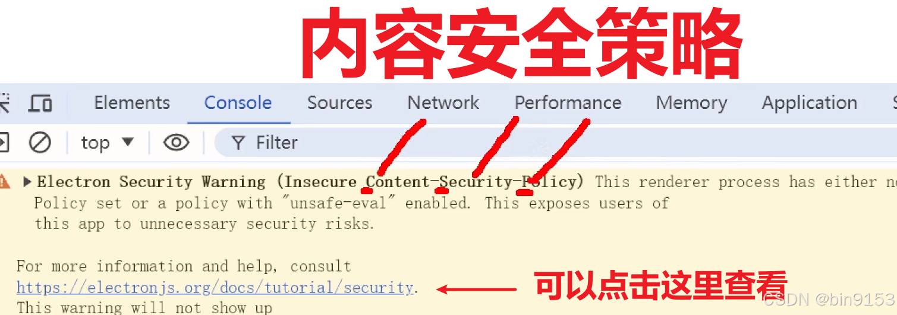 在index.html里加入，如下代码，内容安全策略警告提示消失。

//electron 提供的配置 成功运行 <meta http-equiv="Content-Security-Policy" content="default-src 'self'; script-src 'self'"> //electron 提供的配置2 引入js后也会报错 <meta http-equiv="Content-Security-Policy" content="default-src none"> //视频教程里的配置 会报错 <meta http-equiv="Content-Security-Policy" content="default-src 'self';style-src 'self''unsafe-inline';img-src self'data:;"> //我自己写的组合的配置更全 加了一个script的限制,有事儿后期再改， 刚试了会报错，可能哪里没写对，先记录在这里 <meta http-equiv="Content-Security-Policy" content="default-src 'self'; script-src 'self';style-src 'self''unsafe-inline';img-src self'data:;">

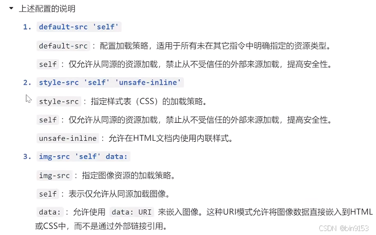

关于CSP的详细说明：[MDN内容安全策略详解](https://developer.mozilla.org/zh-CN/docs/Web/HTTP/CSP) 、[Electron安全策略规范](https://www.electronjs.org/zh/docs/latest/tutorial/security)

#### 4.2.3 增加多系统的兼容代码

兼容mac(完善窗口行为） electron文档： [关闭所有窗口时退出应用 (Windows & Linux)](https://www.electronjs.org/zh/docs/latest/tutorial/quick-start#%E5%85%B3%E9%97%AD%E6%89%80%E6%9C%89%E7%AA%97%E5%8F%A3%E6%97%B6%E9%80%80%E5%87%BA%E5%BA%94%E7%94%A8-windows--linux) [如果没有窗口打开则打开一个窗口 (macOS)](https://www.electronjs.org/zh/docs/latest/tutorial/quick-start#%E5%A6%82%E6%9E%9C%E6%B2%A1%E6%9C%89%E7%AA%97%E5%8F%A3%E6%89%93%E5%BC%80%E5%88%99%E6%89%93%E5%BC%80%E4%B8%80%E4%B8%AA%E7%AA%97%E5%8F%A3-macos) 在main.js里写入兼容各个系统平台的代码

const {app, BrowserWindow} = require('electron') function createWindow(){ //当app准备好后，执行createWindow创建窗口 const win = new BrowserWindow({ width: 800,//窗口宽度 height: 600,//窗口高度 autoHideMenuBar: true,//自动隐藏菜单档 alwaysOnTop: true,//置顶 }) win.loadFile('./pages/index/index.html') } app.on('ready', () => { createWindow() //兼容核心代码 1 app.on('activate', () => { if (BrowserWindow.getAllWindows().length === 0) createWindow() }) }) //兼容核心代码 2 app.on('window-all-closed', () => { if (process.platform !== 'darwin') app.quit() })

代码解析 

下面两句代码相等

app.on('ready', () => { // 写核心代码 }) // 或者 app.whenReady().then(() => { //写核心代码 })

#### 4.2.4 配置自动重启,保存后自动热更新

npm i nodemon -D

package.json里重写start

"start": "nodemon --exec electron ."

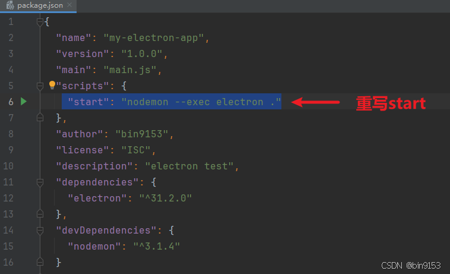

这样保存main.js里的内容，就自动热更新了。 但是更新index.html里的代码不能热更新，要加一个nodemon.json，需要手动添加

{ "ignore":[ "node modules", "dist" ], "restartable":"r", "watch":["*.*"], "ext":"html,js,css" }

增加nodemon.json, 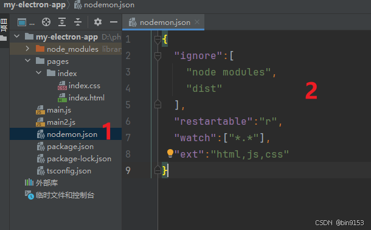 重启生效

npm start

#### 4.2.5 编写页面程序(写一个应用程序，可以写入任意文字到hello.text里)

页面程序要写在页面里，那它和主进程的关系如图  **每个页面程序通过渲染和主进程通信，主进程根据需求调用Native Api来实现功能。**

**实际，每个页面和主程序通信时，需要建个桥梁来管理它们的通信，preload.js(自己创建)，来管理实现通信**。  **创建preload.js定义桥梁js** 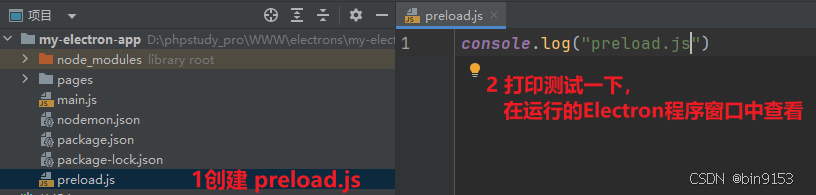 在main.js中定义preload.js为桥梁 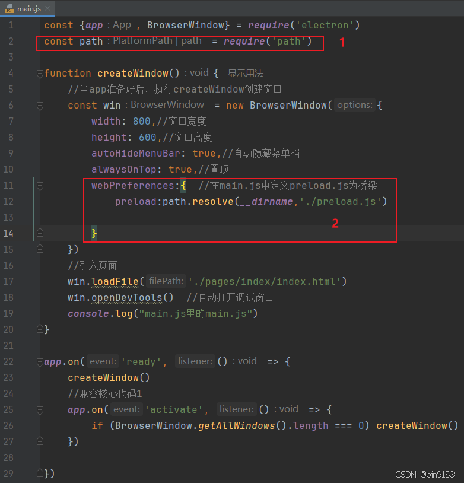

main.js代码：

const {app, BrowserWindow} = require('electron') const path = require('path') function createWindow(){ //当app准备好后，执行createWindow创建窗口 const win = new BrowserWindow({ width: 800,//窗口宽度 height: 600,//窗口高度 autoHideMenuBar: true,//自动隐藏菜单档 alwaysOnTop: true,//置顶 webPreferences:{ //在main.js中定义preload.js为桥梁 preload:path.resolve(__dirname,'./preload.js') } }) //引入页面 win.loadFile('./pages/index/index.html') win.openDevTools() //自动打开调试窗口 console.log("main.js里的main.js") } app.on('ready', () => { createWindow() //兼容核心代码1 app.on('activate', () => { if (BrowserWindow.getAllWindows().length === 0) createWindow() }) })

**创建渲染js**  定义渲染js 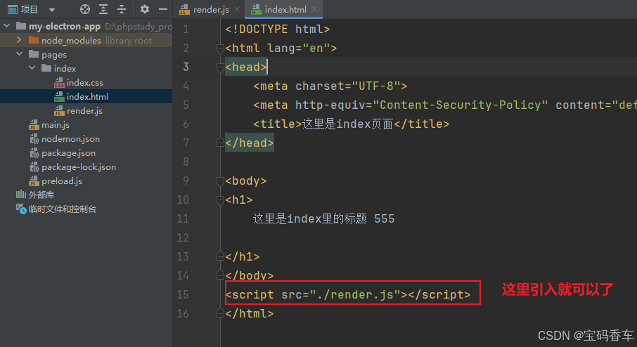 这是自己整理的，整理了前面45分钟，再这么整理下去，1000字也不够用。 下面写代码不详细介绍了。会点前端的能懂一半多代码。 可以看原来的教程 从45分钟开始看。[视频教程](https://www.bilibili.com/video/BV1sE421N7M5/?spm_id_from=333.880.my_history.page.click&vd_source=a454397b4591f4f1fe0cf403e74737a0) 直接上代码。

> main.js里的代码

const {app, BrowserWindow,ipcMain} = require('electron') const path = require('path') const fs = require('fs') //写入文件 function writeFile(_, data) { fs.writeFileSync('D:/hello.txt', data) } //读取文件 function readFile() { const res = fs.readFileSync("D:/hello.txt").toString() return res } function createWindow() { //当app准备好后，执行createWindow创建窗口 const win = new BrowserWindow({ width: 800,//窗口宽度 height: 600,//窗口高度 autoHideMenuBar: true,//自动隐藏菜单档 alwaysOnTop: true,//置顶 webPreferences: { //在main.js中定义preload.js为桥梁 preload: path.resolve(__dirname, './preload.js') } }) ipcMain.on('file-save', writeFile) ipcMain.handle('file-read', readFile) //引入页面 win.loadFile('./pages/index/index.html') win.openDevTools() //自动打开调试窗口 console.log("main.js里的main.js") } app.on('ready', () => { createWindow() //兼容核心代码1 app.on('activate', () => { if (BrowserWindow.getAllWindows().length === 0) createWindow() }) })

> preload.js里的代码

const {contextBridge, ipcRenderer} = require('electron') contextBridge.exposeInMainWorld('myAPI', { version: process.version, saveFile: (data) => { ipcRenderer.send('file-save', data) }, readFile() { return ipcRenderer.invoke('file-read') } })

> render.js里的代码

const btn1 = document.getElementById("btn1") const btn2 = document.getElementById("btn2") const btn3 = document.getElementById("btn3") const input = document.getElementById("inp") btn1.onclick = () => { alert(myAPI.version) } btn2.onclick = () => { myAPI.saveFile(input.value) } btn3.onclick = async() => { const res = await myAPI.readFile() alert(res) }

> html里的代码

<!DOCTYPE html> <html lang="en"> <head> <meta charset="UTF-8"> <meta http-equiv="Content-Security-Policy" content="default-src 'self'; script-src 'self'"> <title>这里是index页面</title> </head> <body> <h1>欢迎学习Electron开发！！！</h1> <button id="btn1">点我</button> 
 <input type="text" id="inp"/> <button id="btn2">向D盘写入hello.txt</button> 
 <button id="btn3">读取hello.txt的内容</button> </body>  </html>

> 目录结构

> **备注**： 1.代码稍微有点不一样 2.目录结构也有变化，功能是一样的

## 五、打包

### 5.1 使用electron-builder打包，打包时要访问`github`需要`修仙术`

1.安装electron-builder:

npm install electron-builder -D

2.在package.json中进行相关配置，具体配置如下：

> 备注：json文件不支持注释，使用时请去掉所有注释。

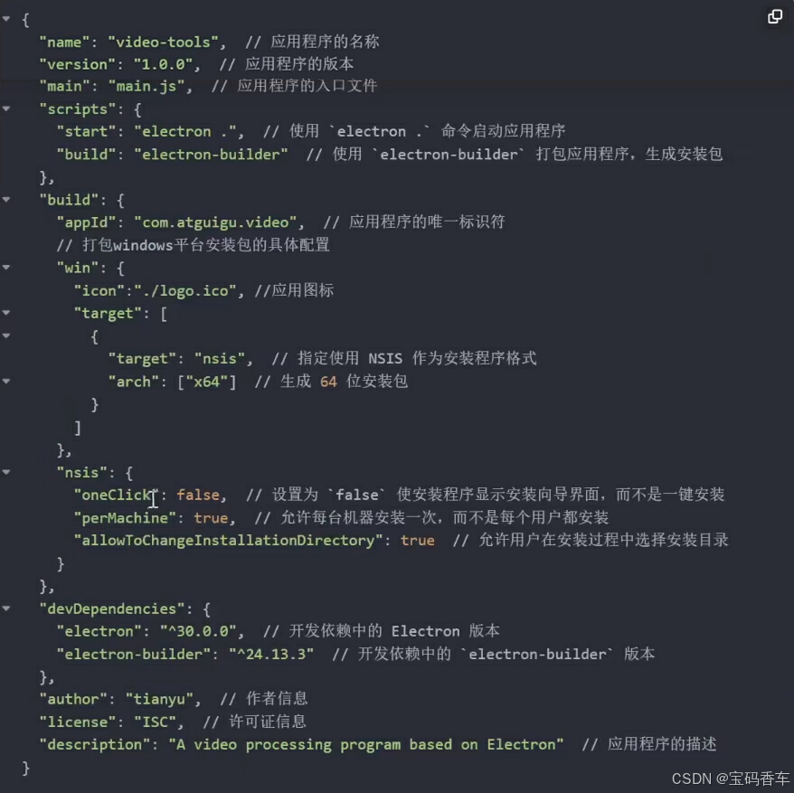

> package.json里的代码

{ "name": "video-tools", "version": "1.0.0", "main": "main.js", "scripts": { "start": "electron .", "build": "electron-builder" }, "build": { "appId": "com.atguigu.video", "win": { "icon": "./logo.ico", "target": [ { "target": "nsis", "arch": ["x64"] } ] }, "nsis": { "oneClick": false, "perMachine": true, "allowToChangeInstallationDirectory": true } }, "devDependencies": { "electron": "^30.0.0", "electron-builder": "^24.13.3" }, "author": "宝码香车", "license": "ISC", "description": "A video processing program based on Electron" }

> 根据视频操作未能完成打包，这种方式在打包时 访问`github` 多次尝试后，决定放弃

### 5.2 使用Electron Forge进行打包（使用这种方式打包的）

Electron中文网也推荐使用这种方式。 Electron Forge是从建项目开始配置 的，因为项目已经写完了，所以从第五步开始。 [Electron Forge 从第五步开始的文档](https://www.electronjs.org/zh/docs/latest/tutorial/%E6%89%93%E5%8C%85%E6%95%99%E7%A8%8B)

#### 5.2.1 使用3条命令，完成打包。

1、运行第1条命令

npm install --save-dev @electron-forge/cli

2、运行第2条命令

npx electron-forge import

这时在packgae.json里会增加一些配置。

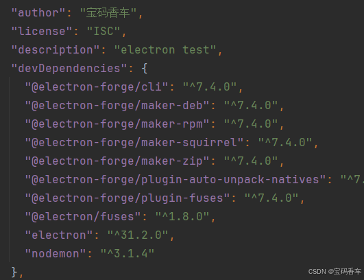 不用管。

3、直接运行第3条命令

npm run make

> 打包完成。

#### 5.2.2 打包后的位置,在根项目下的out文件里

打包后的文件,在根项目下的out文件夹里

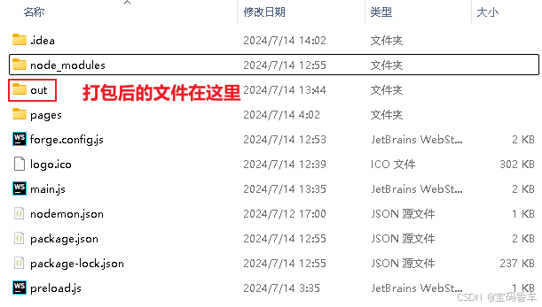

> 可运行程序在 `my-electron-app\out\make\squirrel.windows\x64`

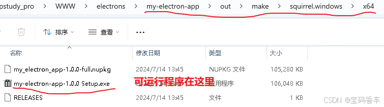

#### 5.2.3 看运行效果，终于完成了。

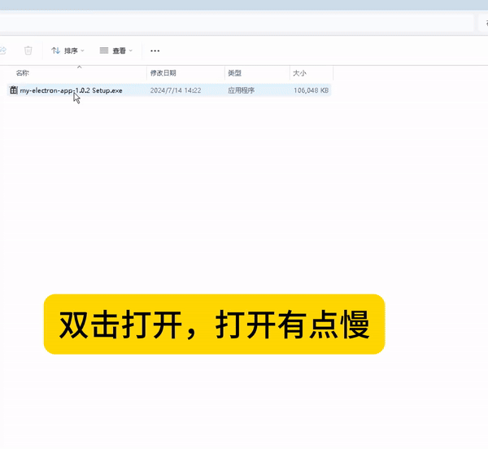

#### 5.2.4 出现的bug

1.安装一次后再打开会报错， 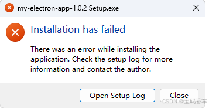

2.直接删除软件，目录在 `C:\Users\Administrator\AppData\Roaming` 删除my_electron_app这个文件夹。然后用360安全卫士清理垃圾。然后重启即可。

> 其他bug 1.软件有卡死的现象 2.还会自动重启 3.软件关闭后会自动重启 4.在输入框中输入内容，写入后可能会卡死，第二次可能无法输入，但可以读取。 5.启动时有点卡

## 六、总结

1.后面有的bug可能与Electron Forge配置有关。有时间试试，找个解决方案。 2.也有可能与main.js写法有关。 3.打包时删除main.js里的 `win.openDevTools() //自动打开调试窗口` 否则软件会自动打开调试窗口。 4. 代码仓库位置 `https://gitee.com/electron_9/my-electron-app`