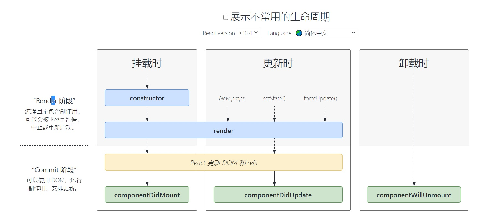
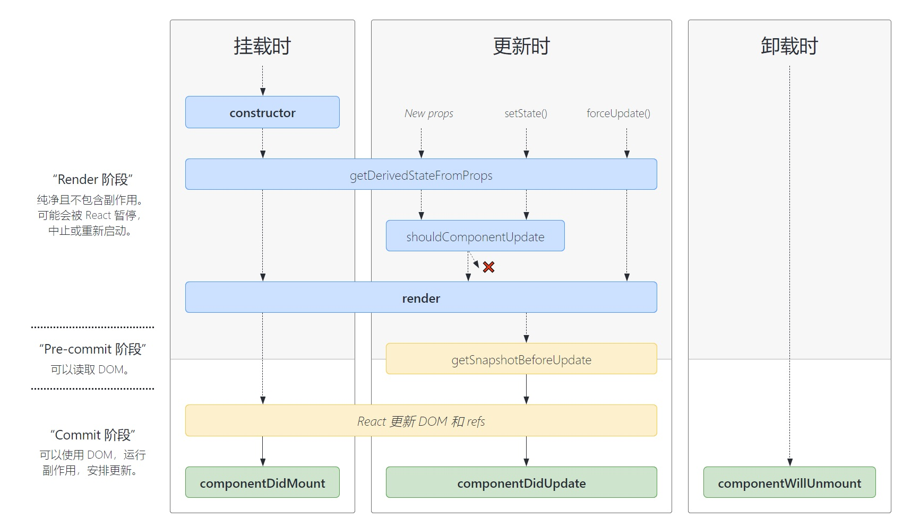

# 组件生命周期图谱

## 一、16.3以前的组件生命周期图谱


```javascript
#App.js
import React form 'react'
import Child from './Child'

class App extends React.Component{
    //initialization
    //最先执行，只执行一次一定会执行
    constructor(props){
        super(props)
        this.state={
            x:0
        }
        
    }
    //mounting
    componentWillReceiveProps(){//已废弃，有性能问题和安全隐患

    }
    //组件将要卸载时运行（在这里消除定时器)
    componentWillUnmount(){
        ClearInterval(this.timer)
    }
    UNSAFE_compoonentWillMount(){
        //可以修改state
        this.state={
            y:1
        }
        console.log('UNSAFE_componentWillMount')
    }
    //render调用的时机:初始化渲染，状态更新之后
    render(){
        return(
        <div>
            UNSAFE_componentWillReceiveProps:{this.state.y }
            app:{this.state.x}
            <Child title="Hello"></Child>
        </div>
        )
    }
    //组件将要挂载的钩子
    componentWillMount(){

    }
    //组件挂载完毕运行（定时器一般在这里做）
    componentDidMount(){
        //做ajax请求时在这里进行
        //父组件render执行，子组件render一定执行。这里调用修改state,render也要调用1次
        //用setTimeout做一个测试
        this.timer=setTimeout(()=>{
            this.setState(...)//写一些其它操作
        },200)
        this.setState({
            x:4//设置了新的数据，但页面上不更新
        })        
    }
    //组件是否应该被更新，如果返回true则进行更新操作，返回false则不进行更新
    //控制组件更新的操作
        shouldComponentUpdate(){
            //return ture 不写这个钩子的话，默认返回为真
            //return fasle 不进行更新，不再执行render
            //必须返回一个true或false，不返回的话出错

    }
}

export default App
```

```javascript
#Child.js
import React from 'react'
export default class Child extends React.Component{//使用PureComponent组件时，可以不用shouldComponentUpDate事件，当Props和State变化时才渲染子组件
   //updating
    UNSAFE_componentWillReceiveProps(nextProps){//父组件传给子组件的属性发生变化时触发，第一次时不触发，第一次时不运行。
        console.log('componentWillReceiveProps',nextProps)
    }
    shouldComponentUpdate(nextProps,nextState){//要有一个返回值true或false,true是继续渲染，优化功能
        //根据父组件传递来的状态和属性来判断是否进行后面的渲染,nextProps,nextState
        return !(nextProps.title===this.props.title)//如果title没有变化就不需要重新渲染（不重新执行render)
        
    }
    //组件将要更新的钩子
    UNSAFE_componentWillUpdate(){
        console.log('Unsafe_componentWillUpdate')
    }
    //组件更新完毕的钩子
    componentDidUpdate(){
        console.log('componentDidUpdate')
    }
    render(){
        return(
        <div>
            Child
        </div>
        )
    }
 }

```
forceUpdate()流程：强制更新流程（<font color=red>与setState()不一样，这个是正常更新</font>）,<font color=yellow>不修改状态的时候</font>进行更新时使用这个流程。比正常更新少走了shouldComponentUpdate这个过程。
force=()=>{
    this.forceUpdate()
}

UNSAFE_componentWillReceiveProps(nextProps){//父组件传给子组件的属性发生变化时触发，<font color=red>第一次时不触发，第一次时不运行</font>。
**<font color=red>旧的生命周期的总结</font>**

- <font color=red>初始化阶段</font>：由ReactDOM.render()触发--初次渲染
  - constructor()
  - componentWillMount()
  - render()
  - compnentDidMount():常用于：开启定时器、发送网络请求、订阅消息
- <font color=red>更新阶段</font>：由组件内部this.setState()或你组件重新render触发
  - shouldComponentUpdate()
  - componentWillUpdate()
  - render()
  - componentDidUpdate()
- <font color=red>卸载组件</font>：由ReactDOM.unmountComponentAtNode()触发
    - componentWillUnmout():常用于：关闭定时器，取消订阅消息
## 二、16.4以后的组件生命周期图谱

常用的

在新的版本中，除了<font color=red>compoentWillUnmount</font>，其它的<font color=red>Will钩子</font>都不是安全的，需要加<font color=red>UNSAFE_</font>前缀来使用。(<font color=yellow>为异步渲染做准备</font>)



全部的



## 三、getDeriveStateFromProps

会在<font color=red>调用render方法之前调用</font>，并且在<font color=yellow>初始挂载及后续更新</font>时都会被调用。它应<font color='red'>返回一个对象</font>来更新<font color=yellow>state</font>，如果<font color=green>返回null则不更新任何内容</font>。用于若state的值<font color=red>在任何时候</font>都取决于props的时候使用该函数。(<font color=yellow>使用后state中的值不会变化了</font>)

- 如果想执行副作用（例如：数据提取或动画）以响应props的更改，请改用componentDidUpdate.
- 如果想在prop更新时重新计算某些数据，请使用memoizaton helper 代替
- 如果想在prop更改时“重置”某些state，考虑使用组件完全受控或使用key使组件完全不受控代替。

**注意要点：**

- 在使用此生命周期时，要注意把传入的prop值和之前的prop进行比较。
- 因为这个生命周期是静态方法，同时要保持它是纯函数，不要产生副作用。
- 不使用getDerivedStateFromProps可以改成组件保持完全不可控模式，通过初始值和key值来实现prop改变state的情景。

```javascript
#Child.js
import React form 'react'

class Child extends React.Component{
    state={
        color:'',
        prevColor:''
    }
    //静态方法，根据props，生成一个新的state
    static getDerivedStateFromProps(nextProps,nextState){//两个参数要传,是静态的函数，当父组件变化时传值并渲染,通过在state中加一个prevColor状态，来实现父组件和本组件的修改能使用
        console.log(next.Props.color)
        if (nextProps.color===prevState.prevColor){
            return null //不修改的话必须返回null
        }else{
            return {//shallow merge state浅复制state
                color:nextProps.color,
                prevColor:nextProps.color
            }
        }
    }
    render(){
        return(
            <div>
                child color:{this.state.color} 
            </div>
        )
    }
}
```

## 四、getSnapshotBeforeUpdate

```javascript
#Child.js
import React form 'react'

class Child extends React.Component{
    state={
        color:'',
        prevColor:''
    }
     getSnapShotBeforeUpdate(){
        //dom操作，此勾子在时一定要使用componentDidUpdate中接受数据
        return 120
    }
    componentDidUpdate(nextProps,nextState,snapshot){
        console.log(snapshot)//snapshot接受getSnapShotBeforeUpdate中返回的值。
    }
    render(){
        return(
            <div>
                child color:{this.state.color} 
            </div>
        )
    }
}

```


