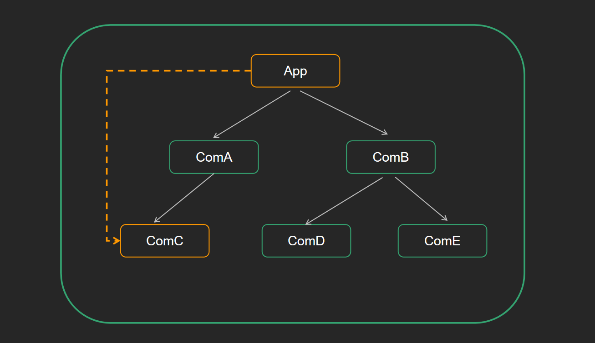

# 组件通信

## 一、组件通信的意义

`目标任务:`   了解为什么需要组件通信

组件是独立且封闭的单元，默认情况下组件**只能使用自己的数据（state）**

组件化开发的过程中，完整的功能会拆分多个组件，在这个过程中不可避免的需要互相传递一些数据

为了能让各组件之间可以进行互相沟通，数据传递，这个过程就是组件通信

1. 父子关系 -  **最重要的**
2. 兄弟关系 -  自定义事件模式产生技术方法 <font color=red>eventBus</font>  /  <font color=red>通过共同的父组件通信</font>
3. 其它关系 -  **mobx / redux / 基于hook的方案**
## 二、父传子实现

`目标任务:`   实现父子通信中的父传子，把父组件中的数据传给子组件

**实现步骤**

1. 父组件提供要传递的数据  -  `state`

2. 给子组件标签`添加属性`值为 state中的数据  

3. 子组件中通过 `props` 接收父组件中传过来的数据

   -  <font color=red>类组件</font>使用this.props获取props对象
   - <font color=red>函数式组件</font>直接通过参数获取props对象
### props说明

`目标任务:`   知道props传递时的一些注意事项

**1.  props是只读对象（readonly）**

根据单项数据流的要求，子组件只能读取props中的数据，不能进行修改

**2. props可以传递任意数据**
<font color=red></font>
<font color=red>数字、字符串、布尔值、数组、对象、`函数、JSX`</font>


**代码实现**
```jsx
import React from 'react'

// 函数式子组件
function FSon(props) {
  console.log(props)
  return (
    <div>
      子组件1
      {props.msg}
    </div>
  )
}

// 类子组件
class CSon extends React.Component {
  render() {
    return (
      <div>
        子组件2
        {this.props.msg}
      </div>
    )
  }
}
// 父组件
class App extends React.Component {
  state = {
    message: 'this is message'
  }
  render() {
    return (
      <div>
        <div>父组件</div>
        <FSon msg={this.state.message} />
        <CSon msg={this.state.message} />
      </div>
    )
  }
}

export default App
```
**其他类型值传递的代码示例**
```jsx
function Fson(props){
  props.cb()
  return(
      <div>
        msg:{props.message}
        age:{props.age}
        isMan:{props.isMan}
        child:{props.child}
      </div>
  )
}
class App extends React.Component {
  state = {
    message: 'this is message'
  }
  render() {
    return (
      <div>
        <div>父组件</div>
        <FSon 
          msg={this.state.message} 
          age={20} 
          isMan={true} 
          cb={() => { console.log(1) }} 
          child={<span>this is child</span>}
        />
      </div>
    )
  }
}
```
## 三、子传父实现

`目标任务:`   实现父子通信中的子传父

**口诀：** <font color=red>父组件给子组件</font><font color=yellow>传递回调函数，子组件调用</font>

**实现步骤**

1. 父组件提供一个回调函数 - 用于接收数据
2. 将函数作为属性的值，传给子组件
3. 子组件通过props调用 回调函数
4. 将子组件中的数据作为参数传递给回调函数

**代码示例**
```jsx
function Son(props){
    function sendMessage(str){
        props.receiveMessage(str)
    return(
        <button onClick={()=>sendMessage("child message")}>
    )
    }
}
function App(){
    const [msg,setMsg]=useState('')
    function receiveMessage(str){
        setMsg(str)
    }
    return(
        <div>
            msg:{msg}
            <Son receiveMessage={receiveMessage}>
        </div>
    )
}
```
## 四、兄弟组件通信
**实现步骤**

1. <font color=red>将共享状态提升到最近的公共父组件中</font>，由<font color=yellow>公共父组件管理这个状态</font>
   - 提供共享状态 
   - 提供操作共享状态的方法
2. 要接收数据状态的子组件通过 props 接收数据
3. 要传递数据状态的子组件通过props接收方法，调用方法传递数据

`目标任务:`   实现兄弟组件之间的通信

**核心思路：** 通<font color=red>过状态提升机制，利用共同的父组件实现兄弟通信</font>
**代码实现**
```jsx
import React from 'react'

// 子组件A
function SonA(props) {
  return (
    <div>
      SonA
      {props.msg}
    </div>
  )
}
// 子组件B
function SonB(props) {
  return (
    <div>
      SonB
      <button onClick={() => props.changeMsg('new message')}>changeMsg</button>
    </div>
  )
}

// 父组件
class App extends React.Component {
  // 父组件提供状态数据
  state = {
    message: 'this is message'
  }
  // 父组件提供修改数据的方法
  changeMsg = (newMsg) => {
    this.setState({
      message: newMsg
    })
  }

  render() {
    return (
      <>
        {/* 接收数据的组件 */}
        <SonA msg={this.state.message} />
        {/* 修改数据的组件 */}
        <SonB changeMsg={this.changeMsg} />
      </>
    )
  }
}

export default App
```
## 其他简单例子

```javascript
import React from 'react'
import {testContext,Provider,Consumer} from './testContext'

class ChildA extends React.Component{
    static contextType=testContext//类组件声明一个静态变量
    render(){
        return(
            <div>
            ChildA Component:
            {this.context}//类组件使用该值
            </div>
        )
    }
}


class ChildB extends React.Component{
    render(){
        return(
            <div>
                ChildB Component:
                <ChildC></ChildC>
            </div>
        )
    }
}

const ChildC=function(props){
    return(
        <div>
            ChildC Component:
            <ChildD></ChildD>
        </div>
    )
}

const ChildD=function(props){
    return(
        <div>
            ChildD Component:
            ChildD
            <Consumer>
                {
                    (value)=>{
                        return <div>{value}</div>
                }
                }
            </Consumer>
        </div>
    )
}

export default class App extends React.Component{

    render(){
        return (
            <Provider value="hello world"> //使用标签包起来
                <ChildA></ChildA>
            <ChildB></ChildB>
            </Provider>
        )
    }
```
```javascript
//testContext.js
import React from 'react'

const testContext=React.createContext()
const {Provider,Consumer}=testContext

export{
    testContext,
        Provider,Consumer
}
    // const {Provider,Consumer}=testContext=createContext()与上两个语句的作用是一样的
```
### 预留插入位置例子
父组件中,A组件中包含一个B组件(A和B是父子关系）,传递props的方法如下：
- < A render={(name)=>< B name={name}/>}/>,插入组件,render只是一个属性可以更换名字，但一般都使用render。
- A组件中使用{this.props.render(name)},这里是预留位置，等插入组件
- B组件使用{this.props.name} 来使用该值。
```javascript
//children props方法
//问题：如果B组件需要A组件内的数据，无法实现
<A>
<B>***</B>
</A>
{this.props.children}

//render props
<A render={(data)=><B data={data}>}></B></A>
A组件：{this.props.render(内部state的数据)}
B组件：读取A组件传入的数据显示{this.props.data}
```
## 五、Context实现跨组件传值
Context 提供了一个**无需为每层组件手动添加 props，就能在组件树间进行数据传递的方法**


**实现步骤**

1. 创建Context对象 导出 Provider 和 Consumer对象

   ```js
   const { Provider, Consumer } = createContext()
   ```

2. 使用Provider包裹根组件提供数据 

   ```jsx
   <Provider value={this.state.message}>
       {/* 根组件 */}
   </Provider>
   ```

3. 需要用到数据的组件使用Consumer包裹获取数据

   ```jsx
   <Consumer >
       {value => /* 基于 context 值进行渲染*/}
   </Consumer>
   ```
**代码示例**
```jsx
import React, { createContext }  from 'react'

// 1. 创建Context对象 
const { Provider, Consumer } = createContext()


// 3. 消费数据
function ComC() {
  return (
    <Consumer >
      {value => <div>{value}</div>}
    </Consumer>
  )
}

function ComA() {
  return (
    <ComC/>
  )
}

// 2. 提供数据
class App extends React.Component {
  state = {
    message: 'this is message'
  }
  render() {
    return (
      <Provider value={this.state.message}>
        <div className="app">
          <ComA />
        </div>
      </Provider>
    )
  }
}

export default App
```

**分组件的代码示例**
```jsx
//App.js
import "./index.css"
import Son from './Son'
import {useState} from 'react'
import {CountProvider} from './Count'

function App () {
    const [msg,setMsg]=useState('not revices msg')
    const reviceSonMessage=(msg)=>{
        console.log(msg)
        setMsg(msg)
    }
    function receive(str){
        setMsg(str)
    }
    return (
        <div className="App">
            Hello World:{msg}
            <CountProvider>
            <Son 
                reviceMessage={reviceSonMessage}
                msg={msg}
                age={20}
                isMan={true}
                cb={()=>console.log(1)}
                child={<span>this is child</span>}
                resMsg={receive}
            />
            </CountProvider>
        </div>
    )
}
export default App
```
```jsx
//Count.js
import {createContext,useState} from 'react'

const CountContext=createContext()
const {Consumer}=CountContext

function CountProvider(props){
    const [count,setCount]=useState(0)
    function increment(){
        setCount(prevCount=>setCount(prevCount+1))
    }
    function decrement(){
        setCount(prevCount=>setCount(prevCount-1))
    }
    return(
        <CountContext.Provider value={{count:count,increment:increment,decrement:decrement}}>
            {props.children}
        </CountContext.Provider>
    )
}
export{
    CountProvider,
    Consumer
}
```
```jsx
import Leaf from './Leaf' 
function Son(props){
    const reviceSonMessage=props.reviceMessage
    props.cb()
    return (
        <div>
            msg:{props.msg}
            age:{props.age}
            isMan:{}
            Son Component
            <button onClick={()=>reviceSonMessage("hello")}>click</button>
            <Leaf/>
        </div>
    )
}

export default Son

```

### 其他例子
```javascript
#count.jsx
import React from 'react'

const {Provider,Consumer:CountConsumer} = React.createContext() //别名为CountComsumer
class CountProvider extends React.Component{
    constructor(props){
        super(props)
        this.increment=this.increment.bind(this)
        this.decrement=this.decrement.bind(this)
    }
    state={
        count:0
    }
    increment(args){
        this.setState(prevState=>({
            count:prevState.count+args
        }))
    }
    decrement(args){
        this.setState(prevState=>({
            count:prevState.count-args
        }))

    }
    render(){
        return (
            <Provider value={{
                count:this.state.count,
                increment:this.increment,
                decrement:this.decrement
            }}>
            {this.props.children}//显示这个组件下的包括的子组件，本例中是显示App.jsx下面CountProvider包括的Child组件
        </Provider>
        )
    }


}
export {
    CountConsumer,
    CountProvider
}
```
```javascript
#Child.jsx

import React from 'react'
import ChildHood from './ChildHood'
import {CountConsumer} from './count'

export default class Child extends React.Component{
    render(){
        return(
            <div>
                <CountConsumer>//返回值用下面的方法
                    {
                        ({count})=>{
                            return(
                                <div>{count}</div>
                            )
                        }
                    }
                            </CountConsumer>
                            <ChildHood></ChildHood>
                        </div>
        )
    }
}
```
```javascript
#ChildHood.jsx
import React from 'react'
import {CountConsumer} from './count'
export default class ChildHood extends React.Component{
    render(){
        return(
            <div>
                <CountConsumer>
                    {
                        ({count,increment,decrement})=>{//解构出状态和方法
                            return(
                                <div>
                                    <button onClick={()=>decrement(3)}>-</button>
                                    {count}
                                    <button onClick={()=>increment(3)}>+</button>
                                </div>
                            )
                        }
                    }
                            </CountConsumer>
                            ChildHood
                        </div>
        )
    }
}

#App.js
import React from 'react'
import Child from './Child'
import {CountProvider} from './count'

export default class App extends React.Component{
    render(){
        return(
            <div>
                <CountProvider>//为里面的内容提供支持
                <Child></Child>
            </CountProvider>
        </div>
        )
    }
}

```

