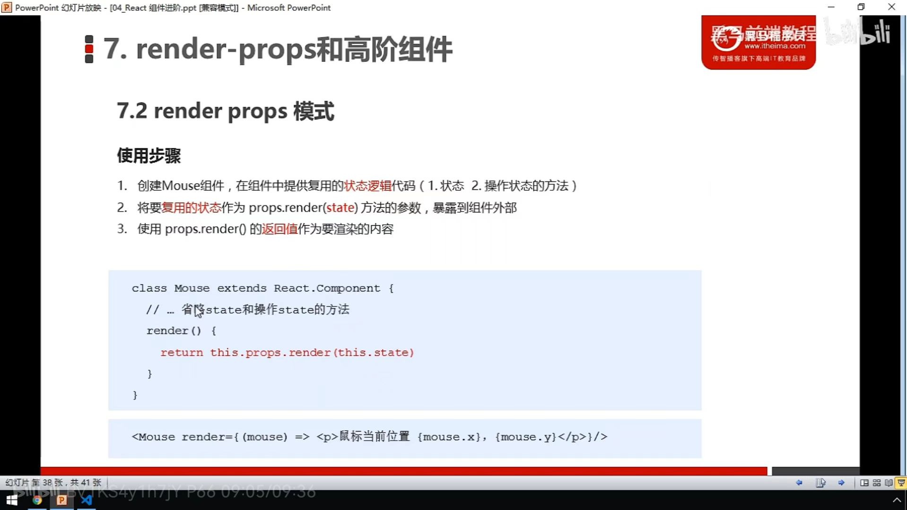
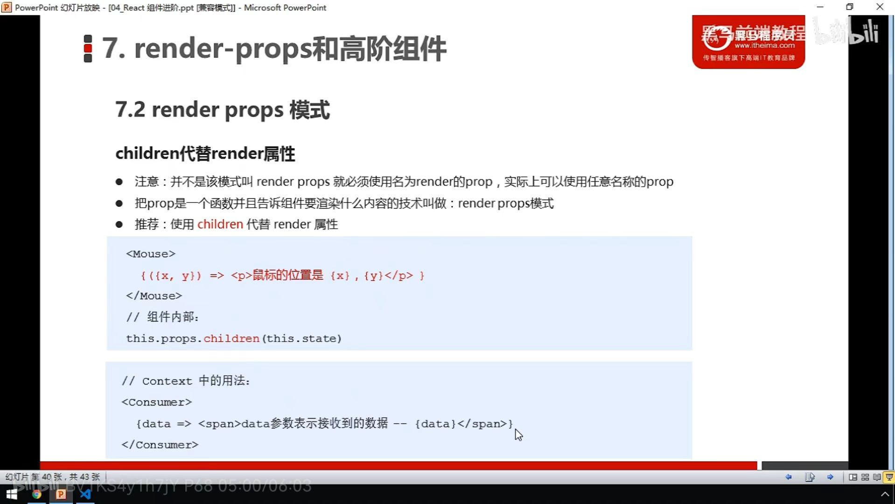

## render props模式



1. 创建Mouse组件，在组件中提供利用的状态逻辑代码（1.状态 2.操作状态的代码）
2. 将要复用的状态作为props.render(state)方法的参数，暴露到组件外部
3. 使用props.render()的返回值作为要渲染的内容
```javascript
function App(){
    return(
        <div>
          <Mouse render={(mouse)=><p>mouseX:{mouse.x},mouseY:{mouse.y}</p>}>
        </div>
    )
}
function Mouse(props){
    const [point,setPoint]=useState({"x":0,"y":0})
    handleMouseMove=(e)=>{
      setPoint({"x":e.clientX,"y":e.clientY})
    }
        useEffect(()=>{
      window.addEventListener('mousemove',handleMouseMove)
    },[point])
    return props.render(point)
}
```
## children 代替render属性



```javascript
function App(){
    return(
        <Mouse>
          {(mouse)=><p>mouseX:{mouse.x},mouseY:{mouse.y}</p>}
        </Mouse>
    )
}

function Mouse(props){
    const [point,setPoint]=useState({"x":0,"y":0})
    const handleMouseMove=(e)=>{
        setPoint({"x":e.clientX,"y":e.clientY})
    }
    useEffect(()=>{
      window.addEventListener('mousemove',handleMouseMove)
      return ()=>{
          window.removeEventListener('mousemove',handleMouseMove)
      }
    },[point])
return props.children(point)
}
```

## 高阶组件（HOC）

higher-Order Components就是一个函数，传给它一个组件，它返回一新的组件。

```javascript
#App.jsx
import React from 'react'
import hoc from './hoc'

class App extends React.Component{
    render(){
        return(
            <div>
                hello hoc
            </div>
        )
    }
    componentDidMount(){
        console.log(this)//打印出props，后面的js文件在props里添加prop
    }
}

export default hoc(App)//这里对App组件进行包装，根据下面hoc.js文件的内容添加prop
```

```javascript
#hoc.js注意是js文件，不是jsx
import React from 'react'
const hoc=(Comp)=>{//将Comp包起来
    return class extends React.Component{
        render(){
            return(
                <Comp title="Hello Compo" {...this.props}> //...this.props将原来的属性放到该位置
            </Comp>
            )
        }
    }
}

export default hoc
```
## 高阶函数
```javascript
//保存表单数据到状态中,柯里化函数。
saveFormData=(dateType)=>{
    return (event)=>{
        //使用[]读出变量的值作为键值(对象的方法)
        this.setState({
            [dateType]:event.target.value
        })
        //console.log(dataType,event.target.value)
    }
}
//this.saveFormDate将返回的函数交给onChange,因此上面的return中的匿名函数的参数是event
<input onChange={this.saveFormData('username')} type="text" name="username" />
<input onChange={this.saveFormData('password')} type="text" name="password" />
```
**<font color=red>高阶函数</font>**：如果一个函数符合下面<font color=red>2个中的任何一个</font>，那该函数就是高阶函数。
- 若a函数，<font color=yellow>接收的参数是一个函数</font>，那a就可以称为高阶函数。
- 若a函数，调用的<font color=yellow>返回值是一个函数</font>，那a就可以称为高阶函数。

  **常用的**高阶函数：Promise、setTimeout、arr.map等数组操作函数。

**<font color=red>函数的柯里化</font>**:<font color=yellow>通过函数调用继续返回函数的方式</font>，实现<font color=green>多次接收参数</font>最后<font color=green>统一处理</font>的函数编码形式。
```javascript
//柯里化代码
function sum(a){
    return(b)=>{
        return(c)=>{
            return a+b+c
        }
    }
}
const result =sum(1)(2)(3)
console.log(result)
```
```javascript
//不用柯里化的方法实现
saveFormData=(dataType,value)=>{
    this.setState([dataType:value])
}
<input onChange={(event)=>{this.saveFormData('username',event.target.value)}} type="text" name="username"/>
<input onChange={this.saveFormData('password',event.target.value)} type="text" name="password" />
```
```javascript
//不用柯里化的方法实现(saveFormData传event,而不是value，能更简单点儿)
saveFormData=(dataType,event)=>{
    this.setState([dataType:event.target.value])
}
<input onChange={(event)=>{this.saveFormData('username',event)}} type="text" name="username"/>
<input onChange={this.saveFormData('password',event)} type="text" name="password" />
```